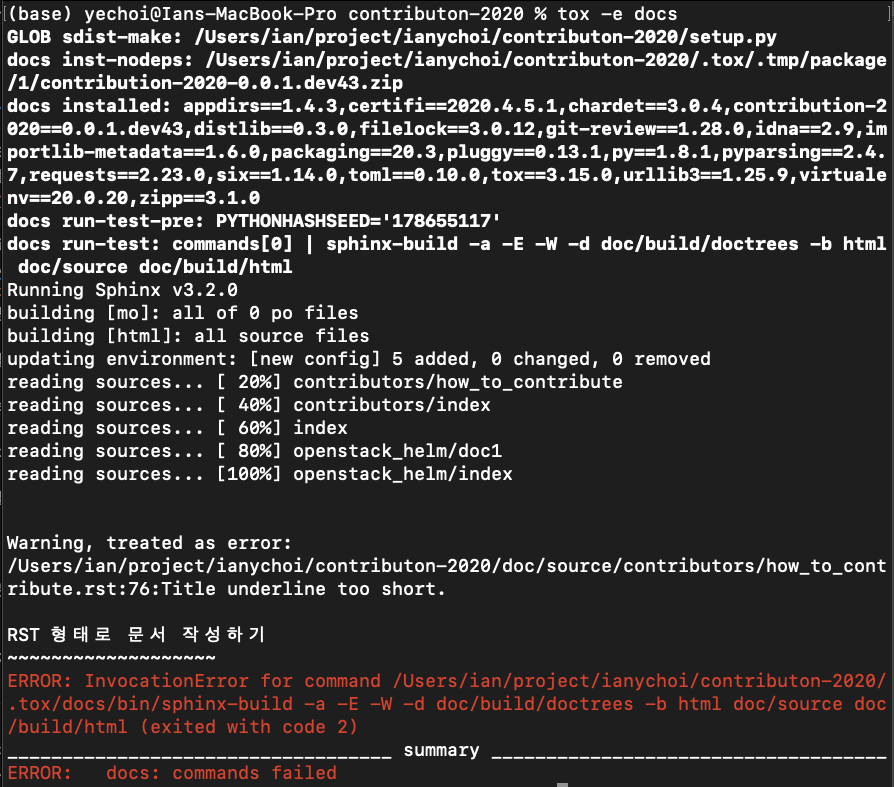
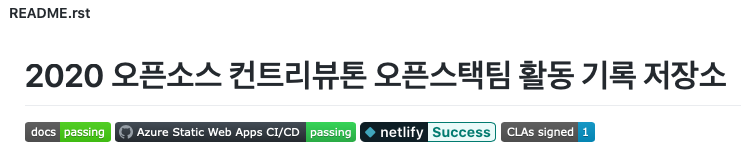

====================================
How to contribute on this repository
====================================

이 가이드는 `OpenStack <https://opendev.org/openstack>`_ 컨트리뷰션을 위해
`컨트리뷰터 가이드 <https://docs.openstack.org/contributors/>`_ 문서를 참고하는 것처럼,
2020 컨트리뷰톤 활동 결과를 어떻게 잘 정리할 수 있는지 (예: 학습한 내용을 저장하기, 커밋/이슈 등록 내용 정리)
에 대해 설명합니다. 참고로, 해당 저장소는 OpenStack 문서 컨트리뷰션을 할 때 사용하는
`Restructured Text <https://docs.openstack.org/doc-contrib-guide/rst-conv.html>`_
를 기반으로 커밋을 권장하며, 오픈스택 컨트리뷰션을 위해 필요로 하는 CI/CD 관련 지식을 GitHub Pull Request에
연관지어 설명을 하고자 합니다. (아래부터 편의상 존칭을 생략합니다)

활동 내용을 커밋 형태로 본 저장소에 기록하기
-------------------------------------------

일반적으로 GitHub 등 많은 오픈 소스 저장소에서 Markdown 기반의 `*.md` 파일을 볼 수 있는데 반해, 많은 Python
프로젝트들은 `Restructured Text (RST) <https://docutils.sourceforge.io/rst.html>`_ 포맷을
기반으로 문서화하는 것을 선호한다 (보다 자세한 설명은 
`PyCon KR 2017 발표 내용 <https://archive.pycon.kr/2017/program/149>`_ 및 PEP에 등록된
`링크1 <https://www.python.org/dev/peps/pep-0012/>`_ 및 
`링크2 <https://www.python.org/dev/peps/pep-0287/>`_ 를 참고하자).
OpenStack에서 문서 컨트리뷰션은 `Sphinx <https://www.sphinx-doc.org/>`_ 라는 RST 빌더를 활용하여
RST로 작성한 커밋 내용을 HTML 및 PDF로 만들어낸다. 예를 들어,
`Nova <https://opendev.org/openstack/nova>`_ 저장소를 살펴보면 *api-guide/source*,
*api-ref/source* 및 *doc* 폴더 3개를 확인할 수 있을텐데 각각은
`Compute API - Guide <https://docs.openstack.org/api-guide/compute/>`_, 
`Compute API - References <https://docs.openstack.org/api-ref/compute/>`_,
`OpenStack Compute <https://docs.openstack.org/nova/>`_ HTML 문서에 정확히 대응한다.

본 저장소는 OpenStack 문서 컨트리뷰션에 대한 이해 및 실제 문서 컨트리뷰션을 권장하고자 동일한 프레임워크를 사용하여
컨트리뷰톤 활동 결과를 이 저장소에 잘 정리하기 위해 어떻게 활동 내용을 커밋 형태로 본 저장소에 기록할지 설명하고자 한다.

Fork 및 로컬에 클론하기
~~~~~~~~~~~~~~~~~~~~~~~

본 저장소에 직접 쓰기를 하는 것보다 Fork를 하여 본인 GitHub 계정에 속한 저장소에서 이것저것 작업을 한 후에
풀리퀘스트를 하는 것이 GitHub에서 권장하는 방법이므로, 이 방법을 설명하고자 한다.

1. `openstack-kr/contributhon2020 GitHub 저장소 <https://github.com/openstack-kr/contributhon-2020/>`_
   URL로 이동한다.

2. 오른쪽 위에 *Fork* 라는 버튼이 보일 것이다. 이를 클릭한 후, 본인 계정을 클릭하면 본인 계정에 Fork된
   저장소가 보일 것이다 (P.S. *Star* 눌러주시는 센스, 아시죠? :) ).

   .. image:: images/github-fork-button.png

3. Fork된 저장소에서 *Code* 버튼을 클릭하면 본인 컴퓨터 (로컬)에 클론할 수 있는 고유 URL이 보일 것이다.
   이를 복사하여 로컬에 클론을 실행하면 폴더가 하나 만들어지면서 클론이 완료될 것이다.

   .. image:: images/github-how-to-clone.png

   .. image:: images/git-local-clone.png

폴더 및 파일 구조
~~~~~~~~~~~~~~~~~

*doc/source* 이 RST 문서에 대한 base 폴더가 된다. 해당 base 폴더에 다음 단계를 참고하여 RST 파일을 작성한다.

1. (이미 했으면 skip) 폴더를 하나 만든다. 컨트리뷰터 GitHub ID, 프로젝트 ID 등 다 괜찮다.

2. (이미 했으면 skip) 만든 폴더 내 *index.rst* 파일을 만든다.
   *doc/source/contributors/index.rst* 파일을 복사하여 참고하는 것도 좋겠다.
   구체적으로는 아래 내용 및 설명을 참고하자. 설명은 # 뒤에 붙였다.

.. code-block:: none

    .. _contributors:               # 책갈피 용도로 사용한다. _[폴더명] 정도면 괜찮을 듯 하다.
      
    ==============================  # 제목 위 아래에 = 으로 표시한다. 길이가 제목과 같거나 길어야 한다.
    참고: 컨트리뷰션을 위한 가이드  # 제목을 붙인다.
    ==============================  # 위에 = 길이와 동일하게 한다.

    .. toctree::                    # 목차를 위한 문법 (그대로 사용하자)
      :maxdepth: 1                  # 1단계 목차로 끝난다는 것을 의미 (그대로 사용하자)

      how_to_contribute.rst         # 실제 rst 문법으로 적을 문서 파일명으로 대체
                                    # 여러 파일 나누고자 할 경우에는 추가를 하자.

3. (이미 했으면 skip) *doc/source/index.rst* 에 Line 15 근처에 위에서 만든 index 파일을 연결시켜준다.
   구체적으로는 아래 내용 및 설명을 참고하자. 설명은 역시 # 뒤에 붙인다.

.. code-block:: none

    .. toctree::                    # 최상위 문서 기준 목차 (그대로 사용하자)
      :maxdepth: 2                  # 2단계 목차라는 의미 (그대로 사용하자)

      openstack_helm/index          # 기존 컨트리뷰션된 문서 index
      [만든 폴더]/index             # 새로 만든 폴더 내 index를 가리키도록 추가하자.
      contributors/index            # 기준 컨트리뷰션된 문서 index

4. *doc/source/[만든 폴더]/[실제 적을 rst 파일]* 형태로 파일을 만들거나, 이미 만들었다면 수정하자.
   RST 형식을 지키면서 문서를 작성이 필요하며, 추가한 파일은 두 번째 언급한 파일에 명시해야 함을 잊지 말자.

5. 추가하여 사용하는 이미지들은 *doc/source/[만든 폴더]/images* 폴더 내에 저장하도록 통일하도록 하자.

RST 형태로 문서 작성하기
~~~~~~~~~~~~~~~~~~~~~~~~

RST에 대한 Convention은 표준 방식을 따르므로 자세한 내용은
`Quick reStructuredText <https://docutils.sourceforge.io/docs/user/rst/quickref.html>`_
및 `OpenStack Documentation Contributor Guide - RST Conventions <https://docs.openstack.org/doc-contrib-guide/rst-conv.html>`_
를 참고하자. 하지만 모든 것을 참고하기 쉽지 않을 수도 있기에, 지금 작성하는 문서에 대한
`RST 원본 파일 <https://github.com/openstack-kr/contributhon-2020/blob/master/doc/source/contributors/how_to_contribute.rst>`_
을 참고한다면 많은 도움이 될 것이다. 제목은 = = 로 감싸며, 부제목은 아래만 -, 소제목은 아래에 ~ 을 사용하며
들여쓰기를 잘 해야 한다는 점, 링크 및 이미지, 코드 블럭 표시 방법을 기본으로 참고하면서 각 행은 최대 80자만 허용한다는 기본 규칙을
참고하여 작성해보자. 추가적으로 생각나는 유의 사항을 적자면 다음과 같다:

* 각 줄 마지막에 스페이스바를 일부러 넣지는 말자.
* Sphinx 빌드 오류로 인해 문법을 사용한 다음에는 일부러 띄어쓰기를 하자. 예를 들면 다음과 같은 상황이다.

  .. code-block:: none

    `링크 <https://example.org>`_와 같이 "_와" 사이에 띄어쓰기가 없다면 빌드가 안될 것이다.

(옵션: 로컬에서 빌드 및 문서 생성 확인)
~~~~~~~~~~~~~~~~~~~~~~~~~~~~~~~~~~~~~~~

PR (풀리퀘스트)를 하면 CI/CD를 통해 확인을 해 주기는 하나, RST 문법대로 잘 작성하여 문서가 잘 만들어지는지 로컬 환경에서
테스트를 해 보는 것이 권장사항이다. 빌드 환경은 *Python 3* 환경을 필요로 하며,
`tox <https://tox.readthedocs.io/>`_ 라는 프로그램을 사용한다. 보통 운영체제에 따른 *Python 3*
설치를 먼저 진행한 후, `pip <https://pip.pypa.io/>`_ 를 Python 3용 (예: `pip3`)으로 설치하여
`pip3 install tox` 식으로 *tox*를 설치 가능한데, 다양한 Python 버전 등과 함께 사용할 때는 *pyenv*,
*pyvenv*, *virtualenv* 등도 사용 가능하기에, 자세한 설명을 여기에서 하지는 않고자 한다.
`OpenStack - Building documentation <https://docs.openstack.org/doc-contrib-guide/docs-builds.html>`_
문서 및 기타 검색한 내용을 참고하면 좋겠다.

문서 빌드는 다음 명령어로 한다.

.. code-block:: none

    $ tox -e docs

문서 빌드가 성공적으로 된다면 *doc/build/html* 폴더에 있는 *index.html* 폴더를 열어 확인할 수 있다.

.. image:: tox-build-success-with-html.png

만약 문서에 rst 문법 오류가 있다면 다음과 같이 오류가 나니 참고하자.

커밋하기
~~~~~~~~

변경 사항을 모두 추가하여 커밋을 만들자. 몇 가지 유의 및 권장 사항을 나열하고자 한다.

* 로컬에서 `master`/`main` 대신 별도로 브랜치를 만들어 작업하는 것을 권장하나, 브랜치에 익숙하지 않다면
  편하게 작업해도 좋겠다.
* 관련 파일들이 모두 커밋에 추가가 되는지 확인하도록 하자. 예를 들어, 아래 스크린샷과 같은 상황에서
  `git commit` 명령어로 커밋을 하면 rename된 결과만 커밋이 이루어지며, `git commit -a` 명령어로 모든
  내용을 커밋하더라도 images 폴더에 있는 파일들이 커밋에 추가가 안된다.

  .. image:: images/git-status.png

* 커밋 메시지를 잘 적도록 하자. 통상 가이드되는 내용은 제목 (첫 줄)은 50자 이내로, 제목과 본문 사이에 1줄 띄우기
  등이 있다. 자세한 내용은 아래 링크를 참고하자.

  * `OpenDev - Developer's Guide <https://docs.opendev.org/opendev/infra-manual/latest/developers.html>`_
  * `Git Commit Good Practice <https://wiki.openstack.org/wiki/GitCommitMessages>`_

폴리퀘스트 만들기
~~~~~~~~~~~~~~~~~

만든 커밋은 로컬 컴퓨터에만 있으므로, 이를 *git push* 명령어를 통해 Fork한 저장소에 

PR 문서 오류 여부 및 프리뷰 확인
--------------------------------

최종 HTML 문서 결과 확인
------------------------

PR이 승인된 커밋을 기준으로 자동으로 문서가 생성되며, 다음 URL을 통해 확인할 수 있다:

* https://openstack-kr-contributhon2020.readthedocs.io/
* https://zealous-ocean-0bb043e1e.azurestaticapps.net
* https://openstack-kr-contributhon2020.netlify.app

1개만 있어도 사실 상관없다고 생각할 수 있으나, 여러 이유로 3가지 어디에서든 확인이 가능하며, 혹 이에 대해 궁금하다면
`이슈 <https://github.com/openstack-kr/contributhon-2020/issues/17>`_ 내용을 살펴보자.
3rd-party 툴에 의해 동작하기에, 사정이 있어 동작하지 않을 수도 있겠으나 *README.rst* 에 나와있는 뱃지를 통해
위 사이트에 문제가 있는지 등 상태 확인이 가능하다.

Resources
---------

* 2018년 컨트리뷰톤 문서 정리 저장소

  * 1팀: https://github.com/openstack-kr/contributhon-2018-team1
  * 2팀: https://github.com/openstack-kr/contributhon-2018-team2
