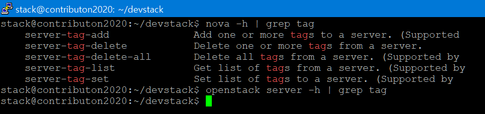

============================================================================
[이슈] Support_nova_server_tags
============================================================================
-------------------------------
이슈 설명
-------------------------------
`StoryBoard Link <https://storyboard.openstack.org/#!/story/2007057>`_

* novaclient에는 서버 태그 기능이 존재하나, openstack client에는 존재하지 않는다는 이슈
* 기존에 분산되어있던 명령어를 openstack client로 통합하는 과정에서 이전되지 않은 기능들이 존재한다.

-------------------------------
이슈 재현
-------------------------------

* 확인 결과, openstack client에서는 image tag에 대한 지원이 정말 빈약하다. 

-------------------------------
이슈 분석
-------------------------------
* nova client의 코드를 분석 후, openstack client에 맞추어 이식해야 할 것으로 추정된다.
