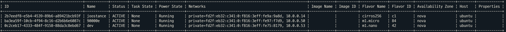
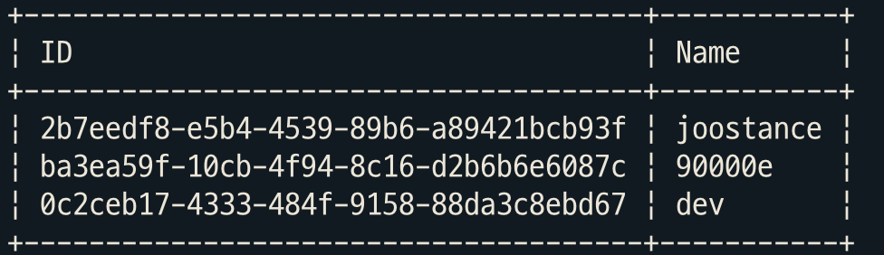

=============
첫 번째 Issue
=============

`OpenStack CLI - Add a few selectable fields to the “openstack server
list” output <https://storyboard.openstack.org/#!/story/2007925>`__

Issue 소개
----------

본 Issue는 ``openstack server list -c ""`` 명령어 사용시 더 많은 필드를
선택할 수 있도록 구현하는 Issue입니다.

재현 방법
---------

.. code:: shell

   $ openstack server list

.. figure:: images/openstack-server-list.png
   :alt: openstack-server-list

   openstack-server-list

.. code:: shell

   $ openstack server list --long

   openstack-server-list—long

-c 옵션
~~~~~~~

.. code:: shell

   $ openstack server list -c ID -c Name

   openstack-server-list–c-ID–c-Name

이 문제를 해결하기 위한 배경 지식
---------------------------------

1. ``openstack server list`` 의 column 정보는 어디에 있는가
2. ``openstack server list`` 의 output인 Table은 어떻게 출력되는가
3. ``openstack server list -c ""`` 은 어떻게 동작하는가

수정해야 할 코드는 무엇인가
---------------------------

1. ``openstack server list -c ""`` 명령어 실행 시에 더 많은 column을
   선택할 수 있어야 합니다.
2. ``openstack server list -c "C1,C2,C3"`` 등 ‘,’ 를 사용하여 multiple
   column을 선택할 수 있어야 합니다.

어떻게 접근해야 할까..
----------------------

1. ``openstack server list -c ""`` 명령어 실행 시에 선택할 수 있는 Column이 제한되어 있습니다.

``openstack server list`` , ``openstack server list --long`` 명령어를
통해 출력되는 table의 column만 선택할 수 있습니다. table로 출력되는
column과 선택할 수 있는 column을 분리하여 다양한 column을 선택할 수
있도록 할 예정입니다.

2. ``openstack server list -c "C1,C2,C3"`` 명령어 실행 시에 Error가 발생합니다.

Multiple Column 선택을 위해서는
``openstack server list -c C1 -c C2 -c C3`` 으로 선택해야합니다. Code
Flow를 trace 해서 선택된 column이 출력되는 부분을 찾아야 합니다.
