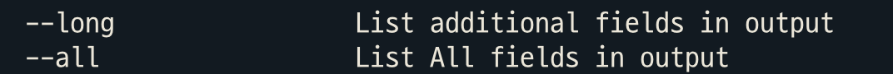
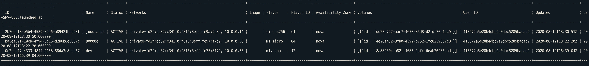
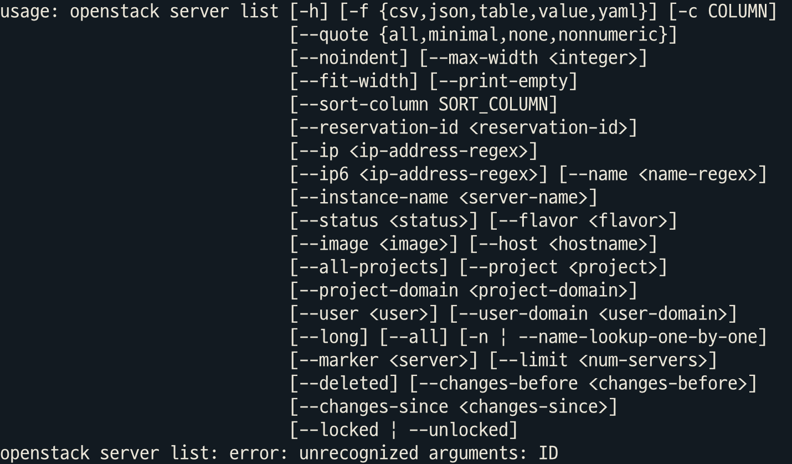
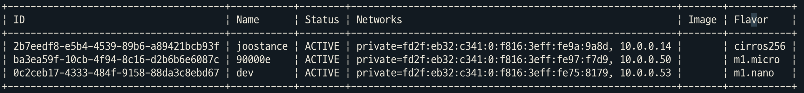
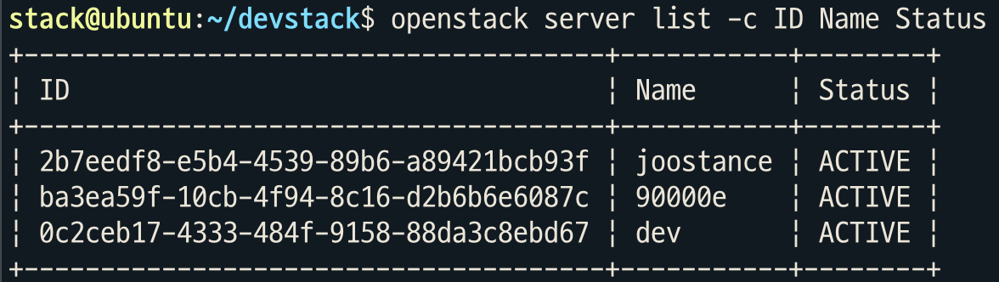

=================================
openstack server list 명령어 분석
=================================

optional argument 추가
----------------------

   ``--all`` : 검색할 수 있는 모든 파라미터

   h-option

.. code:: python

   # Class ListServer :
   #       def get_parser():

               parser.add_argument(
               '--all',
               action='store_true',
               default=False,
               help=_('List All fields in output'),
           )

.. code:: python

   # Class ListServer :
   # def take_action() :

   elif parsed_args.all:
               if parsed_args.no_name_lookup:
                   columns = (
                       'ID',
                       'Name',
                       'Status',
                       'Networks',
                       'Image ID',
                       'Flavor ID',
                       'OS-EXT-AZ:availability_zone',
                       'os-extended-volumes:volumes_attached',
                       'user_id',
                       'updated',
                       'OS-SRV-USG:launched_at',
                   )
               else:
                   columns = (
                       'ID',
                       'Name',
                       'Status',
                       'Networks',
                       'Image Name',
                       'Flavor Name',
                       'Flavor ID',
                       'OS-EXT-AZ:availability_zone',
                       'os-extended-volumes:volumes_attached',
                       'user_id',
                       'updated',
                       'OS-SRV-USG:launched_at',
                   )
               column_headers = (
                   'ID',
                   'Name',
                   'Status',
                   'Networks',
                   'Image',
                   'Flavor',
                   'Flavor ID',
                   'Availability Zone',
                   'Volumes',
                   'User ID',
                   'Updated',
                   'OS-SRV-USG:launched_at',
               )
               mixed_case_fields = [
                   'OS-EXT-AZ:availability_zone',
                   'OS-SRV-USG:launched_at',
               ]

**Ouput**

   openstack-server-list—all

Issue 1
-------

*-c 옵션으로는 한 개의 column 밖에 볼 수가 없다.*

.. code:: shell

   $ openstack server list -c Name ID

   openstack-server-list–c-Name,ID

..

   .. rubric:: Feedback
      :name: feedback

   옵션 ``-c`` 를 연속해서 입력하면 다수의 column을 선택할 수 있다.

   .. code:: shell

      $ openstack server list -c ID -c Name

   .. figure:: images/openstack-server-list--c-ID--c-Name.png
      :alt: openstack-server-list–c-ID–c-Name

      openstack-server-list–c-ID–c-Name

Issue 2
-------

``optional argument``\ 에 ``all`` 을 추가 후 ``-c`` 옵션이 없으면 많은
column의 table이 출력

   .. rubric:: Feedback
      :name: feedback-1

   ``optional argument``\ 에 ``--long`` 과 ``--all`` 이 있으면
   사용자에게 혼란을 줍니다. ``--all`` 옵션은 제거하는 것이 좋을 것
   같습니다.

Trace
-----

Code의 부분만 발췌하였습니다. 전체 코드가 아님을 알려드립니다.

.. code:: shell

   $ openstack server list -c Name

Output 출력
~~~~~~~~~~~

output으로 Table이 출력되는 흐름을 trace 했습니다.

.. code:: python

   # /cliff/app.py
   # full_name : 'openstack server list'
   cmd_parser = cmd.get_parser(full_name)
   parsed_args = cmd_parser.parse_args(sub_argv)
   result = cmd.run(parsed_args)

cmd_parser.parse_args
^^^^^^^^^^^^^^^^^^^^^

.. code:: python

   # openstack server list -c Name
   # columns에서 'Name' 추가됨

   # parsed_args :
   Namespace(all=False, all_projects=False, changes_before=None, changes_since=None, columns=['Name'], deleted=False, fit_width=False, flavor=None, formatter='table', host=None, image=None, instance_name=None, ip=None, ip6=None, limit=None, locked=False, long=False, marker=None, max_width=0, name=None, name_lookup_one_by_one=False, no_name_lookup=False, noindent=False, print_empty=False, project=None, project_domain=None, quote_mode='nonnumeric', reservation_id=None, sort_columns=[], status=None, unlocked=False, user=None, user_domain=None)

cmd.run(parsed_args)
^^^^^^^^^^^^^^^^^^^^

.. code:: shell

   # /osc_lib/command/command.py

   class Command(command.Command):

       def run(self, parsed_args):
           print("args : ",parsed_args.__class__)
           self.log.debug('run(%s)', parsed_args)
           return super(Command, self).run(parsed_args)

.. code:: python

   # super(Command, self).run(parsed_args) 
   #    -> /cliff/display.py

   def run(self, parsed_args):
     parsed_args = self._run_before_hooks(parsed_args)
     self.formatter = self._formatter_plugins[parsed_args.formatter].obj
     column_names, data = self.take_action(parsed_args)
     column_names, data = self._run_after_hooks(parsed_args,
                                                (column_names, data))
     self.produce_output(parsed_args, column_names, data)
     return 0

**column_names, data = self.take_action(parsed_args) 결과**

.. code:: shell

   # openstackclient/compute/v2/server.py 의 Output
   # (('ID', 'Name', 'Status', 'Networks', 'Image', 'Flavor'), <generator object ListServer.take_action.<locals>.<genexpr> at 0x7fc885014ba0>)

   (Pdb) p column_names
   ('ID', 'Name', 'Status', 'Networks', 'Image', 'Flavor')
   (Pdb) p data
   <generator object ListServer.take_action.<locals>.<genexpr> at 0x7fbe731c4d00>

produce_output
''''''''''''''

.. code:: python

   # super(Command, self).run(parsed_args) 
   #    -> /cliff/lister.py

               def produce_output(self, parsed_args, column_names, data):
           if parsed_args.sort_columns and self.need_sort_by_cliff:
               indexes = [column_names.index(c) for c in parsed_args.sort_columns
                          if c in column_names]
               if indexes:
                   data = sorted(data, key=operator.itemgetter(*indexes))
           (columns_to_include, selector) = self._generate_columns_and_selector(
               parsed_args, column_names)
           if selector:
               # Generator expression to only return the parts of a row
               # of data that the user has expressed interest in
               # seeing. We have to convert the compress() output to a
               # list so the table formatter can ask for its length.
               data = (list(self._compress_iterable(row, selector))
                       for row in data)
           self.formatter.emit_list(columns_to_include,
                                    data,
                                    self.app.stdout,
                                    parsed_args,
                                    )
           return 0

::

   (Pdb) p columns_to_include
   ['Name']
   (Pdb) p selector
   [False, True, False, False, False, False]

   openstack-server-list

selector 변수에는 ``openstack server list`` 명령어 실행 시 출력되는
column들이 순서대로 매칭되어 있습니다.

저는 ``-c Name`` 옵션을 추가했기 때문에 Name 외의 다른 column들은
False로 되어있는 것을 볼 수 있습니다.

formatter.emit_list
                   

.. code:: python

       def emit_list(self, column_names, data, stdout, parsed_args):
           x = prettytable.PrettyTable(
               column_names,
               print_empty=parsed_args.print_empty,
           )
           x.padding_width = 1

           # Add rows if data is provided
           if data:
               self.add_rows(x, column_names, data)

           # Choose a reasonable min_width to better handle many columns on a
           # narrow console. The table will overflow the console width in
           # preference to wrapping columns smaller than 8 characters.
           min_width = 8
           self._assign_max_widths(
               stdout, x, int(parsed_args.max_width), min_width,
               parsed_args.fit_width)

           formatted = x.get_string()
           stdout.write(formatted)
           stdout.write('\n')
           return

**input parameter**

.. code:: shell

   (Pdb) p column_names
   ['Name']
   (Pdb) p data
   <generator object Lister.produce_output.<locals>.<genexpr> at 0x7fbe73159048>
   (Pdb) p stdout
   <_io.TextIOWrapper name='<stdout>' mode='w' encoding='UTF-8'>
   (Pdb) p parsed_args
   Namespace(all=False, all_projects=False, changes_before=None, changes_since=None, columns=['Name'], deleted=False, fit_width=False, flavor=None, formatter='table', host=None, image=None, instance_name=None, ip=None, ip6=None, limit=None, locked=False, long=False, marker=None, max_width=0, name=None, name_lookup_one_by_one=False, no_name_lookup=False, noindent=False, print_empty=False, project=None, project_domain=None, quote_mode='nonnumeric', reservation_id=None, sort_columns=[], status=None, unlocked=False, user=None, user_domain=None)
   (Pdb) n

``prettyTable.PrettyTable`` 명령으로 해당 column_names에 대한 Table이
생성이 되고 ``x.get_string()`` 으로 string 형태의 표가 출력됩니다.

.. code:: shell

   (Pdb) p formatted
   '+-----------+\n| Name      |\n+-----------+\n| joostance |\n| 90000e    |\n| dev       |\n+-----------+'

-C 옵션 Trace
~~~~~~~~~~~~~

``-c`` 옵션이 주어졌을 때 ``parsed_args`` 에 값이 어떻게 들어오는지
trace 해봤습니다.

::

   # /cliff/app.py
   # full_name : 'openstack server list'
   cmd_parser = cmd.get_parser(full_name)
   parsed_args = cmd_parser.parse_args(sub_argv)
   result = cmd.run(parsed_args)

cmd_parser.parse_args(sub_argv)
^^^^^^^^^^^^^^^^^^^^^^^^^^^^^^^

.. code:: python

   # /usr/lib/python3.6/argparse.py
   # sub_argv (args) : ['-c', 'Name']
           # =====================================
       # Command line argument parsing methods
       # =====================================
       def parse_args(self, args=None, namespace=None):
           args, argv = self.parse_known_args(args, namespace)
           if argv:
               msg = _('unrecognized arguments: %s')
               self.error(msg % ' '.join(argv))
           return args

self.parse_known_args(args, namespace)
''''''''''''''''''''''''''''''''''''''

.. code:: python

       def parse_known_args(self, args=None, namespace=None):
           # args default to the system args
           if args is None:
               args = _sys.argv[1:]

           # default Namespace built from parser defaults
           if namespace is None:
               namespace = Namespace()

           # add any action defaults that aren't present
           for action in self._actions:
               if action.dest is not SUPPRESS:
                   if not hasattr(namespace, action.dest):
                       if action.default is not SUPPRESS:
                           setattr(namespace, action.dest, action.default)

for 문에서 namespace 값을 setting합니다.

.. code:: shell

   (Pdb) p namespace
   Namespace(all=False, all_projects=False, changes_before=None, changes_since=None, columns=[], deleted=False, fit_width=False, flavor=None, formatter='table', host=None, image=None, instance_name=None, ip=None, ip6=None, limit=None, locked=False, long=False, marker=None, max_width=0, name=None, name_lookup_one_by_one=False, no_name_lookup=False, noindent=False, print_empty=False, project=None, project_domain=None, quote_mode='nonnumeric', reservation_id=None, sort_columns=[], status=None, unlocked=False, user=None, user_domain=None)

이어서 parse_known_args…

.. code:: python

           # parse the arguments and exit if there are any errors
           try:
               namespace, args = self._parse_known_args(args, namespace)
               return namespace, args

.. code:: shell

   (Pdb) p namespace
   Namespace(all=False, all_projects=False, changes_before=None, changes_since=None, columns=['Name'], deleted=False, fit_width=False, flavor=None, formatter='table', host=None, image=None, instance_name=None, ip=None, ip6=None, limit=None, locked=False, long=False, marker=None, max_width=0, name=None, name_lookup_one_by_one=False, no_name_lookup=False, noindent=False, print_empty=False, project=None, project_domain=None, quote_mode='nonnumeric', reservation_id=None, sort_columns=[], status=None, unlocked=False, user=None, user_domain=None)

\**_parse_known_args*\* 메소드 호출 후 ``namespace`` 의 ``columns`` 가
변화되었습니다. ``-c Name`` 의 ``Name`` 이 리스트에 추가되었습니다.

해당 ``namespace`` 는 ``parsed_args = cmd_parser.parse_args(sub_argv)``
로 리턴됩니다.

\*\* 좀 더 들어가 볼까요?

\**_parse_known_args*\*

.. code:: python

       def _parse_known_args(self, arg_strings, namespace):
           # replace arg strings that are file references
           if self.fromfile_prefix_chars is not None:
               arg_strings = self._read_args_from_files(arg_strings)

           # find all option indices, and determine the arg_string_pattern
           # which has an 'O' if there is an option at an index,
           # an 'A' if there is an argument, or a '-' if there is a '--'
           option_string_indices = {}
           arg_string_pattern_parts = []
           arg_strings_iter = iter(arg_strings)
           for i, arg_string in enumerate(arg_strings_iter):

               # all args after -- are non-options
               if arg_string == '--':
                   arg_string_pattern_parts.append('-')
                   for arg_string in arg_strings_iter:
                       arg_string_pattern_parts.append('A')

               # otherwise, add the arg to the arg strings
               # and note the index if it was an option
               else:
                   option_tuple = self._parse_optional(arg_string)
                   if option_tuple is None:
                       pattern = 'A'
                   else:
                       option_string_indices[i] = option_tuple
                       pattern = 'O'
                   arg_string_pattern_parts.append(pattern)

           # join the pieces together to form the pattern
           arg_strings_pattern = ''.join(arg_string_pattern_parts)

           # converts arg strings to the appropriate and then takes the action
           seen_actions = set()
           seen_non_default_actions = set()

.. code:: shell

   (Pdb) p arg_strings
   ['-c', 'Name']
   (Pdb) p arg_string_pattern_parts
   ['O', 'A']
   (Pdb) p arg_strings_pattern
   'OA'

``-옵션`` 은 ‘O’ , ``parameter`` 는 ‘A’ 로 바꿔서
``arg_strings_pattern`` 에 저장됩니다.

.. raw:: html

   

.. raw:: html

   

[더보기]

.. raw:: html

   

.. raw:: html

   <h5>

IF ``openstack server list -c ID Name``

.. raw:: html

   </h5>

.. raw:: html

   <pre>
   (Pdb) p arg_string
   '-c'
   (Pdb) p option_tuple
   (_AppendAction(option_strings=['-c', '--column'], dest='columns', nargs=None, const=None, default=[], type=None, choices=None, help='specify the column(s) to include, can be repeated to show multiple columns', metavar='COLUMN'), '-c', None)
   (Pdb) n
   > /usr/lib/python3.6/argparse.py(1821)_parse_known_args()
   -> pattern = 'O'
    
   (Pdb) p arg_string
   'ID'
   (Pdb) p option_tuple
   None
   (Pdb) n
   > /usr/lib/python3.6/argparse.py(1818)_parse_known_args()
   > -> pattern = 'A'
    
   (Pdb) p arg_string
   'Name'
   (Pdb) p option_tuple
   None
   (Pdb) n
   > /usr/lib/python3.6/argparse.py(1818)_parse_known_args()
   > -> pattern = 'A'
   (Pdb) p arg_strings_pattern
   'OAA'
   </pre>

.. raw:: html

   

.. raw:: html

   

Issue 1 - 구현
--------------

1) arg_strings_pattern에서 OA, OAOA 뿐 아니라 OAA, OAAA … 도 인식하도록 구현

현재에는 ``-c`` 옵션 사용 시 O 뒤에 하나의 A만 인식하여 Namespace의
column에 넣도록 되어 있습니다.

명령어 ``openstack server list -c ID Name`` 를 실행하면
``arg_strings_pattern`` 이 ‘OAA’ 가 됩니다.

.. code:: python

   # /usr/lib/python3.6/argparse.py(1788)_parse_known_args()

   1915                        start = start_index + 1
   1916                        selected_patterns = arg_strings_pattern[start:]
   1917                        arg_count = match_argument(action, selected_patterns)
   1918                        stop = start + arg_count
   1919                        args = arg_strings[start:stop]
   1920                        action_tuples.append((action, args, option_string))
   1921                        break

.. code:: python

   # /usr/lib/python3.6/argparse.py(1788)_match_argument()

   2065        def _match_argument(self, action, arg_strings_pattern):
   2066            # match the pattern for this action to the arg strings
   2067 ->         nargs_pattern = self._get_nargs_pattern(action)
   2068            match = _re.match(nargs_pattern, arg_strings_pattern)

.. code:: python

       def _get_nargs_pattern(self, action):
           # in all examples below, we have to allow for '--' args
           # which are represented as '-' in the pattern
           nargs = action.nargs

           # the default (None) is assumed to be a single argument
           if nargs is None:
               nargs_pattern = '(-*A-*)'

           # allow zero or one arguments
           elif nargs == OPTIONAL:
               nargs_pattern = '(-*A?-*)'

           # allow zero or more arguments
           elif nargs == ZERO_OR_MORE:
               nargs_pattern = '(-*[A-]*)'

기존에서는 ``action.nargs`` 가 ``None`` 으로 설정이 되어서
nargs_pattern이 ``(-*A-*)`` 가 되었습니다.

그래서 ``arg_strings_pattern`` 에서 하나의 ‘O’ 는 하나의 ‘A’ 만
인식하였던 것입니다.

.. code:: python

   class _AppendAction(Action):
       def __init__(self,
                    option_strings,
                    dest,
                    nargs=ZERO_OR_MORE,
                    const=None,
                    default=None,
                    type=None,
                    choices=None,
                    required=False,
                    help=None,
                    metavar=None):

``_AppendAction`` 클래스의 ``nargs`` 변수를 ``None`` 에서
``ZERO_OR_MORE ('*')`` 로 변경합니다. 이렇게 함으로써 ‘OAA’ , ‘OAAA’ 등
하나의 ‘O’ 가 다수의 ‘A’ 를 인식할 수 있도록 하였습니다.

``_get_nargs_pattern`` 함수에서 ``action.nargs`` 가 ``ZERO_OR_MORE``
이기 때문에 최종적인 ``nargs_pattern`` 이 ``'([A]*)`` 가 됩니다.

.. raw:: html

   

.. raw:: html

   

[더보기]

.. raw:: html

   

.. raw:: html

   <h5>

nargs_pattern과 arg_strings_pattern의 매칭

.. raw:: html

   </h5>

.. raw:: html

   <pre>
   > /usr/lib/python3.6/argparse.py(2071)_match_argument()
   -> if match is None:
   (Pdb) l
   2066            # match the pattern for this action to the arg strings
   2067            nargs_pattern = self._get_nargs_pattern(action)
   2068            match = _re.match(nargs_pattern, arg_strings_pattern
   </pre>

.. raw:: html

   <pre>
   > /usr/lib/python3.6/re.py(169)match()
   -> def match(pattern, string, flags=0):
   (Pdb) l
   164     error = sre_compile.error
   165
   166     # --------------------------------------------------------------------
   167     # public interface
   168
   169  -> def match(pattern, string, flags=0):
   170         """Try to apply the pattern at the start of the string, returning
   171         a match object, or None if no match was found."""
   172         return _compile(pattern, flags).match(string)
   </pre>

.. raw:: html

   <pre>
   (Pdb) p pattern
   '([A]*)'
   (Pdb) p string
   'AA'
   (Pdb) p match
   <_sre.SRE_Match object; span=(0, 2), match='AA'>
     </pre>

.. raw:: html

   

.. raw:: html

   

2) Namespace의 columns에 리스트로 들어가는 오류 해결

**문제**

.. code:: shell

   $ openstack server list -c ID Name
   No recognized column names in [['ID', 'Name']]. Recognized columns are ('ID', 'Name', ...).

``parse_known_args`` 함수에서 Namespace의 columns 값에 [‘ID’, ‘Name’] 이
들어가 있어서 이런 오류가 발생하였습니다.

.. code:: python

   Namespace(all_projects=False, changes_before=None, changes_since=None, columns=[['ID', 'Name']], deleted=False, fit_width=False, flavor=None, formatter='table', host=None, image=None, instance_name=None, ip=None, ip6=None, limit=None, locked=False, long=False, marker=None, max_width=0, name=None, name_lookup_one_by_one=False, no_name_lookup=False, noindent=False, print_empty=False, project=None, project_domain=None, quote_mode='nonnumeric', reservation_id=None, sort_columns=[], status=None, unlocked=False, user=None, user_domain=None)

**해결**

.. code:: python

   class _AppendAction(Action):
       def __call__(self, parser, namespace, values, option_string=None):
           items = _copy.copy(_ensure_value(namespace, self.dest, []))
           # items.append(values)
           for value in values:
               items.append(value)
           setattr(namespace, self.dest, items)

.. code:: shell

   (Pdb) p values
   ['ID', 'Name']

기존에는 ``_AppendAction`` 클래스의 nargs가 ``None`` 이였기 때문에
values가 문자열이였습니다.

하지만 nargs를 ``ZERO_OR_MORE`` 로 수정했기 때문에 values에 리스트가
됩니다.

그래서 리스트를 순회하여 요소들을 items에 넣어줘 해당 오류를
해결하였습니다.

3) 결론

   openstack-server-list-multi-column-by-one-opt

Issue 2 - 구현
--------------

멘토님의 피드백대로 ``--all`` 옵션은 삭제하였습니다.

``-c`` 옵션으로 column을 선택할 때, column은 출력되는 column 중에서
선택해야만 합니다. 하지만 본 이슈는 ``-c`` 옵션을 통해 더 많은 column을
선택할 수 있어야 합니다. 그래서 ``-c`` 옵션이 없을 때에는 기존과 같이
동작을 하고, ``-c`` 옵션이 있다면 모든 출력할 수 있는 정보를 column과
column_headers에 저장하도록 구현했습니다. 이를 통해 ``-c`` 옵션으로
선택할 수 있는 column의 수를 늘렸습니다.

.. code:: python

   columns = (
                   'ID',
                   'Name',
                   'Status',
                   'Networks',
                   'Image Name',
                   'Flavor Name',
                   'Flavor ID',
                   'OS-DCF:diskConfig',
                   'OS-EXT-AZ:availability_zone',
                   'OS-EXT-SRV-ATTR:host',
                   'OS-EXT-SRV-ATTR:hypervisor_hostname',
                   'OS-EXT-SRV-ATTR:instance_name', 
                   'OS-EXT-STS:power_state', 
                   'OS-EXT-STS:task_state', 
                   'OS-EXT-STS:vm_state', 
                   'OS-SRV-USG:launched_at', 
                   'OS-SRV-USG:terminated_at',
                   'user_id',
                   'project_id',
                   'accessIPv4',
                   'accessIPv6',
                   'config_drive',
                   'created',
                   'hostId',
                   'key_name',
                   'progress',
                   'security_groups',
                   'status',
                   'updated',
                   'os-extended-volumes:volumes_attached',
                   'properties',
               )
               column_headers = (
                   'ID',
                   'Name',
                   'Status',
                   'Networks',
                   'Image',
                   'Flavor',
                   'Flavor ID',
                   'Disk Config',
                   'Availability Zone',
                   'Host',
                   'Hypervisor Hostname',
                   'Instance Name', 
                   'Power State', 
                   'Task State', 
                   'Vm State', 
                   'Launched At', 
                   'Terminated At',
                   'User ID',
                   'Project ID',
                   'AccessIPv4',
                   'AccessIPv6',
                   'Config Drive',
                   'Created',
                   'Host ID',
                   'Key Name',
                   'Progress',
                   'Security Groups',
                   'Status',
                   'Updated',
                   'Volumes',
                   'Properties',
               )
               mixed_case_fields = [
                   'OS-DCF:diskConfig',
                   'OS-EXT-AZ:availability_zone',
                   'OS-EXT-SRV-ATTR:host',
                   'OS-EXT-SRV-ATTR:hypervisor_hostname',
                   'OS-EXT-SRV-ATTR:instance_name', 
                   'OS-EXT-STS:power_state', 
                   'OS-EXT-STS:task_state', 
                   'OS-EXT-STS:vm_state', 
                   'OS-SRV-USG:launched_at', 
                   'OS-SRV-USG:terminated_at',
               ]

``-c`` 옵션으로 선택할 수 있는 column은
``openstack server show [instanceName]`` 로 출력되는 정보와 동일합니다.

Project ID, Properties의 정보는 어디에?
~~~~~~~~~~~~~~~~~~~~~~~~~~~~~~~~~~~~~~~

``openstack server list`` 을 실행하면 ``ListServer`` 클래스의
``take_action`` 메소드가 실행이 되고, server들의 정보를 가져옵니다. 이
부분을 살펴보겠습니다.

.. code:: python

   class ListServer(command.Lister):
       def take_action(self, parsed_args):
               data = compute_client.servers.list(search_opts=search_opts,
                                              marker=marker_id,
                                              limit=parsed_args.limit)

``compute_client.servers.list`` 를 통해 server들의 정보를 가져옵니다.
``dir()`` 내장 함수는 어떤 객체를 인자로 넣어주면 해당 객체가 어떤
변수와 메소드를 가지고 있는지 나열해줍니다.
`참고 <https://wikidocs.net/10307>`__

아래에서는 필요한 data 외는 삭제하여 포스팅하였습니다.

.. code:: shell

   (Pdb) p data
   [<Server: joostance>, <Server: 90000e>, <Server: dev>]
   (Pdb) p data[0].__class__
   <class 'novaclient.v2.servers.Server'>
   (Pdb) p dir(data[0])
   ['HUMAN_ID', 'NAME_ATTR', 'OS-DCF:diskConfig', 'OS-EXT-AZ:availability_zone', 'OS-EXT-SRV-ATTR:host', 'OS-EXT-SRV-ATTR:hypervisor_hostname', 'OS-EXT-SRV-ATTR:instance_name', 'OS-EXT-STS:power_state', 'OS-EXT-STS:task_state', 'OS-EXT-STS:vm_state', 'OS-SRV-USG:launched_at', 'OS-SRV-USG:terminated_at','accessIPv4', 'accessIPv6','addresses', 'api_version', 'config_drive', 'created', 'flavor', 'hostId', 'human_id', 'id', 'image', 'key_name',  'name', 'networks', 'os-extended-volumes:volumes_attached', 'progress', 'request_ids', 'security_groups', 'tag_list', 'tenant_id', 'updated', 'user_id', 'x_openstack_request_ids']

``compute_client.servers.list`` 를 통해 가져온 server의 정보는
``novaclient.v2.servers.Server`` 클래스인 것을 알 수 있고, dir() 함수를
통해 변수들을 볼 수 있습니다. 하지만 해당 객체에는 ``project_id`` 나
``properties`` 정보는 가지고 있지 않습니다.

``openstack server show [instanceName]`` 명령어에서는 ``project_id`` 나
``properties`` 도 확인 할 수 있으므로, 해당 명령어에서는 해당 data를
어떻게 가져오는지 알아봤습니다.

``openstack server show [instanceName]`` 명령어는 ``ShowServer`` 의
``take_action`` 메소드를 사용하여 server의 data를 가져옵니다.

.. code:: python

   class ShowServer(command.ShowOne):
       def take_action(self, parsed_args):
           compute_client = self.app.client_manager.compute
           server = utils.find_resource(compute_client.servers,
                                        parsed_args.server)

           if parsed_args.diagnostics:
               (resp, data) = server.diagnostics()
               if not resp.status_code == 200:
                   self.app.stderr.write(_(
                       "Error retrieving diagnostics data\n"
                   ))
                   return ({}, {})
           else:
               data = _prep_server_detail(compute_client,
                                          self.app.client_manager.image, server,
                                          refresh=False)

           return zip(*sorted(data.items()))

``openstack server show dev`` 명령어를 실행한 뒤 data를 출력한
모습입니다. 해당 data에는 ``project_id`` 와 ``properties`` 가
존재합니다.

.. code:: shell

   (Pdb) p data
   {'id': '0c2ceb17-4333-484f-9158-88da3c8ebd67', 'name': 'dev', 'status': 'ACTIVE', 'user_id': '413672a5e28b4dbb9a0dbc5285bacac9', 'hostId': '4f15df15234d5425e5f82d3402c3dcbb92348c531adce1cf080273ca', 'image': '', 'flavor': 'm1.nano (42)', 'created': '2020-08-12T16:38:49Z', 'updated': '2020-08-12T16:39:04Z', 'addresses': 'private=fd2f:eb32:c341:0:f816:3eff:fe75:8179, 10.0.0.53', 'accessIPv4': '', 'accessIPv6': '', 'OS-DCF:diskConfig': 'AUTO', 'progress': 0, 'OS-EXT-AZ:availability_zone': 'nova', 'config_drive': '', 'key_name': None, 'OS-SRV-USG:launched_at': '2020-08-12T16:39:04.000000', 'OS-SRV-USG:terminated_at': None, 'OS-EXT-SRV-ATTR:host': 'ubuntu', 'OS-EXT-SRV-ATTR:instance_name': 'instance-00000001', 'OS-EXT-SRV-ATTR:hypervisor_hostname': 'ubuntu', 'OS-EXT-STS:task_state': None, 'OS-EXT-STS:vm_state': 'active', 'OS-EXT-STS:power_state': 'Running', 'volumes_attached': "id='8a88230c-a821-4685-9afc-6eab20286ebd'", 'security_groups': "name='default'", 'properties': '', 'project_id': '4e37ed3493c24ba18dd7844c5e925bfb'}

이를 통해 ``_prep_server_detail`` 메소드를 통해 ``project_id`` 와
``properties`` 를 가져올 수 있는 것을 알았습니다.

그래서 ``ListServer`` 의 ``take_action`` 메소드에서 server들의 data를
가져올 때, ``_prep_server_detail`` 메소드를 통해 ``project_id`` 와
``properties`` 를 가져오도록 구현하였습니다.

.. code:: python

    # class ListServer 의 def take_action       
               for s in data:
               more_data = _prep_server_detail(compute_client,
                                          image_client, s,
                                          refresh=False)
               s.project_id = more_data["project_id"]
               s.properties = more_data["properties"]

.. _결론-1:

결론
~~~~

.. figure:: images/openstack-server-list--c-ID-Name-Project_id-Launched_at.png
   :alt: openstack-server-list–c-ID-Name-Project_id-Launched_at

   openstack-server-list–c-ID-Name-Project_id-Launched_at
