===========================
Create_instance_on_devstack
===========================

#01. 네트워크 토폴로지
----------------------

좌측 프로젝트바의 네트워크>네트워크 토폴로지를 클릭합니다.

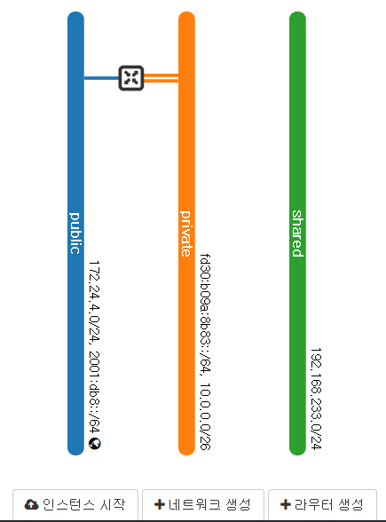

devstack은 demo 프로젝트에 총 3개의 네트워크를 미리 만들어줍니다.

#001.public
~~~~~~~~~~~~
* 인터넷과 연결할 수 있는 네트워크 입니다. 지구본 모양이 있으면 인터넷과 연결이 가능합니다.
* 인스턴스가 직접 연결하는 네트워크 대역이 아닌, floating ip 나 router에 할당하는 아이피입니다.

#002.private
~~~~~~~~~~~~
* demo project만의 가상 네트워크입니다.
* 기본적으로 라우터에 연결되어있어서, 인터넷 통신이 가능한 환경입니다.

#003.shared
~~~~~~~~~~~
* private와 마찬가지로 demo project만의 가상 네트워크입니다.
* 차이점은 public 네트워크와 연결되어있지 않습니다. 폐쇄망입니다.

#02. 인스턴스 생성
------------------
프로젝트 바의 인스턴스를 클릭합니다.

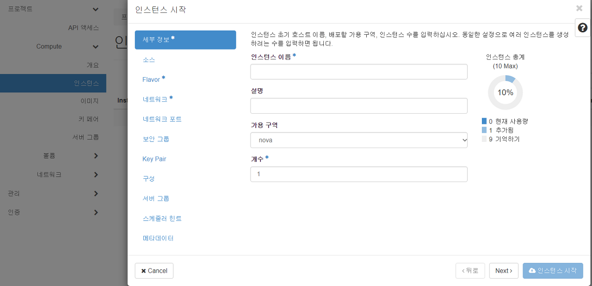

* 소스 : OS를 선택합니다. 오픈스택은 Cirros라는 기본 OS가 있습니다. 다른 OS를 설치하고 싶으면 이미지 배포판을 준비하면 됩니다. 이것은 Glance에 올라갑니다.
* Flavor : HW사양 (CPU/RAM/SSD)를 선택합니다
* 네트워크 : 네트워크 토폴로지의 어느 망과 연결할지 선택합니다.
* Key : SSH 공개키를 생성합니다
* 인스턴스 생성버튼을 누릅니다.

* 인스턴스 생성과정이 cafe24의 가상서버(vm) 생성과정과 동일합니다.

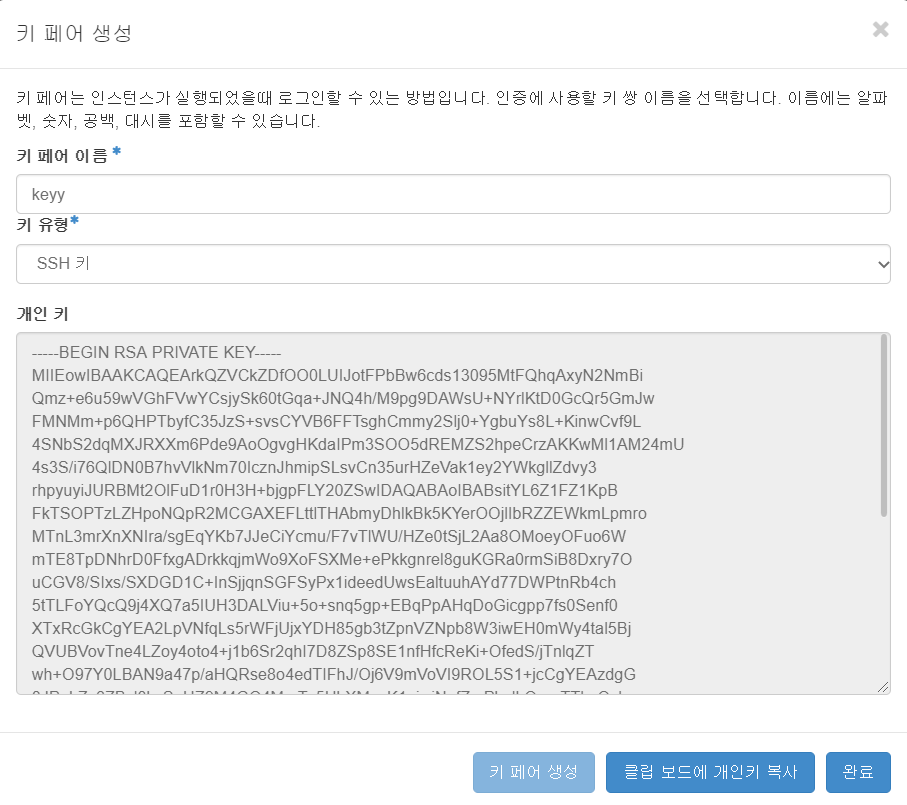

* 생성한 개인키를 복사하여 Devstack 서버에 저장해줍니다.

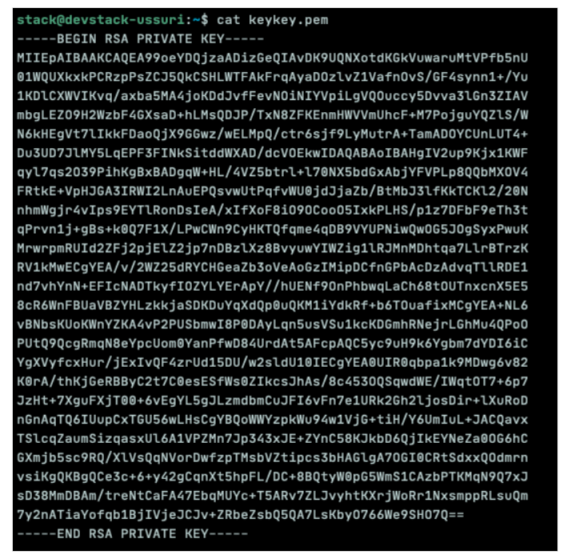

* pem키를 이용해서 접속하기 위해서는 권한 설정이 필요합니다.

.. code-block:: none

   $ chmod 600 keykey.pem
   
* 콘솔 로그를 통해 생성된 인스턴스가 CLI(시리얼)에서 어떻게 동작하고 있는지 볼 수 있습니다.

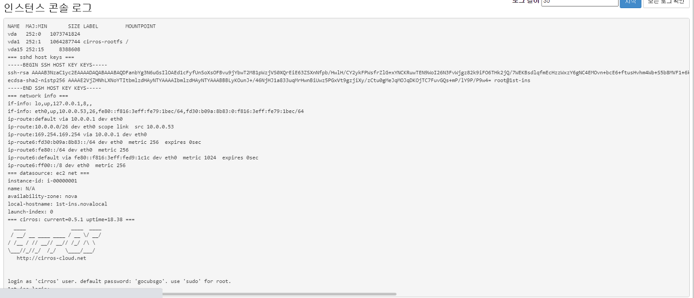

* cafe24의 대쉬보드에서 VM에 22port로 Console로 접속했던 것 처럼 DevStack VM안의 VM Instance에 Console로 접속해봅니다

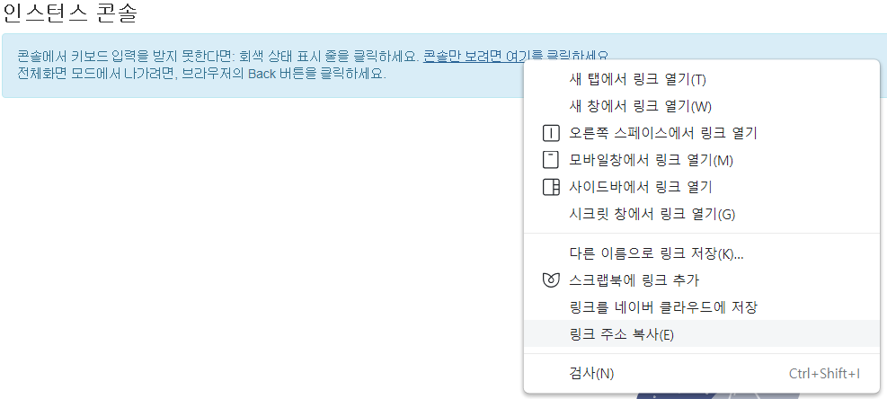

* 기본적으로 열리는 주소가 사설주소이기 때문에 아이피를 vm의 공인 IP(DevStack의 IP)로 변경합니다.
* http:\/\/(**vm 의 공인 IP**):6080/vnc_lite.html?path=%3Ftoken%3D401a7596-fd37-4cce-8315-2c355275fadf&title=test(baad8346-1541-4f12-a7f3-a41681398679)

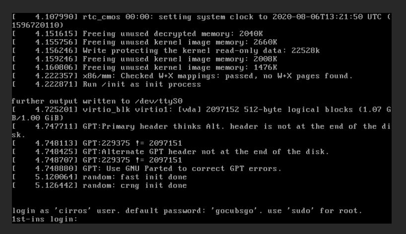

이번에는 
* 공인 IP 변경을 위해 아래와 같이 Floating IP를 할당해줍니다.
* 생성한 가상 환경을 담당하는 OpenStack의 VM이 Floating IP를 Matching 시켜줍니다.

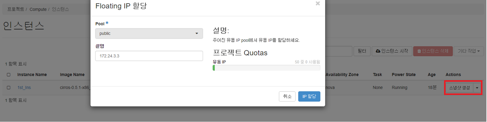

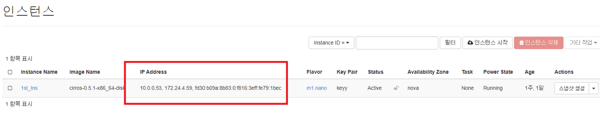

* IP대역에 공인IP와 사설IP가 보이면 성공입니다.
* 마찬가지로, 접속하기전 방화벽(F/W)에서 SSH port(22)를 열어주어야 합니다.

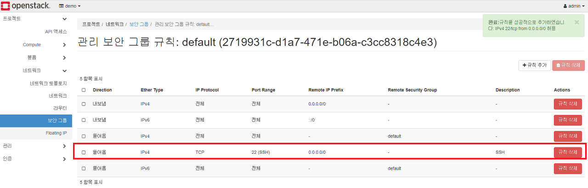

추가한 다음 devstack VM Console(카페24 호스팅 된 가상서버-Ubuntu)에서
devstack VM 위에 설치한 OpenStack VM(Cirros OS)에 접속을 시도합니다.

.. code-block:: none

   ubuntu@devstack-ussuri:~$ ssh cirros@172.24.4.3
   The authenticity of host '172.24.4.3 (172.24.4.3)' can't be established.
   ECDSA key fingerprint is SHA256:U7azykVg/zGNVKHPloX1mXoLUUUjuoz81q5RgLtDkaw.
   Are you sure you want to continue connecting (yes/no)? yes
   Warning: Permanently added '172.24.4.3' (ECDSA) to the list of known hosts.
   cirros@172.24.4.3's password
 
* 접속 성공한 화면

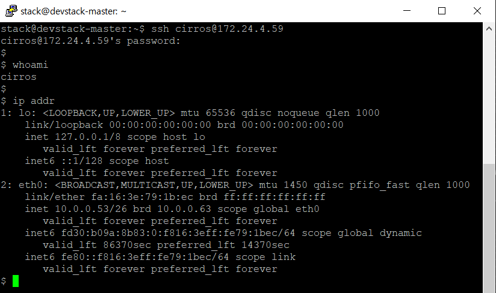

이러한 유동 IP 상태에서, 방화벽에서 ICMP를 풀어주면 카페24의 VM(Ubuntu)에서
devstack vm에 ping을 보낼 수 있습니다.
