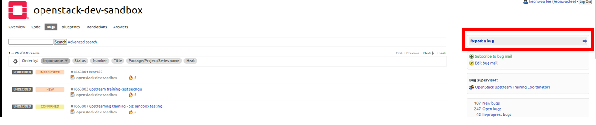
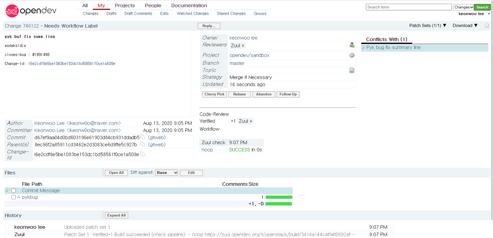
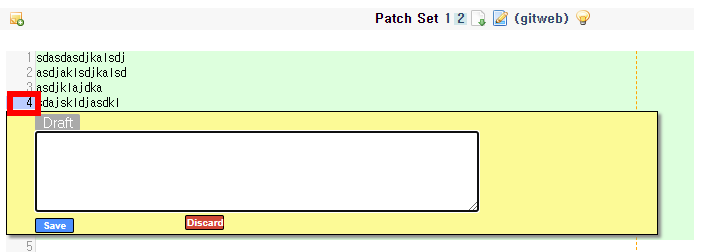
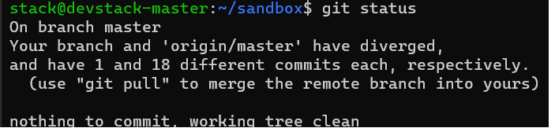
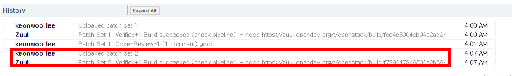
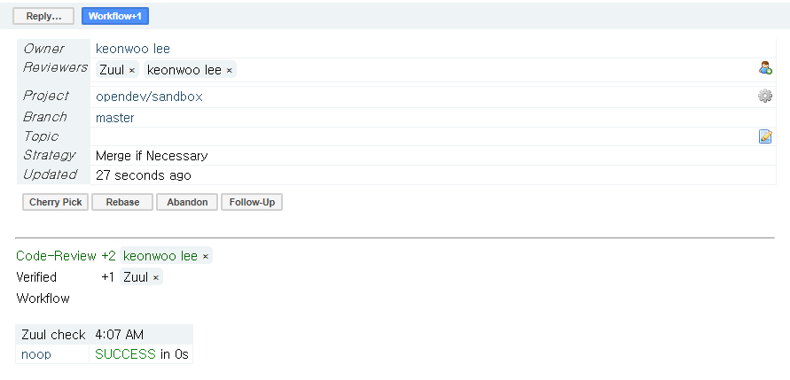

============================
How to fix bug in the gerrit
============================

4. Bug Test 하기
----------------

실습한 URI https://launchpad.net/openstack-dev-sandbox

4-1. Bug Report를 합니다
~~~~~~~~~~~~~~~~~~~~~~~~

* 유사한 버그가 있는지 검색합니다.

* 유사한 버그가 없다면
* Summary를 적고 Bug 내용을 적고 Commit을 합니다

.. image:: images/How_to_fix_bug_in_the_gerrit/2.png

* Bug가 생성됩니다. Bug 번호가 생성됩니다.
* Bug 번호가 굉장히 중요해요

.. image:: images/How_to_fix_bug_in_the_gerrit/3.png

버그를 수정하는 Commit을 만들어 볼거에요

.. code-block:: none

   vim [파일명 아무거나] [내용도 아무거나 채움]
   git add [파일명]
   git commit [파일명]

자 여기서부터 아까 배웠던 Commit Message를 적용해주면 됩니다

.. code-block:: none

   Buf fix summary line

   어쩌구 저쩌구
   블라블라블라

   Closes-Bug: #[Bugid]

   # Please enter the commit message for your changes. Lines starting
   # with '#' will be ignored, and an empty message aborts the commit.
   #
   # On branch master
   # Your barnch is ahead of 'origin/master' by 1 commit.
   # *use "git push" to publish your local commits)
   #
   # Changes to be committed:
   #           new file : [파일명]

저장해주고 닫으면

.. code-block:: none

   git log

.. image:: images/How_to_fix_bug_in_the_gerrit/3-1.png

깃 리뷰가 알아서 체인지 아이디를 만들어줌
저는 아무짓도 안했는데 Change-ID가 생성이 됐어요
Git Review Tool이, 제가 Commit을 하는 순간 Change-ID를 만들어 줍니다.

.. code-block:: none

   git review
   #push 대신 review를 사용합니다

.. image:: images/How_to_fix_bug_in_the_gerrit/3-2.png

이렇게 뜨면 성공이에요

remote 주소로 들어갑니다 : https://review.opendev.org/#/c/750048/

* Zuul이 체크하고 Patch를 했어요
* Patch Set 2: Verified+1 Build succeeded (check pipeline).
* Verified +1은 Zuul이 +1점 준거에요. 아무런 TC가 없어서 Success가 떨어진거에요

그럼 이제 올린 파일을 클릭하고

.. image:: images/How_to_fix_bug_in_the_gerrit/5.png

Line을 클릭하면 적는 공간이 생겨요
여기에 Review 할 Message를 작성하고 Save 해주세요

Comment를 달고나서 위로 올라가기를 클릭해주세요

.. image:: images/How_to_fix_bug_in_the_gerrit/7.png

그리고 Reply를 눌러서 내용을 작성하고 Post를 누르세요.
Post를 눌러야 Comment가 달립니다.

.. image:: images/How_to_fix_bug_in_the_gerrit/8.png

자 그럼 이제 CodeReview 받은 내용을 토대로 파일을 다시 수정합니다.

.. code-block:: none

   vim [파일명 아까꺼]
   # 파일수정
   git add [파일명]
   git commit --amend

.. image:: images/How_to_fix_bug_in_the_gerrit/9.png

이 상태에서 커밋 메시지를 수정합니다.

그리고 나서

.. code-block:: none

   git status

를 확인해보면

Commit 할 것이 없다고 나옵니다.
Amend를 하면 수정한걸로 돼요

이 상태에서 다시 review를 올려요.
새로운 review가 만들어 진게 아니고, 아까 만들어놓은 review와 연결이 될 거에요

.. code-block:: none

   git review

그리고 다시 그 주소로 들어가보면 PatchSet이 추가가 되었어요

.. image:: images/How_to_fix_bug_in_the_gerrit/12.png

그리고 이렇게 코드 변경점을 확인할 수 있어요
그리고나서 아까 Reply에서 +2점을 줍니다.
그러면 Zuul이 Verified를 돌아서 +1점을 줍니다.

아직 하나더 남았는데요
Workflow+1를 해야합니다. 이것은 PR과 동일합니다. 지금은 저희가 하지만, 실제로는 Maintainer들이 해요

Workflow+1를 하면, Zuul이 다시한번 전체적으로 Verified를 돌고 Merge가 됩니다

.. image:: images/How_to_fix_bug_in_the_gerrit/14.png

* Zuul Check : Unit Test
* Zuul gate : Integration Test, python version 별 test

