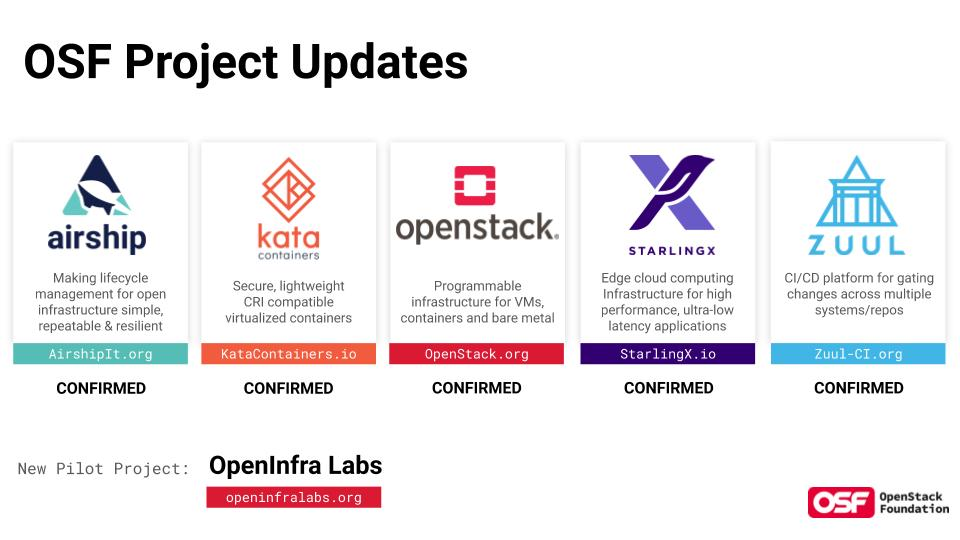
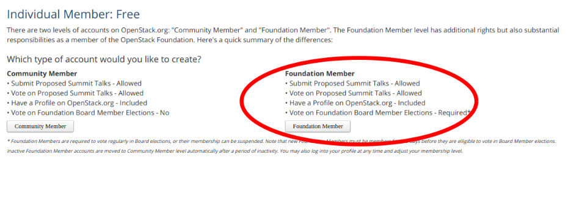
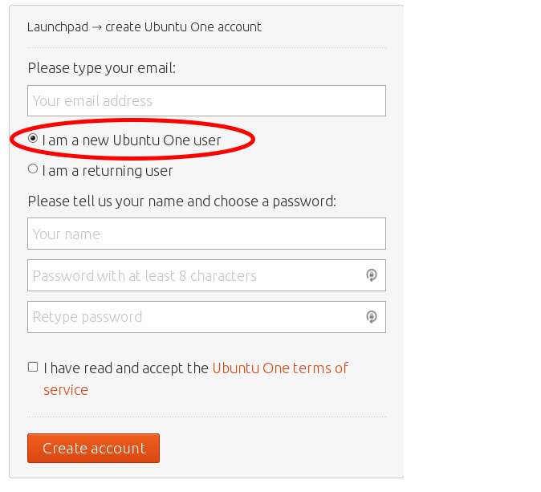

======================
How to start Openstack
======================

오픈스택 팀 멘토이신 최영락(Ian Y. Choi) 님께서 멘토링 해주신 내용을 다룹니다.
오픈스택 팀 멘토이신 조성수 님께서 멘토링 해주신 내용을 다룹니다.

* 오픈스택에 컨트리뷰션 하기 위해 어떤 환경들이 있는지 알아봅니다
* 먼저 많은 개발자들이 아시다시피 오픈소스에 기여하는 형상관리로 Github가 있습니다.
* 오픈스택은 Github에 PR하는 것과는 조금 다른 환경이 구축되어있습니다.
* 오픈스택은 Github가 아닌 Openstack 전용 Repository를 만들었습니다.
* 이 Repository는 `git.openstack.org <http://git.openstack.org>`_ 입니다.
* 이 Repository는 규모가 커져서 지금은 `opendev.org <http://opendev.org>`_ 로 OSF
* (Openstack Foundation)의 더 많은 Open Source Project들을 다루는 공간으로 변모하였습니다.

환경은 크게 4가지로 구성됩니다.
* 소스코드 커밋 리뷰요청 Tool : Gerrit (git 기반)
* 문서작성 : rst format ( github에서 markdown과 같은 기능을 합니다)
* Bug 리포트 : Launchpad / Storyboard
* 소통(메신저/커뮤니케이션) : IRC를 사용합니다 (slack 같은 느낌)

오늘은 Openstack이 어떻게 이루어 있는지 알아보고 컨트리뷰톤을 시작하기 위한
가입 준비를 다루겠습니다.

1.  Openstack의 4 Open 정신
~~~~~~~~~~~~~~~~~~~~~~~~~~~

4 open 이란 ?
: Openstack Foundation 에서 강조하는 가치. 4가지 주제로 활동한다.

`OpenStack Governance: The Four Opens <governance.openstack.org>`_

* Open Source : 우리는 Enterprise Version 안한다. Community 기반이 핵심 가치이다.
* Open Design : Design 하는 Process를 공개하겠다.
* Open Development : 모두 다 개발에 참여할 수 있다.
* Open Community : 특정 회사/국가가 주도하지 않는다. 느린 합의를 지향한다.

Openstack Foundation은 이제 openstack만 하지 않아요.
Opensource 기반의 주변 에코시스템을 아우르는, Infra Structure를 만드는 방향성으로 가고있어요.

* 오픈스택 5가지 메인 프로젝트 : 배포/컨테이너/IaaS/Edge-Computing/CI-CD

2. 오픈스택 구성원
~~~~~~~~~~~~~~~~~~
OpenStack Governance
: 전 세계의 수많은 개발자들이 모이기 때문에

Committees
* Foundation Board Director : 이사진의 역할. 기술적으로 뛰어나거나, 오픈스택의 방향성을 결정함. 지원을 하고, 커뮤니티의 투표를 통해서 결정됨.
↔ Openstack Staff : OSF에 돈을 받고 고용된 사람. (행사 준비/운영 진행)
* Technical Commitee : Group. 기술위원회. Openstack에 필요한 기능들을 결정하는 사람. 이 또한 지원을 하고 투표를 통해 결정 됨
* User Commitee : 유저 커뮤니티가 잘 운영되도록, 더 많은 사람들이 커뮤니티에 들어올 수 있도록 도와주는 역할

Roles (역할)
* Active Technical Contributor(ATC) : 오픈스택의 Release주기(6개월) 이내에 한번이라도 Commit 한 사람.
* Active Project Contributor(APC) : ATC보다 발전된 개념. 특정 Project에 많은 공헌을 한 사람. Maintainer의 수준
* Project Team Lead(PTL) : 팀장님. 6개월마다 바뀌긴 하는데 보통 연임함. PTL에 따라서 Project가 움직임.
* Core Reviewer : APC의 역할이라고도 볼 수 있는데, Gerrit에 +2점을 줄 수 있음 (Merge 가능)
* Active User Contributor(AUC) : 기술적인 것 말고, 유저 커뮤니티를 위해 활동하는 사람

3. 메신저/커뮤니케이션
~~~~~~~~~~~~~~~~~~~~~~

IRC를 기본으로 채팅 함 (전통적인 기술 IRC) :: 인스턴스 식
* 프로젝트 별로 채널을 만들어 놓음 (Slack 같은 느낌)
* 문서들이 산발적으로 펼쳐져 있음
* 처음 접할 때 History 파악은 어렵지만, 메인테이너들에게 물어보면서 알게 됨

메일링리스트(ML) - 주소를 구독하는 사람에게 뿌림  :: 중요한 공지/논의
Wiki Page : 정리
Etherpads : 회의록, 아이디어 를 기록하는 곳. 나는 이런 것을 하고 있어
* 오프라인에서 만나서 이야기를 하면서, 이더패드에 정리함
* 대부분의 자료는 이더패드에 있음
* 단점은 이더패드에서 검색이 잘 안됨
* 기능의 History를 찾기 어려움

4. 오픈스택 가입하기(튜토리얼)
~~~~~~~~~~~~~~~~~~~~~~~~~~~~~~

공식문서의 튜토리얼은 `여기 <https://docs.openstack.org/contributors/code-and-documentation/index.html>`_ 를 참고하시면 됩니다.

이 튜토리얼을 따라하겠습니다.
1. 계정생성
계정 생성은 두 가지를 해야 합니다.
* OSF 계정
* StoryBoard 계정 (Ubuntu One 계정) : 코드관리, Bug tracking software

1-1. OSF 계정
https://www.openstack.org/join

* 위의 페이지에 접속한다
* Foundation member 클릭

1-2. StoryBoard 계정 : bug tracking
https://storyboard.openstack.org/

* 위의 페이지에 접속한다
* Ubuntu One User로 가입

