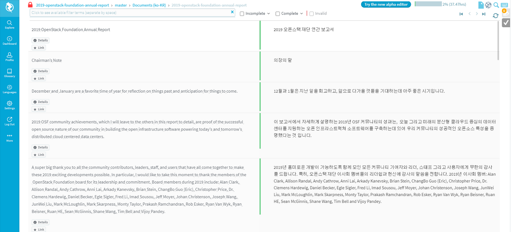
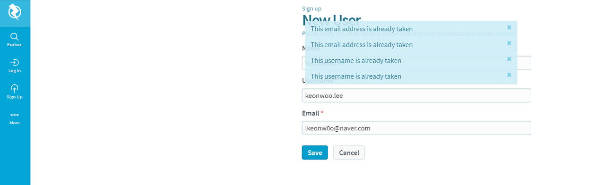
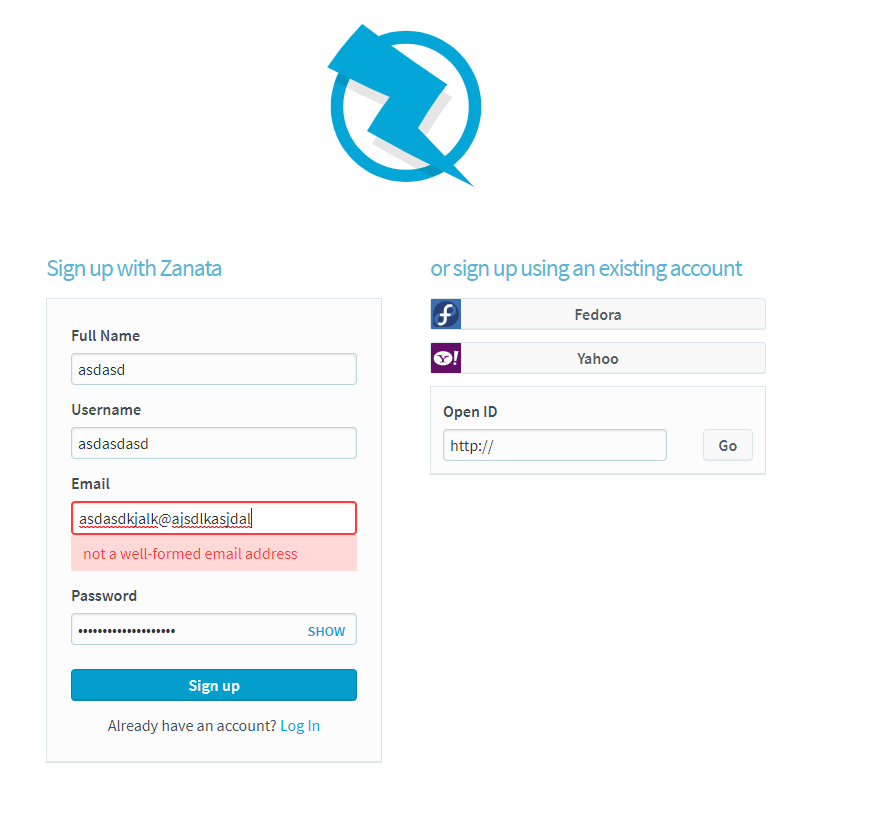
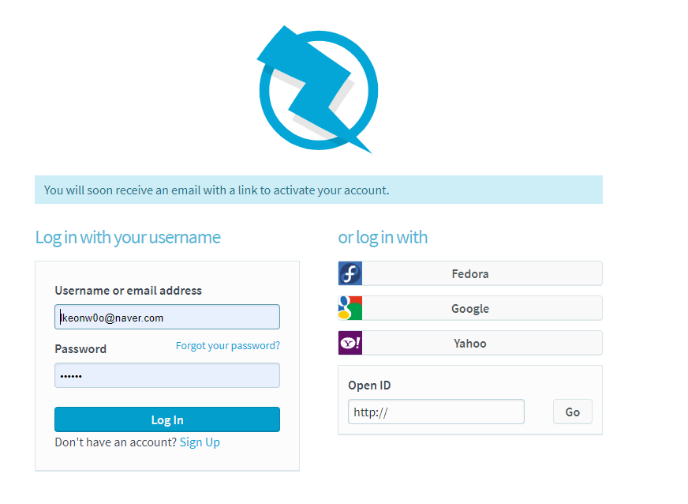
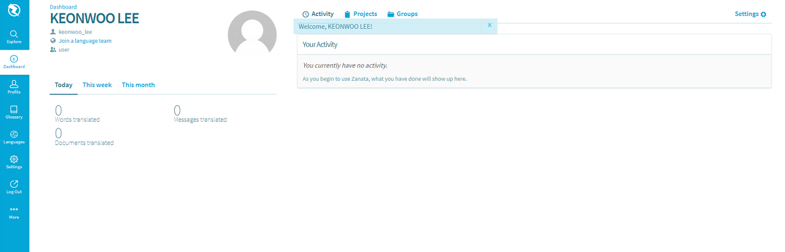

=================================
How to start Translation Activity
=================================

Openstack의 번역
모든 번역은 Zanata라는 도구를 쓰고 `여기 <https://translate.openstack.org/>`_ 에서 합니다.

* 별도로 가입을 해주셔야 합니다.
* 그리고 Explorer Tab에서 아래와 같이 번역작업을 진행할 수 있어요

**위 Site에서 Login이 되지 않는 오류가 있습니다.**

* 이렇게 Login을 시도하면 에러가 뜹니다.

* 주소창을 보니 Create_user로 되어있어요. 이상하네요

**그래서 제가 찾은 방법은 다음과 같습니다**

* Sign up 에서 아무렇게 입력을 해줍니다.
* 그리고 sign up을 누르면

* 로그인 할 수 있는 페이지로 바뀝니다.
* 이상태에서 Log in 을 누르면

Login이 됩니다... 이상하네요
