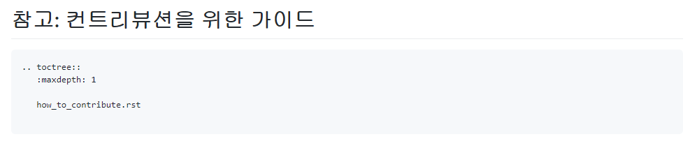

=======================
How_to_write_RST_Format
=======================

일전에 Python기반의 Project들은 RST(Restructed Text)를 사용한다고 한 적이 있습니다.

오늘은 RST 문서 작성법에 대해 알아보려 합니다.

`How to contribute on this repository <https://github.com/openstack-kr/contributhon-2020/blob/master/doc/source/contributors/how_to_contribute.rst>`_

1. index.rst 문서 생성
----------------------
Markdown의 ReadMe.md와 비슷하다고 보시면 됩니다.

아래와 같이 작성해줍니다.

※ 참고 : https://github.com/openstack-kr/contributhon-2020/blob/master/doc/source/contributors/index.rst

``작성``

.. code-block:: none

   .. _contributors:               # 책갈피 용도로 사용한다. _[폴더명] 정도면 괜찮을 듯 하다.

   ==============================  # 제목 위 아래에 = 으로 표시한다. 길이가 제목과 같거나 길어야 한다.
   참고: 컨트리뷰션을 위한 가이드
   ==============================  # 위에 제목을 잘 적고, 해당 줄은 윗 부분 = 길이와 동일하게 한다.

   .. toctree::                    # 목차를 위한 문법 (그대로 사용하자)
      :maxdepth: 1                  # 1단계 목차로 끝난다는 것을 의미 (그대로 사용하자)

      how_to_contribute.rst         # 실제 rst 문법으로 적을 문서 파일명으로 대체
                                   # 여러 파일로 나누고자 할 경우에는 해당 파일명도 추가하자.

``결과``

아시겠죠? 위 경우는 Depth가 1이지만(하위폴더가 없음), 만약 하위 폴더가 있는 경우 아래와 같이 작성합니다.

.. code-block:: none

   .. toctree::                    # 최상위 문서 기준 목차 (그대로 사용하자)
      :maxdepth: 2                  # 하위폴더를 포함한 최대 Depth

      openstack_helm/index          # 폴더의 예시. 폴더/파일 이므로 depth가 2입니다
      [만든 폴더]/index             # 새로 만든 폴더 내 index를 가리키도록 추가하자.

2. 문법
-------
* 제목은 == 로 감싸며,
* 부제목은 아래만 -
* 소제목은 아래에 ~ 을 사용
* 링크는 `링크할 말 <링크할 주소>`_
* 이미지는 .. image:: 경로.png
* 주의 : 각 행은 최대 80자만 허용한다는 기본 규칙

``예시``

.. code-block:: none

   ===============
   제목이 들어갑니다
   ===============

   부제목이들어갑니다
   ----------------

   소제목이들어갑니다
   ~~~~~~~~~~~~~~~~

   `링크를할거에요 <http://~~~~>`_
   # 할거에요 <     <--  꺽쇠 들어가기 전에 한칸 띄워줘야 해요
   # `_  <- 이후에 한칸 띄워주셔야 해요

   이미지를 넣을거에요
   .. image:: folder/image_file.png
   # image::  <- 한칸 띄워주셔야 해요

   *기울임글씨체에요*

   코드블럭을 넣을거에요
   .. code-block:: none
                                  <- "엔터를 넣어주셔야 해요"
      어쩌구저쩌구
      인덴트를 넣어주세요
      여기까지 코드블럭이에요

   * bullet을 넣어줄 거에요

`문법이 더 궁금하다면 <https://docutils.sourceforge.io/docs/user/rst/quickref.html>`_

`문법이 더 궁금하다면2 <https://docs.openstack.org/doc-contrib-guide/rst-conv.html>`_

RST 문서를 작성하고나면 Local에서 Test를 합니다.
Python으로 Build하며, tox라는 프로그램을 사용합니다.

``tox 설치``

.. code-block:: none

   sudo pip install tox

``문서 빌드``

.. code-block:: none

   $ tox -e py38 docs
   # py38 자리에는 사용할 Python version을 넣을 수 있습니다.

문서 build가 되면 doc/build/html 폴더에 index.html 폴더를 열어서 확인할 수 있습니다.

.. code-block:: none

   $ open doc/build/html/index.html

3. Commit 하기
--------------

Commit Message를 잘 적어준다.
이전 번에 배웠습니다 ! 참고 할 수 있어요
`링크 <https://wiki.openstack.org/wiki/GitCommitMessages>`_ 를 참고할 수도 있습니다.

``예시``

.. code-block:: none

    Switch libvirt get_cpu_info method over to use config APIs     # Summary Line

    The get_cpu_info method in the libvirt driver currently uses   # Body line
    XPath queries to extract information from the capabilities     # Do not over 72
    XML document. Switch this over to use the new config class
    LibvirtConfigCaps. Also provide a test case to validate
    the data being returned.

    DocImpact
    Closes-Bug: #1003373                                           # Tag
    Implements: blueprint libvirt-xml-cpu-model
    Change-Id: I4946a16d27f712ae2adf8441ce78e6c0bb0bb657           # Auto generated

4. PR 하기
----------
PR Message를 아래와 같이 적어준다.

.. code-block:: none

   ## WHY (PR을 제출하는 이유)
   본 저장소에 컨트리뷰톤 활동 결과 정리를 위한 구체적인 가이드 내용을 문서로 정리합니다.

   ## HOW (PR을 통해 어떤 부분을 수정하고자 하는가)

   RST 및 본 저장소에 작성하는 형식에 따라 추가합니다.

   ## Related Issues
   #이슈번호

   ## Checklist (확인사항)

   Checking the releveant checkboxes(`[x]`) 확인사항으로는 다음 3개가 있습니다

   CLA 서명여부 : Apache License 2.0에 동의합니다.
   Issue 연결 : 본인이 진행하는 이슈와 연관하고, 없으면 이슈를 생성합니다. Openstack에서 Closes-Bug # 번호와 같습니다.
   리뷰어의 내용을 반영할 의지가 있는지 동의 여부입니다.

5. PR Preview
-------------

1. CLA 서명 여부를 확인합니다.
2. deploy-preview를 하며 PR을 기준으로 Build한 결과가 나옵니다.

*  Build에 실패하면, Log를 보고 실패 이유를 참고하여 수정합니다.

올린 PR을 추가로 수정하고 싶은 경우 기존 Commit을 --amend 하고 --force push를 합니다.
* --force push를 하지 않으면 git push가 되지 않습니다.
* 그러한 이유(reject이 되는 이유)는 Commit은 기본적으로 누적이 되어야 하는데, 누적을 하지 않으므로 push를 허용하지 않는 것 입니다. Commit을 깔끔하게 관리 할 수 있느나, 대신 이전의 Commit 내용을 확인 할 수 없다는 단점 또한 동시에 지니고 있습니다.
