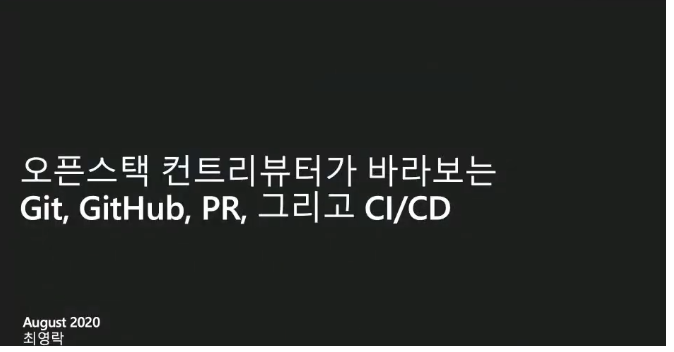
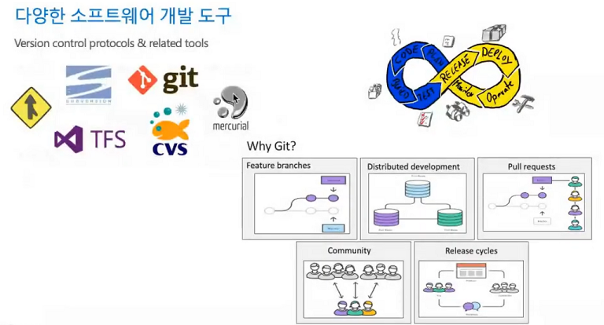
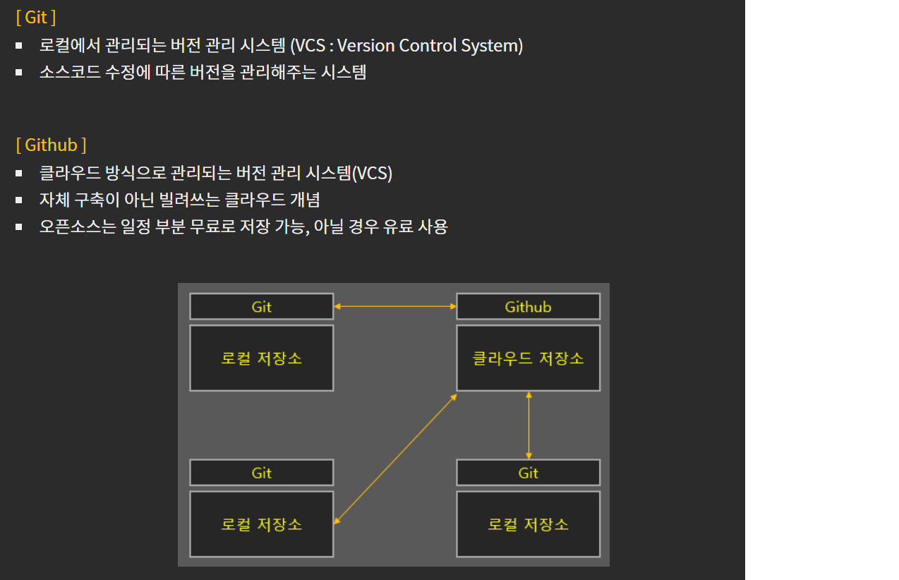
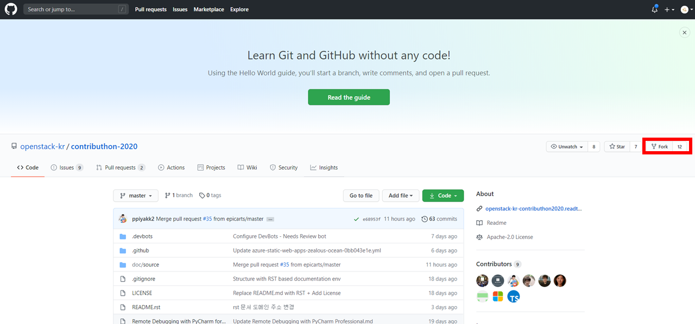
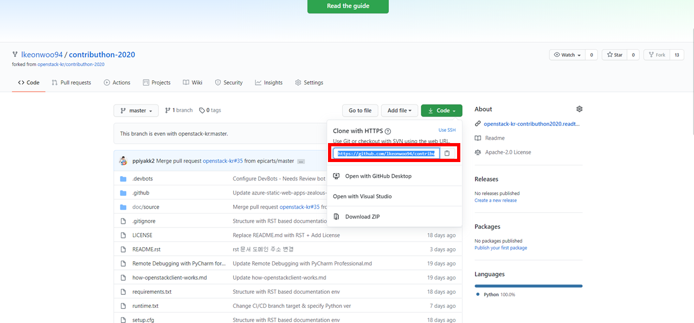
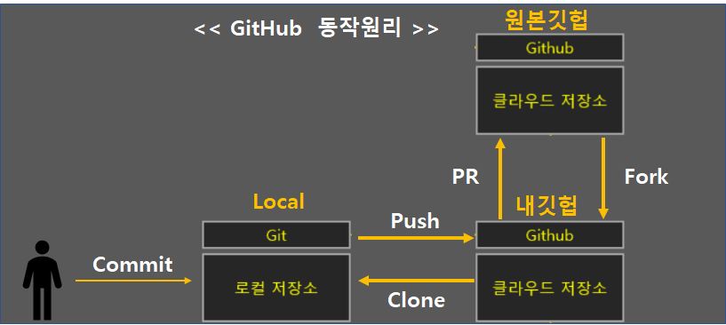
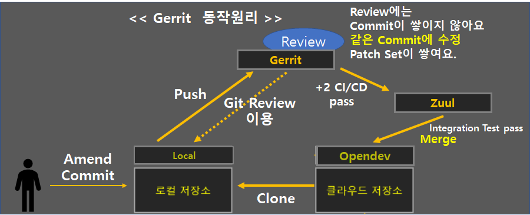
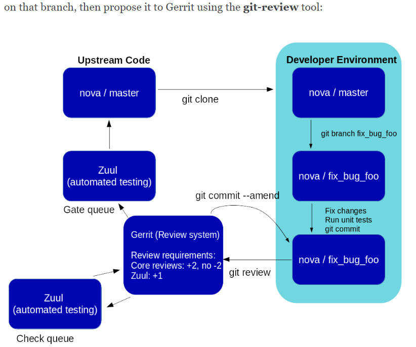
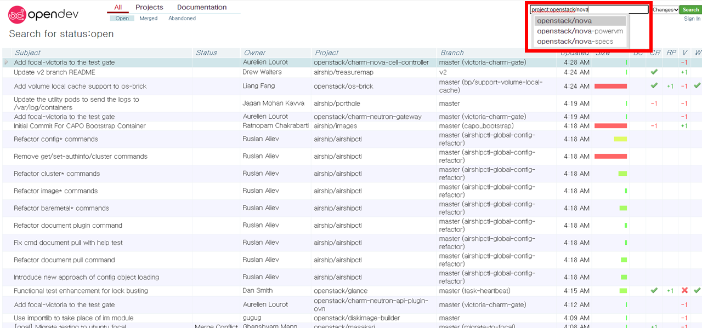
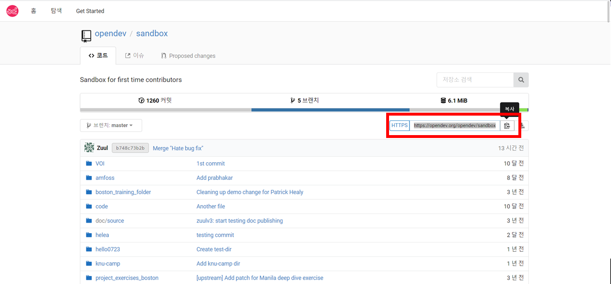

===========================================
Learn how contribute to Openstack Community
===========================================

오픈스택 팀 멘토이신 최영락(Ian Y. Choi) 님께서 멘토링 해주신 내용을 다룹니다.

* 오픈스택에 컨트리뷰션 하기 위해 어떤 환경들이 있는지 알아봅니다
* 먼저 많은 개발자들이 아시다시피 오픈소스에 기여하는 형상관리로 Github가 있습니다.
* 오픈스택은 Github에 PR하는 것과는 조금 다른 환경이 구축되어있습니다.
* 오픈스택은 Github가 아닌 Openstack 전용 Repository를 만들었습니다.
* 이 Repository는 `git.openstack.org <http://git.openstack.org>`_ 입니다.
* 이 Repository는 규모가 커져서 지금은 `opendev.org로  <http://opendev.org>`_ 되었습니다.
* (Openstack Foundation)의 더 많은 Open Source Project들을 다루는 공간으로 변모하였습니다.

환경은 크게 4가지로 구성됩니다.
* 소스코드 커밋 리뷰요청 Tool : Gerrit (git 기반)
* 문서작성 : rst format ( github에서 markdown과 같은 기능을 합니다)
* Bug 리포트 : Launchpad / Storyboard
* 소통(메신저/커뮤니케이션) : IRC를 사용합니다 (slack 같은 느낌)

Opensatck의 형상관리방법을 배우기에 앞서서 많은 사람들에게 친숙한
github의 동작원리를 먼저 파악하고, openstack에서는 어떤 점이 다른지 보겠습니다.

형상관리를 모르시는 분들을 위해 git 과 github의 차이를 간단히 설명 드리겠습니다.

Git과 Github의 차이
~~~~~~~~~~~~~~~~~~~

* Git과 Github 에서 사용되는 용어

Git과 Github의 개념과 용어를 학습하셨습니다.
다음으로 Openstack를 위한 github 사용방법을 배워보겠습니다.
* add >> commit >> PR 은 기존의 github사용법입니다.
* 오픈스택에서는 add >> commit >> review를 하는 점이 다릅니다.

1. Fork를 사용하여 자신의 Repository에 가져온다
~~~~~~~~~~~~~~~~~~~~~~~~~~~~~~~~~~~~~~~~~~~~~~~

2. Fork한 자신의 Repository에서 Clone 한다
~~~~~~~~~~~~~~~~~~~~~~~~~~~~~~~~~~~~~~~~~~

.. code-block:: none

   $ git clone https://github.com/lkeonwoo94/contributhon-2020.gitCloning into 'contributhon-2020'...
   $ cd contributhon-2020/
   $ git remote -v
   origin  https://github.com/lkeonwoo94/contributhon-2020.git (fetch)
   origin  https://github.com/lkeonwoo94/contributhon-2020.git (push)

* 여기에 upstream을 추가할 수도 있습니다.
* upstream 이란? : fork 뜨기 전 main 저장소(Merge되는 원본)를 바라봄

clone한 자신의 repository에서 master branch가 아닌 다른 작업을 하는 공간(branch)를 만듭니다.

3. Branch
~~~~~~~~~

.. code-block:: none

   $ git branch
   * master
   $ git checkout -b test
   Switched to a new branch 'test'

   $ git status
   On branch test
   nothing to commit, working tree clean

   $ git branch
   master
   * test

4 Commit
~~~~~~~~

branch에서 작업을 마치고 나면 add를 하여
local의 작업공간(clone하고 branch한 곳)에 코드변경사항을 추가하고
commit 을 합니다.

.. code-block:: none

   $ git commit -a

이 때, Commit Message 작성 규칙이 있습니다.
Openstack에서는 아래와 같은 규칙을 따라야 온전하게 Commit 될 수 있습니다.
`Opensatck 공식사이트 <https://docs.openstack.org/contributors/common/git.html#commit-messages>`_ 에서도 찾아볼 수 있습니다.

Git Commit Message 규칙입니다.

+----------+--------------+--------------------------------------------------------------------------+
| Line #   |      Name    |                               Description                                |
+----------+--------------+--------------------------------------------------------------------------+
| line 1   | Summary line | Patch(패치)내용 요약, 50자이내작성                                       |
+----------+--------------+--------------------------------------------------------------------------+
| line 2   | 공백         | 한줄 띄움                                                                |
+----------+--------------+--------------------------------------------------------------------------+
| line 3   | Body         | 가로 72자 이내 작성                                                      |
+----------+--------------+--------------------------------------------------------------------------+
| line n   | 공백         | 한줄 띄움                                                                |
+----------+--------------+--------------------------------------------------------------------------+
| line n+1 | Tags         | * Change-id : 우리가 작성하는 것이 아님. git review라는 도구가 자동 생성 |
|          |              | * Task : 내가 해결하고자 하는 Task 번호                                  |
|          |              | * Story : 내가 해결하고자 하는 Story 번호                                |
|          |              |                                                                          |
|          |              | * Closes-Bug : Fully Fix.완전 버그 수정. 이 Patch는 완전히 bug를 Cover함 |
|          |              | * Partial-Bug : 일부분 버그 수정                                         |
|          |              | * Related-Bug : Reference가 되는 Bug들. 연관있는 버그. 유사한 버그       |
|          |              |                                                                          |
|          |              | Blue print 내용 : 새로운 기능을 제안 - 제안서                            |
|          |              | * Implements : 제안                                                      |
|          |              | * Partial-Implements : 일부 제안                                         |
+----------+--------------+--------------------------------------------------------------------------+

예시는 아래와 같다.

.. code-block:: none

   Switch libvirt get_cpu_info method over to use config APIs # Summary Line

   The get_cpu_info method in the libvirt driver currently uses # Body line
   XPath queries to extract information from the capabilities # Do not over 72
   XML document. Switch this over to use the new config class
   LibvirtConfigCaps. Also provide a test case to validate
   the data being returned.

   DocImpact
   Closes-Bug: #1003373 # Tag
   Implements: blueprint libvirt-xml-cpu-model
   Change-Id: I4946a16d27f712ae2adf8441ce78e6c0bb0bb657 # Auto generated

5. Create Pull Request -> Openstack에서는 PR 아니고 Review라고 합니다
~~~~~~~~~~~~~~~~~~~~~~~~~~~~~~~~~~~~~~~~~~~~~~~~~~~~~~~~~~~~~~~~~~~~~

* PR이 아니고 ``Review`` 를 합니다.
* ``Review`` 를 이용하여 Gerrit(Openstack의 review system)에 올립니다.

Gerrit을 사용한 git review의 원리를 알아봅니다.
먼저 github 동작 원리 입니다.

gerrit의 동작 원리 입니다.

Openstack 공식 문서에 나와있는 gerrit의 동작 원리 입니다.

`Gerrit <https://review.opendev.org/>`_ 을 들어가보겠습니다.

* Login을 하면 아까 만들었던 Ubuntu One 의 계정이 필요합니다.
* 그리고 계약서에 Sign을 하게 됩니다.
* Login 후 Settings에서 Individual 을 클릭합니다.
* 컨트리뷰션한 코드에 대한 저작권을 OSF에 귀속한다는 것에 동의해야 합니다.

위 내용 진행을 위해서 , `이 페이지 <https://docs.openstack.org/contributors/common/setup-gerrit.html#sign-up>`_ 를 참고 할 수도 있어요.

그리고 나면, 위 페이지 대로 SSH Key를 등록해야 합니다.

Key가 없을경우 아래처럼 만들 수 있습니다.

.. code-block:: none

   ssh-keygen

6. Openstack의 Pull Request : review
~~~~~~~~~~~~~~~~~~~~~~~~~~~~~~~~~~~~

(인프라) `opendev.org <https://opendev.org/opendev/sandbox>`_ 를 직접 만들어서 제공합니다.

1. git-review install

.. code-block:: none

   sudo pip install git-review

2. Clone Opendev

Fork 없이 Direct로 Clone 합니다.

.. code-block:: none

   $ git clone https://opendev.org/opendev/sandbox.git sandbox
   $ cd sandbox/

3. Local의 git을 configuration 해줍니다

.. code-block:: none

   git remote -v
   # 하면 opendev의 origin만 바라보고있습니다.
   # 근데 우리는 gerrit을 연동시켜야하죠

   git config --global user.name <username>
   git config --global user.email <useremail>
   # Gerrit에 연동할 꺼니까, review.opendev에 사용했던
   # Ubuntu One 에 등록한 e-mail을 반드시 사용하셔야 합니다.

   git config --global gitreview.username <username>
   # review.opendec 에 있는 username을 똑같이 맞춰 주셔야합니다
   # 안맞추면 push가 안됩니다

   $ git review -s
   # git review라는 Tool이 Opendev에 내 설정을 넣어줍니다

   # 커밋에 gerrit을 통해 아이디가 붙고 원하는 것을 patch(패치)함

