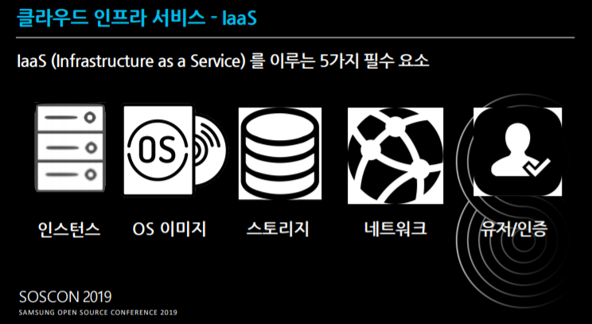
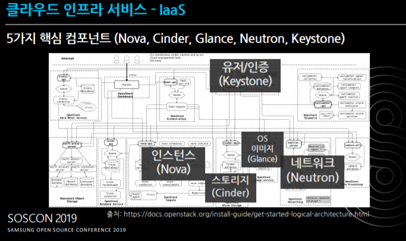
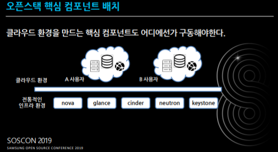
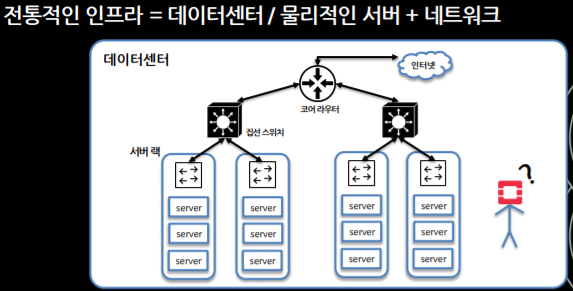
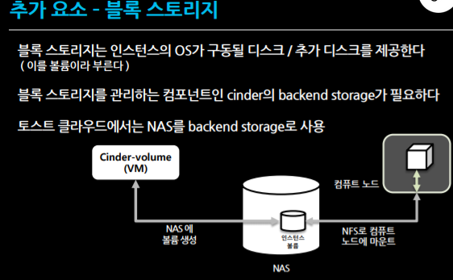
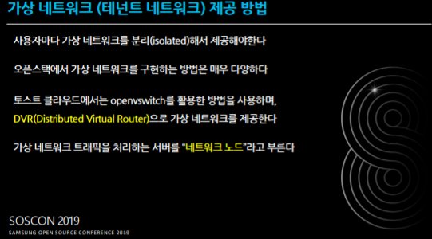
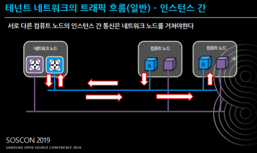
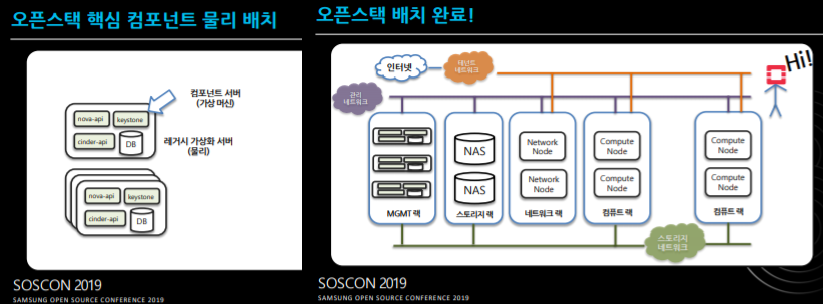
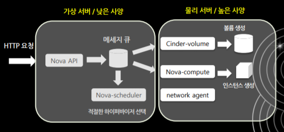

===============================
Openstack_Component_Description
===============================

`[SOSCON 2019] NHN은 어떻게 OpenStack으로 Public Cloud를 운영할까? - 조성수 <https://www.soscon.net/content/data/session/Day%202_1330_2.pdf>`_ 

우리가 할 Openstack은 IaaS (Infra as a Service)입니다.
IaaS에는 5가지 필수요소가 있습니다.
어떤 것을 이용하냐에 따라서 VM, Vbox, 클라우드 서비스가 될 수 있습니다.

오픈스택도 이런것을 다 지원하는 개념[오픈스택 아키텍쳐]들이 있으며, 필수요소 외에도 여러 Component 들이 많지만
오늘은 OpenStack의 5가지 필수요소를 알아봅니다.

* 인스턴스(Nova) : 하나하나가 각각의 서비스로 보시면 돼요
* 스토리지(Cinder) : 하드디스크
* OS이미지(Glance) 
* 네트워크(Neutron) : 인스턴스 間의 가상 네트워크
* 유저/인증(Keystone)

어떤식으로 유기적으로 돌아가는가?
~~~~~~~~~~~~~~~~~~~~~~~~~~~~~~~~~~

핵심 컴포넌트는 크게 2가지

1. API성 서비스 : 각각의 컴포넌트는 다 api를 가짐. 그래서 웹서비스를 해줌

2. 에이전트 : 얘네는 작업을 하는 일꾼들임.

.. image:: images/Openstack_Component_Description/4_Agent.png

* HTTP 요청이 들어오면 Nova API가 메세지 큐에 던집니다.
* 그러면 들어온 요청이 물리적인 머신에 돌아야 하니까 Hypervisor가 선택되어야 합니다.
* 이를 Nova-scheduler가 담당합니다.

* 그리고 어디에 저장돼야하는지 알려주는 Cinder(볼륨), 하드디스크를 하나 받습니다.
* 그리고 나서, Nova-Compute 한테 Instance 생성을 요청합니다. (너는 이 정보를 가지고 VM을 만들어줘)

``VM의 생성단계``
1. Nova-Scheduler에게 Hypervisor 선택
2. Cinder(Volume), Nuetron(Network) 할당 받음
3. Nova-Compute (VM Instance생성)

오픈스택 요청의 최 앞단은 API가 받는거에요. 그래서 분석을 할때도 우리는 API를 먼저 보고, API가 누구한테 보내는지를 타고타고 들어가면서 분석을 할거에요.
우리가 다룰 대부분 코드는 뒷단(하이퍼 바이저 뒤쪽, e.g. 신더볼륨) 을 안봐요.
볼륨을 저장할 데이터는 오래된 백엔드 시스템이에요 (e.g. NFS)

노바컴퓨트는 하이퍼바이저를 뭘 선택하느냐에 따라 다 달라요. 하이퍼바이저는 KVM도 있고 여러가지가 있죠.
생각만해도 머리 아픈 영역이죠.

하지만 API는 웹서비스가 어떻게 동작하는지만 알면 돼요. 우리가 6주까지 볼 영역은 API
그리고 좀더 나아가면 앞단(HTTP)의 클라이언트 영역까지.

What's Hypervisor?
~~~~~~~~~~~~~~~~~~

IDC에다가 엄청나게 고사양의 컴퓨터를 만들어놔요. 이거(고사양의 컴퓨터)를 하이퍼바이저라 불러요.
하이퍼 바이저 역할은 VM을 띄우게 해주는 서버. (VM을 생성하고 관리함)

인스턴스 만들 때 스펙을 선택했잖아요. vm도 몇코어 짜리. 이런식으로 만들어 질거에요.
이렇게 많은 하이퍼 바이저 중에서, 어디에 새로운 VM을 생성해야할지 결정함.
이러한 결정을 하는게 노바 스케줄러. 어디에 놓을지

노바 스케줄러는 하이퍼 바이저에 대한 정보를 다 수집하고 있음.
vm은 몇대, 가용랑 코어는 몇코어, 메모리는 몇기가.

그러면 하이퍼 바이저에는 컴퓨트노드라는 노바컴퓨트가 떠있음.
그럼 사용자는 컴퓨트한테 vm을 만들어줘 라고 함.

보통 많이 쓰이는게 리소스 기반, 가장 여유가 많은 하이퍼 바이저를 선택하게 한다.

더이상 만들 수 없을 때는 오류가 납니다.
운영자는 계속 가용량을 확인을 해야함.

블록스토리지 (Cinder-Volume)
~~~~~~~~~~~~~~~~~~~~~~~~~~~~~

거대하게 큰 NAS를 만들어 놓음.

``NAS``
Network Attached Storage
LAN으로 연결하는 외장하드

볼륨생성 요청이 들어오면, 해당 크기만큼 파일을 만들고, NFS붙어서 연결을 시켜줌.
NAS는 뭐를 하느냐 따라서 구성이 다양해져요. NAS 말고 다른 솔루션 쓸 수도 있고.

아마 AWS 도 이런 구조. 이런 구조를 shared storage 구조라고 많이 불러요.

가상 네트워크 (테넌트 네트워크)
~~~~~~~~~~~~~~~~~~~~~~~~~~~~~~~~~

가상 네트워크를 구성하는 방법.
사용자마다 분리된 환경을 만들어주고 vm들이 붙는거고.
이런 네트워크를 isolated 되어있다고 함.

오픈스택에서 가상 네트워크를 구성하는 방법은 다양함.
Vbox는 Vbox 방식대로 가상 네트워크를 붙여줌.
오픈스택은 오픈스위치로 만듬. 깊게 들어가면 어려우니까 이따가 사용해보면서 어떻게 만드는지 위주로 하겠다.

파란색 사용자가 인스턴스를 만들음.
네트워크 노드의 파란색은 공유기의 집합이라고 보면 됨.

오픈스택의 기본 옵션은. a-b 바로 못보내고, 공유기까지 갔다가 가요.
네트워크 노드가 죽으면 오픈스택의 모든 네트워크가 다 죽는다.
기본 흐름은 이런 방식으로 통신흐름. 뉴트론이 이렇게 만들어줌.

오픈스택 핵심 컴포넌트 물리배치
~~~~~~~~~~~~~~~~~~~~~~~~~~~~~~~

오픈스택을 구성하려면 물리적인 것들도 준비해줘야함
API와 에이전트, 2가지로 나눠지는데

* API성 서비스 모아 놓는곳 => Controller Node (DB, 메시지큐, API 서비스를 여기에 다 설치함)
* 컴퓨트 노드 = 하이퍼 바이저, 노바 컴퓨트를 실행시킴
* 블록스토리지 = 신더, 큰 NAS를 서비스 하는 node들
* 네트워크 노드

총 4가지로 분류함. 간단하게 봐도 물리장비가 4개 필요한데.
VM 1개 에서 가능하게 하는 데브스택.

5가지가 어떻게 동작하는지를 쓰면서 해봅니다.  
