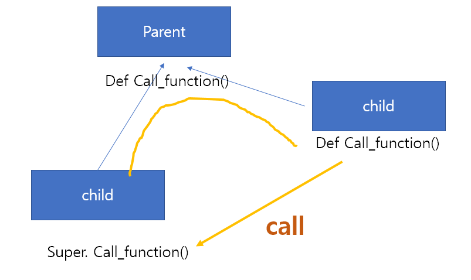
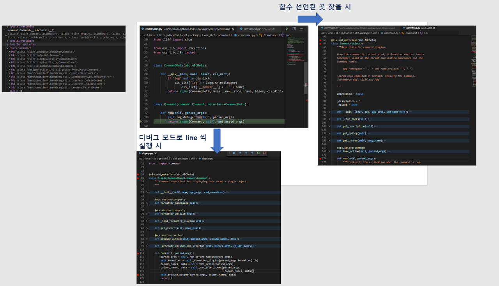
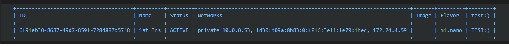

==================================================
Openstack server list가 출력되는 과정 Tracing 하기
==================================================

꼭  source openrc admin 을 해준 뒤, openstack을 실행시켜야 실행이 된다.

.. code-block:: none

   $sudo su- stack
   
   $pwd
   /opt/stack
   
   stack@devstack-master:~$ cd devstack/
   
   stack@devstack-master:~/devstack$ source openrc admin
   WARNING: setting legacy OS_TENANT_NAME to support cli tools.
   
   stack@devstack-ussuri:~/devstack$ openstack server list
   +--------------------------------------+------+--------+---------------------------------------------------------------------+-------+---------+
   | ID                                   | Name | Status | Networks                                                            | Image | Flavor  |
   +--------------------------------------+------+--------+---------------------------------------------------------------------+-------+---------+
   | baad8346-1541-4f12-a7f3-a41681398679 | test | ACTIVE | private=fd82:98dc:7575:0:f816:3eff:fec7:61d8, 10.0.0.22, 172.24.4.3 |       | m1.nano |
   +--------------------------------------+------+--------+---------------------------------------------------------------------+-------+---------+

VSCode Remote - SSH 를 사용하기 전에는 아래와 같이 Tracing 하였습니다.

.. code-block:: none

   stack@devstack-master:~/devstack$ whereis openstack
   openstack: /etc/openstack /usr/local/bin/openstack
   stack@devstack-ussuri:~/devstack$ cat /usr/local/bin/openstack
   #!/usr/bin/python3.6
   # -*- coding: utf-8 -*-
   import re
   import sys
   from openstackclient.shell import main
   if __name__ == '__main__':
      sys.argv[0] = re.sub(r'(-script\.pyw|\.exe)?$', '', sys.argv[0])
      sys.exit(main())
   
   stack@devstack-ussuri:~/devstack$ python3
   >>> import openstackclient
   >>> openstackclient
   <module 'openstackclient' from '/usr/local/lib/python3.6/dist-packages/openstackclient/__init__.py'>
   stack@devstack-ussuri:~/devstack$ cat /usr/local/lib/python3.6/dist-packages/openstackclient/shell.py

1.whereis 로 Python file을 찾고
2.cat 으로 file 내용을 보고
3.import 한 module의 경로를 직접 찾았음
눈물없이 볼 수 없는 광경

 

이제는 VSCode를 사용하여 Tracing 하도록 합니다.
Tracing을 위해 자주 사용한 단축키는 아래와 같습니다.

* F12 : 함수가 선언된 곳으로 이동
* Ctrl + E (or Ctrl+P) : Python File 명으로 검색
* Ctrl + Shift + F : 전체 디렉토리에서 검색
* Alt + ← : 이전 결과로 돌아가기
* Alt + → : 다음 결과로 다시가기
* F9 : Break Point
* F5 : Debug Mode
* F11 : Step into
* F10 : Step

1.출발 : openstack 명령어
~~~~~~~~~~~~~~~~~~~~~~~~~~~~~~~~

.. code-block:: none

   stack@devstack-ussuri:~/devstack$ openstack server list
   +--------------------------------------+------+--------+---------------------------------------------------------------------+-------+---------+
   | ID                                   | Name | Status | Networks                                                            | Image | Flavor  |
   +--------------------------------------+------+--------+---------------------------------------------------------------------+-------+---------+
   | baad8346-1541-4f12-a7f3-a41681398679 | test | ACTIVE | private=fd82:98dc:7575:0:f816:3eff:fec7:61d8, 10.0.0.22, 172.24.4.3 |       | m1.nano |
   +--------------------------------------+------+--------+---------------------------------------------------------------------+-------+---------+

openstack 이라는 명령어와 Argument는 어떻게 넘어가서 출력되는지 찾으러 떠납니다.

.. code-block:: none

   stack@devstack-master:~/devstack$ whereis openstack
   openstack: /etc/openstack /usr/local/bin/openstack
 

Ctrl + Shift + F 를 사용하여 openstack 명령어가 실행된 파일을 클릭합니다.

/usr/local/bin/openstack
~~~~~~~~~~~~~~~~~~~~~~~~~~~~~~~~

.. code-block:: python

   #!/usr/bin/python3.6
   # -*- coding: utf-8 -*-
   import re
   import sys
   from openstackclient.shell import main
   if __name__ == '__main__':
      sys.argv[0] = re.sub(r'(-script\.pyw|\.exe)?$', '', sys.argv[0])
      sys.exit(main())

* line 1 : argument를 받습니다. 출력과 무관할 것이라 예상됩니다.
* line 2 : exit(main())으로 어딘가의 main으로 빠집니다. main() 위에 커서를 두고 F12를 클릭합니다

/usr/local/lib/python3.6/dist-packages/openstackclient/shell.py
~~~~~~~~~~~~~~~~~~~~~~~~~~~~~~~~~~~~~~~~~~~~~~~~~~~~~~~~~~~~~~~~~~~~~~~

.. code-block:: python

   def main(argv=None):
      if argv is None:
         argv = sys.argv[1:]
         if six.PY2:
            # Emulate Py3, decode argv into Unicode based on locale so that
            # commands always see arguments as text instead of binary data
            encoding = locale.getpreferredencoding()
            if encoding:
               argv = map(lambda arg: arg.decode(encoding), argv)
      return OpenStackShell().run(argv)

* return 값으로 무엇인가를 넘겨주는 것을 볼 수 있습니다. 이 구문으로부터 출력이 나올것이라 예상하고 run이라는 function 위에서 F12를 눌러줍니다.

/usr/local/lib/python3.6/dist-packages/osc_lib/shell.py
~~~~~~~~~~~~~~~~~~~~~~~~~~~~~~~~~~~~~~~~~~~~~~~~~~~~~~~~~~~~~

.. code-block:: python

   class OpenStackShell(app.App):
      def run(self, argv):
         ret_val = 1
         self.command_options = argv
         try:
            ret_val = super(OpenStackShell, self).run(argv)
               return ret_val
         except Exception as e:
            if not logging.getLogger('').handlers:
               logging.basicConfig()
            if self.dump_stack_trace:
               self.log.error(traceback.format_exc())
            else:
               self.log.error('Exception raised: ' + str(e))
            return ret_val
         finally:
            self.log.info("END return value: %s", ret_val)

* run 이라는 function은 try~except 구문을 사용하고 있습니다.
* 이 구문을 자세히 보면 return ret_val을 넘겨주는 것을 알 수 있습니다.
* 따라서, ret_val에 전달되는 값인 super(OpenStackShell, self).run(argv)의 run 함수에 커서를 두고 F12를 누릅니다.

.. code-block: python

   Super : Python의 상속의 개념에서 나오며, 자식클래스가 부모 클래스를 사용할 경우 사용합니다.
   class className(Parent) : 괄호 안에 들어있는 것은 상속받는 부모 입니다.

/usr/local/lib/python3.6/dist-packages/cliff/app.py
~~~~~~~~~~~~~~~~~~~~~~~~~~~~~~~~~~~~~~~~~~~~~~~~~~~~~~~~~~~~

.. code-block:: python

   class App(object):
      def run(self, argv):
      """
      Equivalent to the main program for the application.
      :param argv: input arguments and options
      :paramtype argv: list of str
      """
         try:
            self.options, remainder = self.parser.parse_known_args(argv)
            self.configure_logging()
            self.interactive_mode = not remainder
            if self.deferred_help and self.options.deferred_help and remainder:
               # When help is requested and `remainder` has any values disable
               # `deferred_help` and instead allow the help subcommand to
               # handle the request during run_subcommand(). This turns
               # "app foo bar --help" into "app help foo bar". However, when
               # `remainder` is empty use print_help_if_requested() to allow
               # for an early exit.
               # Disabling `deferred_help` here also ensures that
               # print_help_if_requested will not fire if called by a subclass
               # during its initialize_app().
               self.options.deferred_help = False
               remainder.insert(0, "help")
            self.initialize_app(remainder)
            self.print_help_if_requested()
         except Exception as err:
            if hasattr(self, 'options'):
               debug = self.options.debug
            else:
               debug = True
            if debug:
               self.LOG.exception(err)
               raise
            else:
               self.LOG.error(err)
            return 1
         result = 1
         if self.interactive_mode:
            result = self.interact()
         else:
            result = self.run_subcommand(remainder)
         return result

* try ~ except 구문을 사용하고 있습니다. 눈여겨 봐야할 것은 어떤 값이 반환되는지보는 return 값 입니다.
* return result를 사용하고 있으며, result에는 if ~ else 구문으로 각기 다른 값이 들어가고 있습니다.
* `remainder` is empty use print_help_if_requested() to allow
* 이 문장에서, arguments가 empty일 때 remainder가 0이 되고 -> interactive_mode=True가 됩니다.
* 따라서, run_subcommand()로 진입합니다.

/usr/local/lib/python3.6/dist-packages/cliff/app.py.
~~~~~~~~~~~~~~~~~~~~~~~~~~~~~~~~~~~~~~~~~~~~~~~~~~~~

.. code-block:: python

   class App(object):
      def run_subcommand(self, argv):
         try:
            subcommand = self.command_manager.find_command(argv)
         except ValueError as err:
            # If there was no exact match, try to find a fuzzy match
            the_cmd = argv[0]
            fuzzy_matches = self.get_fuzzy_matches(the_cmd)
            if fuzzy_matches:
               article = 'a'
               if self.NAME[0] in 'aeiou':
                  article = 'an'
               self.stdout.write('%s: \'%s\' is not %s %s command. ''See \'%s --help\'.\n'% (self.NAME, ' '.join(argv), article,self.NAME, self.NAME))
               self.stdout.write('Did you mean one of these?\n')
               for match in fuzzy_matches:
                  self.stdout.write('  %s\n' % match)
            else:
                  if self.options.debug:
                  raise
                  else:
                     self.LOG.error(err)
               return 2
         cmd_factory, cmd_name, sub_argv = subcommand
         kwargs = {}
         if 'cmd_name' in utils.getargspec(cmd_factory.__init__).args:
            kwargs['cmd_name'] = cmd_name
         cmd = cmd_factory(self, self.options, **kwargs)
         result = 1
         try:
            self.prepare_to_run_command(cmd)
            full_name = (cmd_name if self.interactive_mode else ' '.join([self.NAME, cmd_name]))
            cmd_parser = cmd.get_parser(full_name)
            parsed_args = cmd_parser.parse_args(sub_argv)
            result = cmd.run(parsed_args)
         except Exception as err:
            if self.options.debug:
               self.LOG.exception(err)
            else:
               self.LOG.error(err)
            try:
               self.clean_up(cmd, result, err)
            except Exception as err2:
               if self.options.debug:
                  self.LOG.exception(err2)
               else:
                  self.LOG.error('Could not clean up: %s', err2)
            if self.options.debug:
               # 'raise' here gets caught and does not exit like we want
               return result
         else:
            try:
               self.clean_up(cmd, result, None)
            except Exception as err3:
               if self.options.debug:
                  self.LOG.exception(err3)
               else:
                  self.LOG.error('Could not clean up: %s', err3)
         return result

코드가 기니까 중요하지 않은 부분은 설명과 함께 주석으로 처리해서 핵심만 바라봅시다.

.. code-block:: none

   try:
      subcommand = self.command_manager.find_command(argv)
      # Exception 발생에 대한 처리입니다. 넘기도록 합니다.              
      #          except ValueError as err:
      #              return 2
      cmd_factory, cmd_name, sub_argv = subcommand
      kwargs = {}
      if 'cmd_name' in utils.getargspec(cmd_factory.__init__).args: ①
         kwargs['cmd_name'] = cmd_name
      cmd = cmd_factory(self, self.options, **kwargs)
      result = 1
      try:
         self.prepare_to_run_command(cmd)
         full_name = (cmd_name
            if self.interactive_mode
            else ' '.join([self.NAME, cmd_name])
         )
         cmd_parser = cmd.get_parser(full_name)
         parsed_args = cmd_parser.parse_args(sub_argv)
         result = cmd.run(parsed_args)
         # Exception 발생에 대한 처리입니다. 넘기도록 합니다.
         #          except Exception as err:
         #                  return result
      else: ②
         try:
            self.clean_up(cmd, result, None)
            # Exception 발생에 대한 처리입니다. 넘기도록 합니다.
            except Exception as err3:  
      return result

* 가장 먼저 맨 마지막의 return result를 바라봅니다. 함수를 추적하는데 있어서 제일 먼저 바라봐야 할 것은 함수의 Entry와 Exit 입니다.
* result의 값이 유의미하게 쓰여지는 곳은 result = cmd.run(parsed_args) 입니다.
* 느낌상 cmd.run이 print 해줄 것 같습니다. 일단 따라갑니다.

/usr/local/lib/python3.6/dist-packages/osc_lib/command/command.py
~~~~~~~~~~~~~~~~~~~~~~~~~~~~~~~~~~~~~~~~~~~~~~~~~~~~~~~~~~~~~~~~~~~~~~~~~

.. code-block:: python

   class Command(command.Command, metaclass=CommandMeta):
      def run(self, parsed_args):
         self.log.debug('run(%s)', parsed_args)
         return super(Command, self).run(parsed_args) 

여기서부터는 답을 찾지 못했는데, 아시는 분은 알려주시면 감사할 것 같습니다.

20.08.30

F12를 눌르면 아래의 경로로 갑니다.

/usr/local/lib/python3.6/dist-packages/osc_lib/command/command.py.
~~~~~~~~~~~~~~~~~~~~~~~~~~~~~~~~~~~~~~~~~~~~~~~~~~~~~~~~~~~~~~~~~~

.. code-block:: python

   class Command(command.Command, metaclass=CommandMeta):
      def run(self, parsed_args):
         """Invoked by the application when the command is run.
         Developers implementing commands should override
         :meth:`take_action`.
         Developers creating new command base classes (such as
         :class:`Lister` and :class:`ShowOne`) should override this
         method to wrap :meth:`take_action`.
         Return the value returned by :meth:`take_action` or 0.
         """
         parsed_args = self._run_before_hooks(parsed_args)
         return_code = self.take_action(parsed_args) or 0
         return_code = self._run_after_hooks(parsed_args, return_code)
         return return_code

* 그러나 실제로 디버깅 진입시에는 아래와 같은 경로로 진입합니다.

/usr/local/lib/python3.6/dist-packages/cliff/display.py
~~~~~~~~~~~~~~~~~~~~~~~~~~~~~~~~~~~~~~~~~~~~~~~~~~~~~~~~~~~~

.. code-block:: python

   @six.add_metaclass(abc.ABCMeta)
   class DisplayCommandBase(command.Command):
   def run(self, parsed_args):
      parsed_args = self._run_before_hooks(parsed_args)
      self.formatter = self._formatter_plugins[parsed_args.formatter].obj
      column_names, data = self.take_action(parsed_args)
      column_names, data = self._run_after_hooks(parsed_args,(column_names, data))
      self.produce_output(parsed_args, column_names, data)
      return 0

``참조한 Site``
* https://stackoverflow.com/questions/4799401/pythons-super-abstract-base-classes-and-notimplementederror
* https://docs.python.org/ko/3/library/abc.html
* https://dojang.io/mod/page/view.php?id=2389
* https://www.geeksforgeeks.org/abstract-classes-in-python/
* https://alphahackerhan.tistory.com/34

.. code-block:: none

   [Python에서 자식 클래스 확인]
   Foo.__subclasses__()
   [<class '__main__.Bar'>, <class '__main__.Baz'>]
   [Python에서 부모 클래스 확인]
   cls.__bases__
   (<class '__main__.A'>, <class '__main__.B'>)
   [Python에서 Instance 확인]
   simclass = Csimple()
   isinstance(simclass,Csimple)
   # simclass가 Csimple 클래스인지 확인. 결과는 True

마저 진행해보면

/usr/local/lib/python3.6/dist-packages/cliff/display.py.
~~~~~~~~~~~~~~~~~~~~~~~~~~~~~~~~~~~~~~~~~~~~~~~~~~~~~~~~

.. code-block:: python

   @six.add_metaclass(abc.ABCMeta)
   class DisplayCommandBase(command.Command):
      def run(self, parsed_args):
      parsed_args = self._run_before_hooks(parsed_args)
      self.formatter = self._formatter_plugins[parsed_args.formatter].obj
      column_names, data = self.take_action(parsed_args)
      column_names, data = self._run_after_hooks(parsed_args,(column_names, data))
      self.produce_output(parsed_args, column_names, data)
      return 0

* self.produce_output() 함수를 통해 출력이 됨을 확인할 수 있습니다.

.. code-block:: python

   +--------------------------------------+---------+--------+----------------------------------------------------------------------+-------+---------+
   | ID                                   | Name    | Status | Networks                                                             | Image | Flavor  |
   +--------------------------------------+---------+--------+----------------------------------------------------------------------+-------+---------+
   | 6f91eb30-8687-49d7-859f-7284887d57f8 | 1st_Ins | ACTIVE | private=10.0.0.53, fd30:b09a:8b83:0:f816:3eff:fe79:1bec, 172.24.4.59 |       | m1.nano |
   +--------------------------------------+---------+--------+----------------------------------------------------------------------+-------+---------+

* 함수명에 output 이 있는걸로 보아 출력 된다는 것을 예상 할 수 있지만, 표준출력함수(stdout)이 나올 때 까지 좀 더 Tracing 해보도록 합니다.

"/usr/local/lib/python3.6/dist-packages/cliff/display.py"
~~~~~~~~~~~~~~~~~~~~~~~~~~~~~~~~~~~~~~~~~~~~~~~~~~~~~~~~~

.. code-block:: python

   @six.add_metaclass(abc.ABCMeta)
   class DisplayCommandBase(command.Command):
      def run(self, parsed_args):
         self.produce_output(parsed_args, column_names, data)
         return 0
   @abc.abstractmethod
      def produce_output(self, parsed_args, column_names, data):
         """Use the formatter to generate the output.
         :param parsed_args: argparse.Namespace instance with argument values
         :param column_names: sequence of strings containing names of output columns
         :param data: iterable with values matching the column names
         """

* DisplayCommandBase Class의 produce_output() function 에는 내용이 없습니다.
* F11을 누르면 상속받은 Class의 produce_output() function으로 갑니다.

.. code-block:: none

   DisplayCommandBase.__subclasses__()
   
   [<class 'cliff.lister.Lister'>, <class 'cliff.lister.Lister'>, <class 'cliff.show.ShowOne'>]
   
   class variables
   0:<class 'cliff.lister.Lister'>
   1:<class 'cliff.lister.Lister'>
   2:<class 'cliff.show.ShowOne'>
   
/usr/local/lib/python3.6/dist-packages/cliff/lister.py
~~~~~~~~~~~~~~~~~~~~~~~~~~~~~~~~~~~~~~~~~~~~~~~~~~~~~~~~~

.. code-block:: python

   @six.add_metaclass(abc.ABCMeta)
   class Lister(display.DisplayCommandBase):
      def produce_output(self, parsed_args, column_names, data):
         if parsed_args.sort_columns and self.need_sort_by_cliff:
            indexes = [column_names.index(c) for c in parsed_args.sort_columns if c in column_names]
            if indexes:
               data = sorted(data, key=operator.itemgetter(*indexes))
         (columns_to_include, selector) = self._generate_columns_and_selector(
            parsed_args, column_names)
         if selector:
            # Generator expression to only return the parts of a row
            # of data that the user has expressed interest in
            # seeing. We have to convert the compress() output to a
            # list so the table formatter can ask for its length.
            data = (list(self._compress_iterable(row, selector)) for row in data)
            self.formatter.emit_list(columns_to_include,data,self.app.stdout,parsed_args,)
         return 0

* self.formatter.emit_list 이후 출력이 됩니다.
* F11을 눌러 emit_list 함수를 따라갑니다.
* F12를 눌러 선언을 확인했을 때는 이동하지 않았었습니다. ㅠㅠ.

.. code-block:: python

   +--------------------------------------+---------+--------+----------------------------------------------------------------------+-------+---------+
   | ID                                   | Name    | Status | Networks                                                             | Image | Flavor  |
   +--------------------------------------+---------+--------+----------------------------------------------------------------------+-------+---------+
   | 6f91eb30-8687-49d7-859f-7284887d57f8 | 1st_Ins | ACTIVE | private=10.0.0.53, fd30:b09a:8b83:0:f816:3eff:fe79:1bec, 172.24.4.59 |       | m1.nano |
   +--------------------------------------+---------+--------+----------------------------------------------------------------------+-------+---------+

/usr/local/lib/python3.6/dist-packages/cliff/formatters/table.py
~~~~~~~~~~~~~~~~~~~~~~~~~~~~~~~~~~~~~~~~~~~~~~~~~~~~~~~~~~~~~~~~~~~~

.. code-block:: python

   class TableFormatter(base.ListFormatter, base.SingleFormatter):
      def emit_list(self, column_names, data, stdout, parsed_args):
         x = prettytable.PrettyTable(column_names,print_empty=parsed_args.print_empty,)
         x.padding_width = 1
         # Add rows if data is provided
         if data:
            self.add_rows(x, column_names, data)
         # Choose a reasonable min_width to better handle many columns on a
         # narrow console. The table will overflow the console width in
         # preference to wrapping columns smaller than 8 characters.
         min_width = 8
         self._assign_max_widths(stdout, x, int(parsed_args.max_width), min_width,parsed_args.fit_width)
         formatted = x.get_string()
         stdout.write(formatted)
         stdout.write('\n')
         return

* stdou.wrtie(formatted) 이후 출력이 나옵니다.
* 이를 통해서 formatted 라는 곳에 문자열(string)이 들어가 있음을 알 수 있겠습니다.

.. code-block:: python

   +--------------------------------------+---------+--------+----------------------------------------------------------------------+-------+---------+
   | ID                                   | Name    | Status | Networks                                                             | Image | Flavor  |
   +--------------------------------------+---------+--------+----------------------------------------------------------------------+-------+---------+
   | 6f91eb30-8687-49d7-859f-7284887d57f8 | 1st_Ins | ACTIVE | private=10.0.0.53, fd30:b09a:8b83:0:f816:3eff:fe79:1bec, 172.24.4.59 |       | m1.nano |
   +--------------------------------------+---------+--------+----------------------------------------------------------------------+-------+---------+

* 이제 출력이 되는 것을 확인하였으니 변경을 시도해 봅니다.

3. [실습] Openstack server list Table 변경하여 출력하기
------------------------------------------------------------------------------- 

"/usr/local/lib/python3.6/dist-packages/cliff/formatters/table.py"
~~~~~~~~~~~~~~~~~~~~~~~~~~~~~~~~~~~~~~~~~~~~~~~~~~~~~~~~~~~~~~~~~~

.. code-block:: python

   class TableFormatter(base.ListFormatter, base.SingleFormatter):
      def emit_list(self, column_names, data, stdout, parsed_args):
         x = prettytable.PrettyTable( column_names, print_empty=parsed_args.print_empty, )
         x.padding_width = 1
         # Add rows if data is provided if data: self.add_rows(x, column_names, data)
         # Choose a reasonable min_width to better handle many columns on a
         # narrow console. The table will overflow the console width in
         # preference to wrapping columns smaller than 8 characters.
         min_width = 8
         self._assign_max_widths( stdout, x, int(parsed_args.max_width), min_width, parsed_args.fit_width)
         formatted = x.get_string()
         stdout.write(formatted)
         stdout.write('\n')
         return

* x=prettytable.PrettyTable() 에서 +---+ 가 들어가게 이쁘게 테이블을 생성해주는 것 같습니다.
* 이 때 들어가는 column들은 column_names 라는 argument가 될 것 같네요. 한번 찍어봅시다.

.. code-block: python

   #DEBUG CONSOLE
   column_names
   ('ID', 'Name', 'Status', 'Networks', 'Image', 'Flavor')

* self.add_rows 에서 Data를 추가해줄 것 같네요. F11을 눌러 들어가 봅니다

""/usr/local/lib/python3.6/dist-packages/cliff/formatters/table.py""
~~~~~~~~~~~~~~~~~~~~~~~~~~~~~~~~~~~~~~~~~~~~~~~~~~~~~~~~~~~~~~~~~~~~

.. code-block:: python

   class TableFormatter(base.ListFormatter, base.SingleFormatter):
      def add_rows(self, table, column_names, data):
         # Figure out the types of the columns in the
         # first row and set the alignment of the
         # output accordingly.
         data_iter = iter(data)
         try:
            first_row = next(data_iter)
         except StopIteration:
            pass
         else:
            for value, name in zip(first_row, column_names):
               alignment = self.ALIGNMENTS.get(type(value), 'l')
               table.align[name] = alignment
            # Now iterate over the data and add the rows.
            table.add_row(_format_row(first_row))
            for row in data_iter:
               table.add_row(_format_row(row))

* fisrt_row 라는 곳에 저희가 원하는 데이터가 들어가 있습니다.

.. code-block:: python

   first_row
   ('6f91eb30-8687-49d7-8...84887d57f8', '1st_Ins', 'ACTIVE', 'private=10.0.0.53, f...72.24.4.59', '', 'm1.nano')
   special variables
   function variables
   0:'6f91eb30-8687-49d7-859f-7284887d57f8'
   1:'1st_Ins'
   2:'ACTIVE'
   3:'private=10.0.0.53, fd30:b09a:8b83:0:f816:3eff:fe79:1bec, 172.24.4.59'
   4:''
   5:'m1.nano'
   len():6
 
그리고 

.. code-block:: none

   type(first_row)
   <class 'tuple'>

타입은 Tuple이군요
저는 여기서 fisrt_row와 column_names에 item을 추가해서 출력시켜 보겠습니다.

.. code-block:: python
   
   first_row += ('Test:)',)
   first_row
   ('6f91eb30-8687-49d7-8...84887d57f8', '1st_Ins', 'ACTIVE', 'private=10.0.0.53, f...72.24.4.59', '', 'm1.nano', 'Test:)')

""/usr/local/lib/python3.6/dist-packages/cliff/display.py""
~~~~~~~~~~~~~~~~~~~~~~~~~~~~~~~~~~~~~~~~~~~~~~~~~~~~~~~~~~~

.. code-block:: python

   column_names += ("TestL:)",)
   column_names
   ('ID', 'Name', 'Status', 'Networks', 'Image', 'Flavor', 'TestL:)')
 

* 일단 출력 되었습니다 !
* 이제 이런 주먹구구식 말고, 좀 더 general 하게 접근할 수 있는 방법을 찾아보겠습니다.

1.가장 먼저 추측해본 곳은 column_names에 정보가 담기는 곳입니다.
-----------------------------------------------------------------------------

최종적으로 stdout.write 될 때, 사용 되는 것이 column_names 였기 때문입니다.
따라서 Display.py 파일부터 tracing Entry로 잡았습니다.

"/usr/local/lib/python3.6/dist-packages/cliff/display.py".
~~~~~~~~~~~~~~~~~~~~~~~~~~~~~~~~~~~~~~~~~~~~~~~~~~~~~~~~~~

.. code-block:: python

   @six.add_metaclass(abc.ABCMeta)
   class DisplayCommandBase(command.Command):
      def run(self, parsed_args):
         parsed_args = self._run_before_hooks(parsed_args)
         self.formatter = self._formatter_plugins[parsed_args.formatter].obj
   =>    column_names, data = self.take_action(parsed_args)
         column_names, data = self._run_after_hooks(parsed_args, (column_names, data))
         self.produce_output(parsed_args, column_names, data)
         return 0
        
* => 표시된 Break point를 걸고 F11로 진입하였습니다.

/usr/local/lib/python3.6/dist-packages/openstackclient/compute/v2/server.py
~~~~~~~~~~~~~~~~~~~~~~~~~~~~~~~~~~~~~~~~~~~~~~~~~~~~~~~~~~~~~~~~~~~~~~~~~~~~~~~~~~~~~~

.. code-block:: python

   class ListServer(command.Lister):
      def take_action(self, parsed_args):
         compute_client = self.app.client_manager.compute
         identity_client = self.app.client_manager.identity
         image_client = self.app.client_manager.image
         
         project_id = None
         # None 이어서 실행되지 않는 문장 제거
         
         ## 명령어 입력시 --long을 해야함. 아래 참고한 페이지 서술
         if parsed_args.long:
         else:
            if: parsed_args.no_name_lookup:
            else:
               columns = (
                  'ID',
                  'Name',
                  'Status',
                  'Networks',
                  'Image Name',
                  'Flavor Name',
               )
            column_headers = (
               'ID',
               'Name',
               'Status',
               'Networks',
               'Image',
               'Flavor',
            )
            mixed_case_fields = []
         marker_id = None
   =>    data = compute_client.servers.list(search_opts=search_opts,marker=marker_id,limit=parsed_args.limit)

* 중간에 data=compute_client.servers.list() 를 담는 곳이 있습니다.
* 저희가 입력한 명령어는 server list 이기 때문에, 이부분이 실제로 list 자료를 get 하는 부분이 아닐까 의심합니다.
* => 표시된 Break point를 걸고 F11로 진입하였습니다.
 

``[Debug Console로 확인한 parsed_args 의 값들]``

.. code-block:: python

   parsed_args
   all_projects:False
   changes_before:None
   changes_since:None
   columns:[]
   deleted:False
   fit_width:False
   flavor:None
   formatter:'table'
   no_name_lookup:False
   noindent:False
   print_empty:False
   project:None
   project_domain:None
   quote_mode:'nonnumeric'
   reservation_id:None
   sort_columns:[]
   status:None
   unlocked:False
   user:None
   user_domain:None

/usr/local/lib/python3.6/dist-packages/novaclient/v2/servers.py
~~~~~~~~~~~~~~~~~~~~~~~~~~~~~~~~~~~~~~~~~~~~~~~~~~~~~~~~~~~~~~~~~~

.. code-block:: python

   class ServerManager(base.BootingManagerWithFind):
   def list(self, detailed=True, search_opts=None, marker=None, limit=None,sort_keys=None, sort_dirs=None):
      """
      Get a list of servers.
      :param detailed: Whether to return detailed server info (optional).
      :param search_opts: Search options to filter out servers which don't
         match the search_opts (optional). The search opts format is a
         dictionary of key / value pairs that will be appended to the query
         string.  For a complete list of keys see:
         https://docs.openstack.org/api-ref/compute/#list-servers
      :param marker: Begin returning servers that appear later in the server list than that represented by this server id (optional).
      :param limit: Maximum number of servers to return (optional).
         Note the API server has a configurable default limit.
         If no limit is specified here or limit is larger than
         default, the default limit will be used.
         If limit == -1, all servers will be returned.
      :param sort_keys: List of sort keys
      :param sort_dirs: List of sort directions
      :rtype: list of :class:`Server`

      Examples:
      
      client.servers.list() - returns detailed list of servers
      
      client.servers.list(search_opts={'status': 'ERROR'}) -
      returns list of servers in error state.
      
      client.servers.list(limit=10) - returns only 10 servers
      
      """
      if search_opts is None:
         search_opts = {}
         ....
   =>    servers = self._list("/servers%s%s" % (detail, query_string),"servers")
         result.extend(servers)
         result.append_request_ids(servers.request_ids)
      return result

* 함수 내용이 길지만, 주석에 대놓고 "Get a list of server" 라고 써져 있습니다.
* servers=self._list를 통해서 서버 명이 전달됩니다

.. code-block:: none

   result
   [<Server: 1st_Ins>]
   
   0:<Server: 1st_Ins>
   special variables
   function variables
   HUMAN_ID:True
   NAME_ATTR:'name'
   OS-DCF:diskConfig:'AUTO'
   OS-EXT-AZ:availability_zone:'nova'
   OS-EXT-STS:power_state:1
   OS-EXT-STS:task_state:None
   OS-EXT-STS:vm_state:'active'
   OS-SRV-USG:launched_at:'2020-08-06T13:21:45.000000'
   OS-SRV-USG:terminated_at:None
   accessIPv4:''
   accessIPv6:''
   addresses:{'private': [{...}, {...}, {...}]}
   api_version:<APIVersion: 2.1>
   config_drive:''
   created:'2020-08-06T13:21:28Z'
   flavor:{'id': '42', 'links': [{...}]}
   hostId:'f0b0f1375254bb6ee4a83c7f4e2ad6331d94f497bb3a9b1848af817a'
   human_id:'1st_ins'
   id:'6f91eb30-8687-49d7-859f-7284887d57f8'
   image:''
   key_name:'keyy'
   links:[{'href': 'http://192.168.1.10/...84887d57f8', 'rel': 'self'}, {'href': 'http://192.168.1.10/...84887d57f8', 'rel': 'bookmark'}]
   manager:<novaclient.v2.servers.ServerManager object at 0x7f65b323eeb8>
   metadata:{}
   name:'1st_Ins'
   networks:OrderedDict([('private', ['10.0.0.53', 'fd30:b09a:8b83:0:f81...:fe79:1bec', '172.24.4.59'])])
   os-extended-volumes:volumes_attached:[{'id': '05e026ea-96ed-4499-9...ba1cb63897'}]
   progress:0
   request_ids:[]
   security_groups:[{'name': 'default'}]
   status:'ACTIVE'
   tenant_id:'4e2abe72f99d484a82473b851a792f8a'
   updated:'2020-08-06T13:21:46Z'
   user_id:'b1f15ecfa456447c8d69ffaca15a2c69'
   x_openstack_request_ids:[]
   _add_details:<bound method Resource._add_details of <Server: 1st_Ins>>
   _append_request_id:<bound method RequestIdMixin._append_request_id of <Server: 1st_Ins>>
   _info:{'OS-DCF:diskConfig': 'AUTO', 'OS-EXT-AZ:availability_zone': 'nova', 'OS-EXT-STS:power_state': 1, 'OS-EXT-STS:task_state': None, 'OS-EXT-STS:vm_state': 'active', 'OS-SRV-USG:launched_at': '2020-08-06T13:21:45.000000', 'OS-SRV-USG:terminated_at': None, 'accessIPv4': '', 'accessIPv6': '', 'addresses': {'private': [...]}, 'config_drive': '', 'created': '2020-08-06T13:21:28Z', 'flavor': {'id': '42', 'links': [...]}, 'hostId': 'f0b0f1375254bb6ee4a8...1848af817a', ...}
   _loaded:True
   len():1

* 쫙 긁혀서 나옵니다.
* 그리고 _info를 보시면 위의 것이 한번 더 정리되어서 아래와 같습니다.

.. code-block:: python

   'hostId':'f0b0f1375254bb6ee4a83c7f4e2ad6331d94f497bb3a9b1848af817a'
   'image':''
   'flavor':{'id': '42', 'links': [{...}]}
   'created':'2020-08-06T13:21:28Z'
   'updated':'2020-08-06T13:21:46Z'
   'addresses':{'private': [{...}, {...}, {...}]}
   'accessIPv4':''
   'accessIPv6':''
   'links':[{'href': 'http://192.168.1.10/...84887d57f8', 'rel': 'self'}, {'href': 'http://192.168.1.10/...84887d57f8', 'rel': 'bookmark'}]
   'OS-DCF:diskConfig':'AUTO'
   'progress':0
   'OS-EXT-AZ:availability_zone':'nova'
   'config_drive':''

다시 돌아와서 이후 코드를 진행합니다.

"/usr/local/lib/python3.6/dist-packages/openstackclient/compute/v2/server.py".
~~~~~~~~~~~~~~~~~~~~~~~~~~~~~~~~~~~~~~~~~~~~~~~~~~~~~~~~~~~~~~~~~~~~~~~~~~~~~~

.. code-block:: python

   class ListServer(command.Lister):
      def take_action(self, parsed_args):
         data = compute_client.servers.list(search_opts=search_opts,marker=marker_id,limit=parsed_args.limit)
         #있는 list를 싹 다 긁어옴
         # 싹다 긁어온거랑, server 에서 가져온거랑 matching 시킴
         table =  (column_headers,
                  (utils.get_item_properties(
                     s, columns,
                     mixed_case_fields=mixed_case_fields,
                     formatters={'OS-EXT-STS:power_state': _format_servers_list_power_state,
                        'Networks': _format_servers_list_networks,
                        'Metadata': utils.format_dict,
                     },
                  ) for s in data))
         return table

.. code-block:: none

   table
   0:('ID', 'Name', 'Status', 'Networks', 'Image', 'Flavor')
   1:<generator object ListServer.take_action.<locals>.<genexpr> at 0x7f65b2e3c1a8>
   len():2

* 이 Table이 반환되면서 column_names와 Data가 반환되게 되고
* 우리의 여정은 끝입니다.

