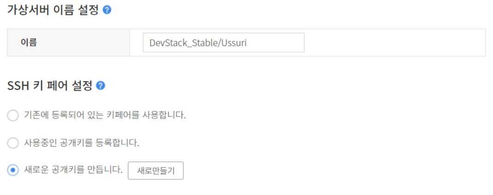
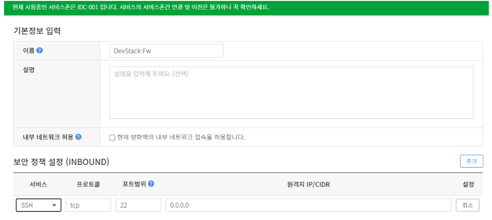
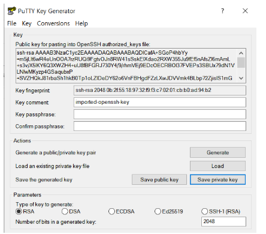
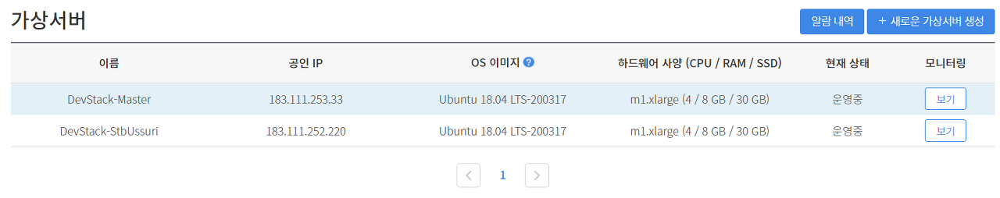
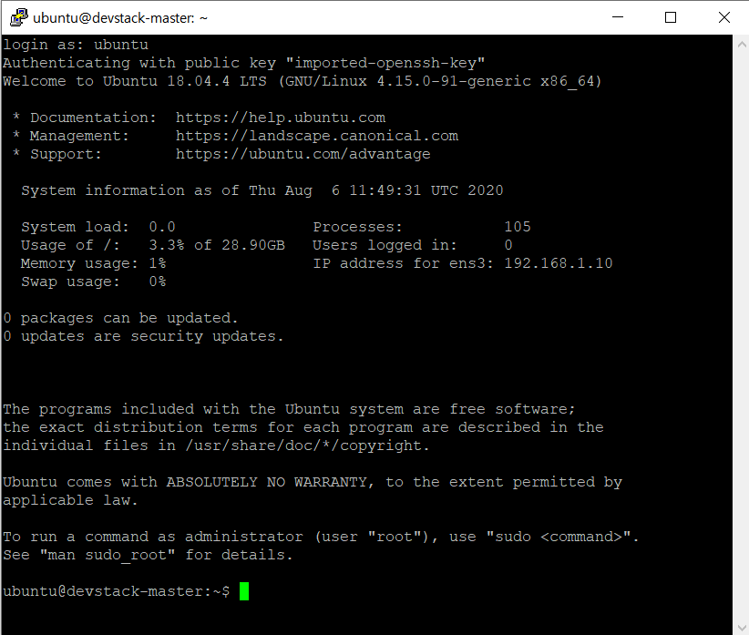
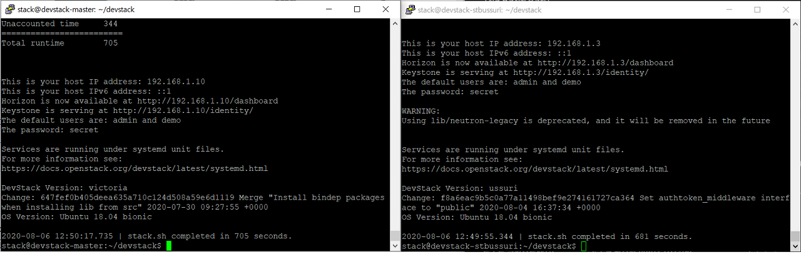
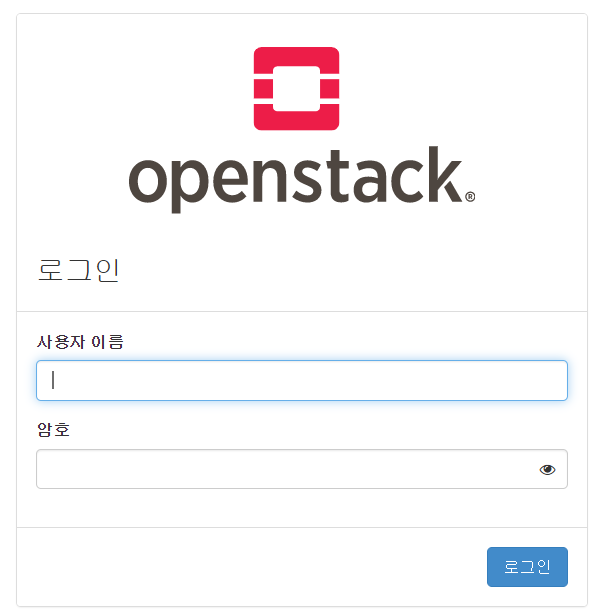
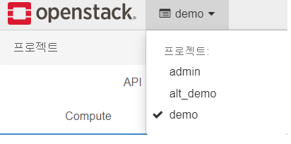

========================
Installation of devstack
========================

| 이 글은 2020 OSS Openstack Team 첫 Off-line 모임에서 
| 진행한 내용을 토대로 작성되었습니다.

목적
----
* Devstack을 설치하고, CLI 코드를 분석하며 분석능력을 다짐

목차
----
1.Devstack 설치 (Stable/ussuri || Master) 2개
2.Devstack 대쉬보드 소개

1.DevStack 설치
---------------
* 설치환경 : Cafe 24 Hosting을 사용한 가상 서버
* OS : Ubuntu 18.04 LTS
* HW사양 : m1.xlarge(CPU-4/RAM-8G/SSD-30G)

#01.가상서버생성
~~~~~~~~~~~~~~~~

* 가상서버를 생성할 때 만든 SSH 키 페어를 잘 보관합니다. 추후 SSH로 접속 시 사용되어야 합니다.

#02. 방화벽 생성 & 가상서버와 연결
~~~~~~~~~~~~~~~~~~~~~~~~~~~~~~~~~~

* 가상서버에 SSH로 접속하기 위해서는 방화벽이 필요합니다.
* 기본 정책은 차단되어 있으므로 **Inbound Rule** 에 SSH port(22)를 추가해줍니다.

#03. Putty를 사용하여 가상서버에 접속합니다.
~~~~~~~~~~~~~~~~~~~~~~~~~~~~~~~~~~~~~~~~~~~~
* 접속에 앞서 #01 에서 발급받은 공개키[pem]를 개인키[ppk] 로 바꿔줍니다
* 그러한 까닭은, EC2 같은 인스턴스 들이 일반적으로 PPK를 사용하기 때문입니다.
* 변환은 `PuTTY Key Generator <https://www.chiark.greenend.org.uk/~sgtatham/putty/latest.html>`_ 를 사용합니다.

* PuTTY를 사용하여 생성된 가상서버의 **공인IP** 에 접속한다. 접속시 SSH에 ppk 키를 입력해준다.

* login 시 ubuntu를 입력한다.

#04. 가상서버에 Devstack을 설치
~~~~~~~~~~~~~~~~~~~~~~~~~~~~~~~

공식문서의 `설치가이드 <https://docs.openstack.org/devstack/latest/>`_ 는 다음과 같다.

서술할 본문은 공식문서의 내용과 같다.

.. code-block:: none

   $ sudo useradd -s /bin/bash -d /opt/stack -m stack
   $ echo "stack ALL=(ALL) NOPASSWD: ALL" | sudo tee /etc/sudoers.d/stack
   $ sudo su - stack # Download Devstack
   $ git clone https://opendev.org/openstack/devstack
   $ cd devstack # Master || Stable/ussuri
   $ git checkout stable/ussuri
   $ git status

* Create local.conf

.. code-block:: none

   vim local.conf #생성
   [[local|localrc]]
   ADMIN_PASSWORD=secret
   DATABASE_PASSWORD=$ADMIN_PASSWORD
   RABBIT_PASSWORD=$ADMIN_PASSWORD
   SERVICE_PASSWORD=$ADMIN_PASSWORD
   HOST_IP=[호스팅한 가상서버의 Local IP 입력]

* Start Install

.. code-block:: none

   ./stack.sh #약 20분동안 설치가 진행된다.

* 성공적으로 설치된 모습

설치가 완료되면 localhost의 80 port를 이용하여 OpenStack의 DashBoard에 접근할 수 있는데,
우리는 외부에서 접속하므로 cafe24 vm의 공인IP를 통해 접속합니다.

 
이를 위해 다시 cafe24의 방화벽에 Inbound 정책으로 80/6080번 포트를 추가해줍니다.
공인아이피로 대쉬보드에 접속해줍니다.

2.DevStack 소개
---------------

devstack이 설치되면 총 3개 프로젝트를 기본적으로 만듭니다.
* admin
* alt_demo(보조데모)
* demo

이후에는 Devstack 상에서 Instance를 생성해보겠습니다.
