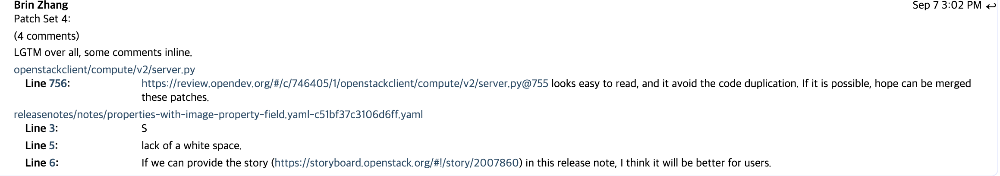
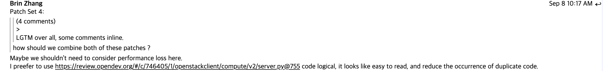
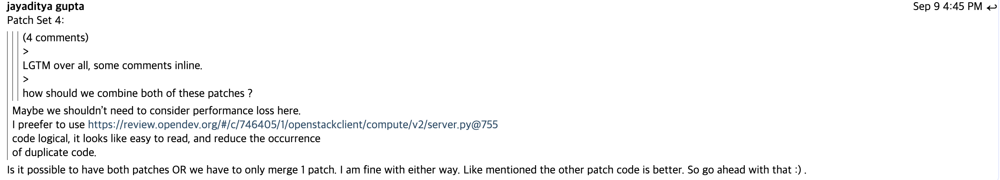
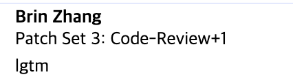
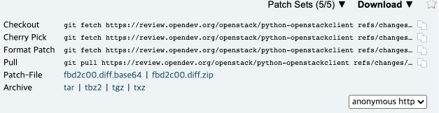

================================================================================================
[이슈] openstack CLI - Create an instance using --image-property filtering not working
================================================================================================

첫 컨트리뷰트가 될 이슈를 `이것 <https://storyboard.openstack.org/#!/story/2007860>`_ 으로 결정했다.

-----------
이슈 분석
-----------

``openstack server create`` 명령어로 인스턴스를 생성할 때, --image-property 옵션을 사용할 수 있었다.
property라는 단어가 ``openstack image show`` 로 이미지 정보를 볼 때 나오는 properties와 관련이 있다고 생각해서 cirros 이미지를 찾아보았다.

.. code-block:: shell

    $ openstack image show  cirros-0.5.1-x86_64-disk
    +------------------+----------------------------------------------------------------------------------------------------------------------------------------------------------------------------------------------------------------------------------------------------------------------------------------------------------------------------------------------------------------------------------+
    | Field            | Value                                                                                                                                                                                                                                                                                                                                                                            |
    +------------------+----------------------------------------------------------------------------------------------------------------------------------------------------------------------------------------------------------------------------------------------------------------------------------------------------------------------------------------------------------------------------------+
    | checksum         | 1d3062cd89af34e419f7100277f38b2b                                                                                                                                                                                                                                                                                                                                                 |
    | container_format | bare                                                                                                                                                                                                                                                                                                                                                                             |
    | created_at       | 2020-08-15T12:28:18Z                                                                                                                                                                                                                                                                                                                                                             |
    | disk_format      | qcow2                                                                                                                                                                                                                                                                                                                                                                            |
    | file             | /v2/images/56aad641-dd16-44af-86f0-b61ec980709c/file                                                                                                                                                                                                                                                                                                                             |
    | id               | 56aad641-dd16-44af-86f0-b61ec980709c                                                                                                                                                                                                                                                                                                                                             |
    | min_disk         | 0                                                                                                                                                                                                                                                                                                                                                                                |
    | min_ram          | 0                                                                                                                                                                                                                                                                                                                                                                                |
    | name             | cirros-0.5.1-x86_64-disk                                                                                                                                                                                                                                                                                                                                                         |
    | owner            | e90e398ff160422b84557c3924f775fe                                                                                                                                                                                                                                                                                                                                                 |
    | properties       | hw_rng_model='virtio', os_hash_algo='sha512', os_hash_value='553d220ed58cfee7dafe003c446a9f197ab5edf8ffc09396c74187cf83873c877e7ae041cb80f3b91489acf687183adcd689b53b38e3ddd22e627e7f98a09c46', os_hidden='False', os_version='0.5.1', owner_specified.openstack.md5='', owner_specified.openstack.object='images/cirros-0.5.1-x86_64-disk', owner_specified.openstack.sha256='' |
    | protected        | False                                                                                                                                                                                                                                                                                                                                                                            |
    | schema           | /v2/schemas/image                                                                                                                                                                                                                                                                                                                                                                |
    | size             | 16338944                                                                                                                                                                                                                                                                                                                                                                         |
    | status           | active                                                                                                                                                                                                                                                                                                                                                                           |
    | tags             |                                                                                                                                                                                                                                                                                                                                                                                  |
    | updated_at       | 2020-08-15T12:33:37Z                                                                                                                                                                                                                                                                                                                                                             |
    | visibility       | public                                                                                                                                                                                                                                                                                                                                                                           |
    +------------------+----------------------------------------------------------------------------------------------------------------------------------------------------------------------------------------------------------------------------------------------------------------------------------------------------------------------------------------------------------------------------------+

이 결과에서 나오는 프로퍼티를 사용해 VM을 생성하는 방식을 여러 번 시도했다. 여기서 한 가지 문제점을 발견했다.

--------
문제점
--------

이미지가 여러 개 있을 때, 프로퍼티로 이미지를 선택하는 것이 제대로 동작하지 않는 것을 발견했다. 사용한 명령어는 다음과 같다.

.. code-block:: shell

    $ openstack image set --os-version 0.5.1 cirros-0.5.1-x86_64-disk
    $ openstack image save cirros-0.5.1-x86_64-disk --file cirros.image
    $ openstack image create cirros --file cirros.image

    +------------------+--------------------------------------------------------------------------------------------------------------------------------------------+
    | Field            | Value                                                                                                                                      |
    +------------------+--------------------------------------------------------------------------------------------------------------------------------------------+
    | container_format | bare                                                                                                                                       |
    | created_at       | 2020-08-17T10:48:18Z                                                                                                                       |
    | disk_format      | raw                                                                                                                                        |
    | file             | /v2/images/53cbd213-a39c-4d88-b8e1-5e14a512e292/file                                                                                       |
    | id               | 53cbd213-a39c-4d88-b8e1-5e14a512e292                                                                                                       |
    | min_disk         | 0                                                                                                                                          |
    | min_ram          | 0                                                                                                                                          |
    | name             | cirros                                                                                                                                     |
    | owner            | e1c2fb4e069e4a5a8935bef43df00e85                                                                                                           |
    | properties       | os_hidden='False', owner_specified.openstack.md5='', owner_specified.openstack.object='images/cirros', owner_specified.openstack.sha256='' |
    | protected        | False                                                                                                                                      |
    | schema           | /v2/schemas/image                                                                                                                          |
    | status           | queued                                                                                                                                     |
    | tags             |                                                                                                                                            |
    | updated_at       | 2020-08-17T10:48:18Z                                                                                                                       |
    | visibility       | shared                                                                                                                                     |
    +------------------+--------------------------------------------------------------------------------------------------------------------------------------------+
    $ openstack server create cirros-test \
    --flavor 1 \
    --key-name key \
    --image-property os_version=0.5.1

    No images match the property expected by --image-property
    
위의 명령어들을 요약하면 다음과 같다.

1. 기존 이미지(cirros-0.5.1-x86_64-disk)에 ``os_version`` 이라는 프로퍼티를 설정한다.
2. 기존 이미지를 저장한 뒤, 그 파일로 새로운 이미지를 등록한다.
3. 서버를 생성할 때 --image-property에 ``os_version`` 프로퍼티를 사용한다.

분명히 ``os_version`` 을 설정했음에도 불구하고 이미지를 선택하지 못하는 것을 확인할 수 있었다.

-----------
코드 분석
-----------

발견한 문제점을 토대로 코드를 분석했다. 분석해야 할 파일은  python-openstackclient 프로젝트에서 openstackclient/compute/v2/server.py 파일이며, VM을 생성하는 함수는 ``CreateServer`` 클래스의 ``take_action()`` 이다. 

``CreateServer`` 클래스의 ``take_action()`` 를 살펴보니, ``_match_image()`` 라는 함수가 ``take_action()`` 내부에 정의되어 있었고, 여기서 --image-propert 옵션과 관련된 로직이 실행되고 있었다. 해당 함수는 아래와 같은 모습이다.

.. code-block:: python3

    def _match_image(image_api, wanted_properties):
        image_list = image_api.images()
        images_matched = []
        for img in image_list:
            img_dict = {}
            # exclude any unhashable entries
            for key, value in img.items():
                try:
                    set([key, value])
                except TypeError:
                    pass
                else:
                    img_dict[key] = value
            if all(k in img_dict and img_dict[k] == v
                    for k, v in wanted_properties.items()):
                images_matched.append(img)
            else:
                return []
        return images_matched

이 함수의 문제점은 --image-property로 명시한 조건과 일치하지 않는 이미지가 존재하면 필터링된 이미지 리스트(위 함수에서는 ``images_matched`` )가 아닌 빈 리스트를 리턴한다는 것이다. 이렇게 되면 --image-property 조건과 일치하는 이미지가 있어도 무시될 가능성이 존재하며, 그 경우가 바로 위에서 재현된 버그와 같은 것이다. 

이 문제는 빈 리스트를 반환하는 코드 두 줄을 제거하여 수정했다.

.. code-block:: python3

    def _match_image(image_api, wanted_properties):
        image_list = image_api.images()
        images_matched = []
        for img in image_list:
            img_dict = {}
            # exclude any unhashable entries
            for key, value in img.items():
                try:
                    set([key, value])
                except TypeError:
                    pass
                else:
                    img_dict[key] = value
            if all(k in img_dict and img_dict[k] == v
                    for k, v in wanted_properties.items()):
                images_matched.append(img)
        return images_matched

또 다른 문제점
---------------

이슈를 올렸던 작성자가 직접 `리뷰 <https://review.opendev.org/#/c/740455/3>`_ 도 올린 것을 뒤늦게 확인했다. 
코드를 살펴보니 내가 발견한 것과는 다른 문제점을 발견한 것을 알게 되었다.

예를 들면, 이미지 프로퍼티 중 ``owner_specified.openstack.object`` 라는 키를 --image-property 조건으로 넣으면 이미지가 생성되지 않는다.

.. code-block:: shell

    $ openstack image list
    +--------------------------------------+--------------------------+--------+
    | ID                                   | Name                     | Status |
    +--------------------------------------+--------------------------+--------+
    | 56aad641-dd16-44af-86f0-b61ec980709c | cirros-0.5.1-x86_64-disk | active |
    +--------------------------------------+--------------------------+--------+

    $ openstack server create --flavor 1 --key-name key --image-property owner_specified.openstack.object=images/cirros-0.5.1-x86_64-disk --network private cirros-test

    No images match the property expected by --image-property

이전과는 달리, 이미지가 하나만 있는데도 서버 생성에 실패했다. 왜 이런 문제가 발생하는지 알아보기 위해 다시 디버깅을 시도했다.

.. code-block:: python3

    def _match_image(image_api, wanted_properties):
        image_list = image_api.images()
        images_matched = []
        for img in image_list:
            img_dict = {}
            # exclude any unhashable entries
            for key, value in img.items():
                try:
                    set([key, value])
                except TypeError:
                    pass
                else:
                    img_dict[key] = value
            if all(k in img_dict and img_dict[k] == v
                    for k, v in wanted_properties.items()):
                images_matched.append(img)
        return images_matched

이 코드에서, ``img`` 오브젝트는 이미지의 여러 프로퍼티를 저장한 딕셔너리였다. 딕셔너리의 키를 순회하면서 하나의 set으로 만들 수 있는 것만 --image-property에 사용할 수 있는 키 값의 대상이 되는 것이었다. 

그런데 앞서 사용한 ``owner_specified.openstack.object`` 프로퍼티는 ``img`` 의 ``properties`` 라는 키에 딕셔너리로 저장된 값 중 하나였다. 따라서 ``properties`` 라는 키에 저장된 프로퍼티는 --image-property 필터에 사용할 수 없었던 것이다.

------------
리뷰 작성
------------

두 가지 경우 모두 --image-property가 제대로 동작하지 않는 원인이기 떄문에 둘 다 수정할 필요가 있었다.
내가 수정한 코드는 다음과 같다.

.. code-block:: python3

    def _match_image(image_api, wanted_properties):
        image_list = image_api.images()
        images_matched = []
        for img in image_list:
            img_dict = {}
            # exclude any unhashable entries
            img_dict_items = list(img.items())
            if img.properties:
                img_dict_items.extend(list(img.properties.items()))
            for key, value in img_dict_items:
                try:
                    set([key, value])
                except TypeError:
                    pass
                else:
                    img_dict[key] = value
            if all(k in img_dict and img_dict[k] == v
                    for k, v in wanted_properties.items()):
                images_matched.append(img)
        return images_matched

그리고 이 두 가지 문제점을 포함한 테스트 케이스 하나를 작성한 다음, gerrit에 리뷰를 작성했다.

- `리뷰 링크 <https://review.opendev.org/#/c/746405/1/openstackclient/compute/v2/server.py>`_

-------------------------
다른 컨트리뷰터와 논의
-------------------------

사실 내가 올린 리뷰보다 `먼저 생성된 리뷰 <https://review.opendev.org/#/c/740455/>`_ 가 있었다. 멘토님이 내 리뷰를 보시고 다른 리뷰와 차이점을 언급해 주셨고, 이슈 오너가 이에 반응했다.

이슈 오너는 내 리뷰가 어떤 내용인지 잘 모르는 것 같아 코멘트를 달아 주었다. 먼저 올라간 리뷰는 코드 상 properties 키의 내용을 참조하지 않는다는 문제를 해결했다면, 내 리뷰는 이미지가 여러 개 있을 때 발생하는 문제에 관한 패치였다.

물론 내 코드에도 properties 문제를 해결하는 코드가 있지만, 먼저 올라간 리뷰가 이것을 더 잘 처리한 것 같았다. 코멘트에 네 것이 더 낫다는 말과 함께, 두 리뷰가 같이 머지되어야 스토리를 닫을 수 있다고 적었다.

그는 내가 한 말을 이해하고, 이슈를 메일링 리스트와 IRC에 올려서 같이 머지하자고 말해주었다.

-------------------------------------
Mailing List에 코드 리뷰 요청
-------------------------------------

리뷰를 처음 올린 8월 16일로부터 거의 20일 가까이 코드 리뷰를 받지 못하고 있었다.

Mailing List에 코드 리뷰를 부탁하는 메일을 작성하고, 그래도 답이 없다면 IRC에서 직접 논의를 이어 갈 예정이다.

.. code-block:: text

    Myeong Chul Chae <rncchae@gmail.com>
    오후 8:30 (5분 전)
    openstack-discuss@lists.openstack.org에게

    Hi. 

    I researched the story 'openstack CLI - Create an instance using 
    --image-property filtering not working' and modified the code to 
    solve it.

    This is the issue that I opened. - Link

    And the hyperlink of the story is here.

    In addition, there is a review posted before my review of the same 
    story, so conflict resolution is necessary.

    Please check the commit message and history of the two reviews 
    and continue the discussion.

------------------------------------------------
Mailing List 작성 후 코드 리뷰
------------------------------------------------

Mailing List를 작성한게 효과가 있었는지, 다음 날 바로 코드 리뷰를 받았다.

리뷰어는 내 리뷰를 보기 전에 먼저 올라온 리뷰에 코멘트를 남겼다.

두 리뷰를 비교하면서 내가 수정한 부분이 좀 더 좋다는 평을 받았다.

그러면서 내 리뷰에는 코드를 제거한 부분이 있는데 왜 그렇게 했는지 설명해달라고 요청하는 코멘트를 남겼다.

해당 코드 라인을 제거한 이유는 이미지가 여러 개 있을 때 조건에 맞는 이미지가 있어도 빈 리스트가 반환될 수 있는 문제 때문이었다.

이 내용을 설명하는 코멘트를 달아 주었다.

.. code-block:: text

    If any image does not fit a given condition (--image-property), an empty list is returned.

    If there is an image that meets the conditions, I think it is the right behavior of this method to put it on the list and return it.

    So I'm suggesting that this line should be removed.

이 코멘트를 봤는지, 리뷰어가 다음 날 다른 쪽 리뷰에 내 코드가 더 좋다는 의견을 남겼다.

멘토님을 포함한 다른 리뷰어들이 내가 올린 리뷰를 선택해서 그런지 먼저 리뷰를 올렸던 컨트리뷰터가 내 리뷰로 논의를 이어가자고 양보해주었다. 

LGTM!!
----------------

드디어 생애 첫 LGTM을 획득했다.

**+2** 를 받고 Merge가 되기까지 얼마 남지 않은 것 같다.

-------------------------------
추가 요청
-------------------------------

이전 리뷰의 리뷰어 중 한 명이 ``try-except`` 구문에 로그를 추가하자고 제안했다.

이 제안은 다른 리뷰에 올라온 것이지만, 내 리뷰에서 계속해서 반영해달라는 요청을 받았다.

수정이 필요한 코드는 아래와 같다.

.. code-block:: python3

    for key, value in img.items():
        try:
            set([key, value])
        except TypeError:
            pass
        else:
            img_dict[key] = value

``except TypeError`` 부분에서, 어떤 이유로 에러가 발생했는지 로그를 추가하는 것이 이번 패치의 목표였다.

위의 For 문은 ``--image-property`` 의 값과 이미지가 가지고 있는 프로퍼티의 값을 비교하기 위한 사전 작업이다. ``set()`` 함수를 사용해 ``==`` 연산을 사용할 수 있는 프로퍼티만을 골라내는 작업을 하게 된다.

만약 ``==`` 연산자를 사용할 수 없는(해싱 불가능한) 값이 포함되어 있다면 ``except`` 로 넘어가게 된다.

``except`` 로 흐름이 넘어가게 되는 값의 특성이 위와 같으므로, '비교가 불가능하기 때문에 프로퍼티를 생략한다' 라는 뉘앙스를 가진 로그 문장을 작성해서 커밋했다.

바뀐 코드는 다음과 같다.

.. code-block:: python3

    def _match_image(image_api, wanted_properties):
        image_list = image_api.images()
        images_matched = []
        for img in image_list:
            img_dict = {}

            # exclude any unhashable entries
            img_dict_items = list(img.items())
            if img.properties:
                img_dict_items.extend(list(img.properties.items()))
            for key, value in img_dict_items:
                try:
                    set([key, value])
                except TypeError:
                    if key != 'properties':
                        LOG.debug('Skipped the \'%s\' attribute. '
                                    'That cannot be compared. '
                                    '(image: %s, value: %s)',
                                    key, img.id, value)
                    pass
                else:
                    img_dict[key] = value

            if all(k in img_dict and img_dict[k] == v
                    for k, v in wanted_properties.items()):
                images_matched.append(img)

다른 사람이 작업한 패치에 이어서 커밋하기
-----------------------------------------

내가 올린 패치에 다른 리뷰어가 이어서 패치를 했기 때문에, ``git pull`` 처럼 패치를 로컬 git 레포지토리에 합칠 필요가 있었다.

그러나 gerrit은 GitHub와는 다른 코드 리뷰 방식을 사용하고 있기 때문에, 본능적으로 ``git pull`` 로 패치를 받으면 안될 것 같다는 느낌을 받았다.

그래서 검색해본 결과, 다음의 `StackOverflow 문서 <https://stackoverflow.com/questions/51743564/pull-patchset-from-gerrit-into-current-branch>`_ 를 찾게 되었다.

거기에는 ``checkout`` 커맨드를 사용하라는 조언이 적혀있었다.

무엇을 사용해야 되는지 알게 되었으니, 패치를 받는 일은 매우 간단했다.

리뷰의 우측 상단에 **Download** 라는 메뉴가 있는데, 거기에서 **Checkout** 이라고 쓰인 커맨드를 복사해 붙여넣기만 하면 패치가 완료된다.

정리해보면 다음과 같다.

1. review 페이지의 **Download** 항목에서 **Checkout** 커맨드를 복사해 로컬 Git 레포지토리에서 실행
2. 코드 수정 작업
3. ``git commit --amend`` 로 커밋
4. ``git review`` 로 작업 업로드

