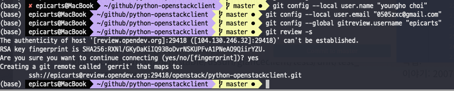
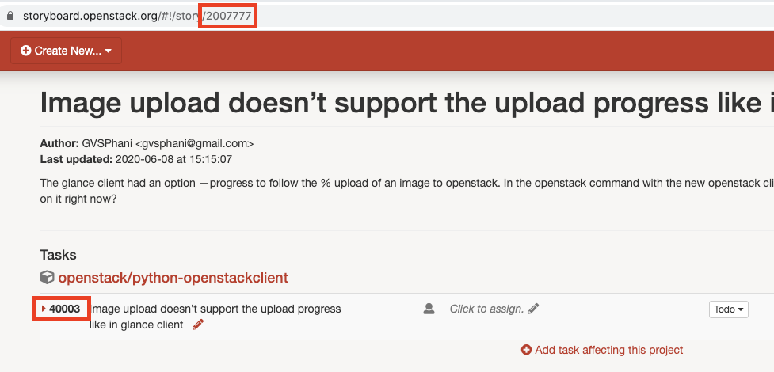
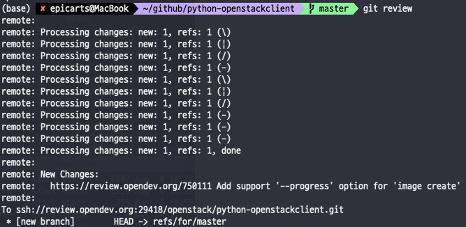
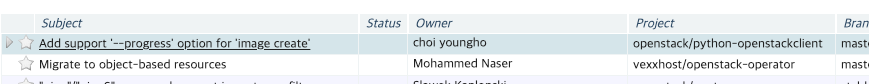
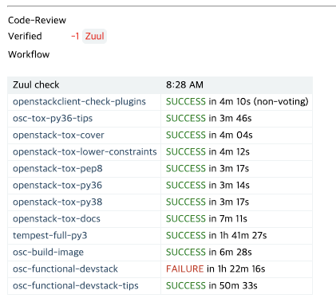
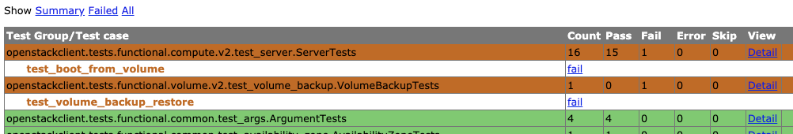
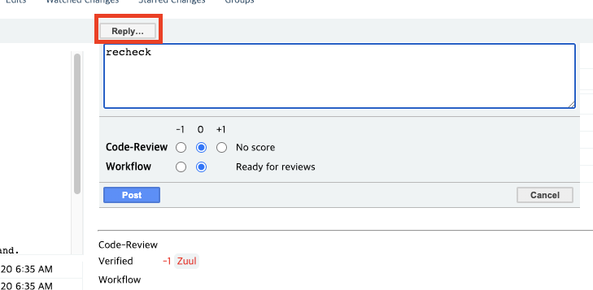
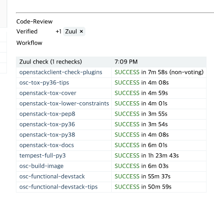

==========================================================================================
[이슈] Image upload doesn’t support the upload progress like in glance client
==========================================================================================

----------------------
이슈 소개
----------------------

스토리 보드: https://storyboard.openstack.org/#!/story/2007777

스토리 보드의 내용은 다음과 같습니다.

이미지 업로드시 ``glance client`` 의 ``--progress`` 옵션을 ``openstack client`` 에서도
지원을 했으면 좋겠다는 이슈입니다.

아마 ``glance client`` 에 있는 progress 기능을 ``openstack client``  로 이식하면 될 거 같습니다.

-----------------
이슈 재현하기
-----------------

재현을 위해 기존 devstack 서버에 ``glance client`` 설치를 하였습니다.

.. code-block:: shell

    apt install glance #패키지 관리자를 이용해 glance 를 설치
    source openrc admin # devstack 폴더에서 접속 계정을 admin로 설정

``glance client`` 가 제대로 설치가 되었는지, 그리고 ``openstack client`` 에서 이와 비슷하게 사용되는 
사용되는 커맨드는 무엇인지 찾기 위해 image list 를 조회하는 커맨드를 입력해보았습니다.

.. code-block:: shell

    stack@server1:~/devstack$ glance image-list
    +--------------------------------------+--------------------------+
    | ID                                   | Name                     |
    +--------------------------------------+--------------------------+
    | aa08f22f-d505-4aa3-80e4-49f34cae21e2 | 2u2buntu5                |
    | 3b6445d7-a301-40fa-82ca-205b341bf41e | cirros                   |
    +--------------------------------------+--------------------------+

.. code-block:: shell

    stack@server1:~/devstack$ openstack image list
    +--------------------------------------+--------------------------+--------+
    | ID                                   | Name                     | Status |
    +--------------------------------------+--------------------------+--------+
    | aa08f22f-d505-4aa3-80e4-49f34cae21e2 | 2u2buntu5                | active |
    | f5b65c06-d5aa-47b4-b304-ef95b3d31a9d | cirros                   | active |
    +--------------------------------------+--------------------------+--------+

``openstack clinet`` 에서는 Status 를 컬럼을 추가로 보여주는 것을 제외하고는 같은 결과 값을 내보내는 것을 확인할 수 있었습니다.

progress 재현
--------------------

같은 서버로 요청을 받아서 처리하는 것을 확인했으니, glance에 progress 옵션을 주어 이미지를 업로드 해보겠습니다.

.. code-block:: shell

    #서버에 업로드 하기 위한 이미지 다운
    stack@server1:~$ wget http://cloud-images-archive.ubuntu.com/releases/bionic/release-20200519.1/ubuntu-18.04-server-cloudimg-arm64.img

    #glance client를 사용해 다운 받은 이미지 업로드
    stack@server1:~$ glance image-create --name "ubuntu" --file /opt/stack/ubuntu-18.04-server-cloudimg-arm64.img --disk-format qcow2 --container-format bare --visibility public --progress
    [=============================>] 100%
    +------------------+----------------------------------------------------------------------------------+
    | Property         | Value                                                                            |
    +------------------+----------------------------------------------------------------------------------+
    | checksum         | 894d3c7009fc7ce476fdf2fabd403745                                                 |
    | container_format | bare                                                                             |
    | created_at       | 2020-09-01T20:48:49Z                                                             |
    | disk_format      | qcow2                                                                            |
    | id               | f78f5ce8-b6cc-4998-b4d5-ed6f71d11f7e                                             |
    | min_disk         | 0                                                                                |
    | min_ram          | 0                                                                                |
    | name             | ubuntu                                                                           |
    | os_hash_algo     | sha512                                                                           |
    | os_hash_value    | 4683e1da762e246c7e2ddaecb4830af1a31da0bd2b25c1554ed288e24b79a14c6e42cb5b4a32146c |
    |                  | fc0e7b61b64e3de4585be8fb0f4c4891ddba5290505d7c4a                                 |
    | os_hidden        | False                                                                            |
    | owner            | c4c153328c74498cba350e0db85c3a67                                                 |
    | protected        | False                                                                            |
    | size             | 327352320                                                                        |
    | status           | active                                                                           |
    | tags             | []                                                                               |
    | updated_at       | 2020-09-01T20:48:52Z                                                             |
    | virtual_size     | Not available                                                                    |
    | visibility       | public                                                                           |
    +------------------+----------------------------------------------------------------------------------+

glance를 사용해서 업로드를 한 결과 ``[=============================>] 100%``
같은 형태로 진행률과 함께 업로드 되는 것을 볼 수 있습니다.

-----------
코드 분석
-----------

glance client는 `python-glanceclient <https://github.com/openstack/python-glanceclient>`_ 에 코드가 있습니다.
glance client 에서 progress 옵션을 어디에서 주는지 찾아보았습니다. 

전체 검색으로 ``--progress`` 를 검색해 봤습니다.

.. code-block:: python

    @utils.arg('--progress', action='store_true', default=False,
            help=_('Show upload progress bar.'))
    @utils.arg('id', metavar='<IMAGE_ID>',
            help=_('ID of image to upload data to.'))
    @utils.arg('--store', metavar='<STORE>',
            default=utils.env('OS_IMAGE_STORE', default=None),
            help='Backend store to upload image to.')
    def do_image_upload(gc, args):
        """Upload data for a specific image."""
        # 생략

glance client에서는 위와 같은 방법으로 옵션 인자(arguments)를 넣어 주는 듯 합니다. 
그리고 밑으로 좀 내리면 ``def do_image_upload()`` , ``def do_image_create_via_import()``, ``def do_image_create()`` 
등 여러 함수들을 볼 수 있습니다. 

이 중에 업로드 기능을 구현하고자 하므로, ``do_image_upload`` 함수를 살펴보겠습니다.
링크: `do_image_upload 함수 stable/ussuri 버전 
<https://github.com/openstack/python-glanceclient/blob/4c63903403d7ef7801c8e274b67f9647ff329991/glanceclient/v2/shell.py#L639>`_

.. code-block:: python

    def do_image_upload(gc, args):
        """Upload data for a specific image."""
        backend = None
        if args.store:
            backend = args.store
            # determine if backend is valid
            _validate_backend(backend, gc)

        image_data = utils.get_data_file(args)
        if args.progress:
            filesize = utils.get_file_size(image_data)
            if filesize is not None:
                # NOTE(kragniz): do not show a progress bar if the size of the
                # input is unknown (most likely a piped input)
                image_data = progressbar.VerboseFileWrapper(image_data, filesize)
        gc.images.upload(args.id, image_data, args.size, backend=backend)

``do_image_upload`` 함수는 ``python-glanceclient/glanceclient/v2/shell.py`` 에 위치하고 있습니다. 
여기에서 주목해야 할 부분은 ``if args.progress:`` 입니다.

우리가 ``--progress`` 옵션을 주었을 때만 해당 if 문이 ``참(True)`` 이 되게 됩니다. 

filesize를 구하고, None이 아닐 경우에만 ``image_data = progressbar.VerboseFileWrapper(image_data, filesize)`` 함수가 작동 되네요.

``progressbar.VerboseFileWrapper()`` 이 친구에게 인자값을 넘겨주고, 받은 데이터를 그대로 사용하는 것을 볼 수 있습니다. 직역하면 자세한 파일 감싸기(래퍼) 라는 이름을 가지고 있습니다.

저 친구를 어디에서 데리고 왔는지 ``progressbar.`` 가 `선언된 곳 <https://github.com/openstack/python-glanceclient/blob/4c63903403d7ef7801c8e274b67f9647ff329991/glanceclient/v2/shell.py#L23>`_ 을 찾아보겠습니다.

.. code-block:: python

    import json
    import os
    import sys

    from oslo_utils import strutils

    from glanceclient._i18n import _
    from glanceclient.common import progressbar

제일 최상단에서 import 하고 있었습니다. from glanceclient.common 에서 import 했으므로 
`해당 코드 <https://github.com/openstack/python-glanceclient/blob/4c63903403d7ef7801c8e274b67f9647ff329991/glanceclient/common/progressbar.py#L53>`_ 
로 이동해보겠습니다.

.. code-block:: python

    class VerboseFileWrapper(_ProgressBarBase):
    """A file wrapper with a progress bar.
    The file wrapper shows and advances a progress bar whenever the
    wrapped file's read method is called.
    """

    def read(self, *args, **kwargs):
        data = self._wrapped.read(*args, **kwargs)
        if data:
            self._display_progress_bar(len(data))
        else:
            if self._show_progress:
                # Break to a new line from the progress bar for incoming
                # output.
                sys.stdout.write('\n')
        return data

``_ProgressBarBase`` 를 상속받은 ``VerboseFileWrapper`` 클래스를 사용했네요.

``openstack-clinet`` 에 ``python-glanceclient/glanceclient/common/progressbar.py`` 를 이식하면 progressbar를 사용할 수 있을거 같습니다.

------------
코드 작성
------------

이제 코드 이식을 위해 openstack-client 로 가보겠습니다.

.. code-block:: python

    class CreateImage(command.ShowOne):
        _description = _("Create/upload an image")

        deadopts = ('size', 'location', 'copy-from', 'checksum', 'store')

        def get_parser(self, prog_name):
            parser = super(CreateImage, self).get_parser(prog_name)
            # TODO(bunting): There are additional arguments that v1 supported
            # that v2 either doesn't support or supports weirdly.
            # --checksum - could be faked clientside perhaps?
            # --location - maybe location add?
            # --size - passing image size is actually broken in python-glanceclient
            # --copy-from - does not exist in v2
            # --store - does not exits in v2
            parser.add_argument(
                "name",
                metavar="<image-name>",
                help=_("New image name"),
            )
            # 생략

openstack-clinet 에서 이미지는 
`class createImage <https://github.com/openstack/python-openstackclient/blob/5b25ea899e023bcd3d7384cca943f9844bcb0b79/openstackclient/image/v2/image.py#L184>`_
클래스의 ``def get_parser()`` 에서 인자(arguments)를 추가 시켜줄 수 있고, ``def take_action()`` 에서 실제 이미지 업로드가 됩니다.

``def get_parser()`` 에서 --progress 옵션을 추가시켜 보겠습니다.

.. code-block:: python

    def get_parser(self, prog_name):
    
    #생략
    public_group.add_argument(
        "--shared",
        action="store_true",
        help=_("Image can be shared"),
    )
    parser.add_argument(
        "--progress",
        action="store_true",
        default=False,
        help=_("Show upload progress bar."),
    )

``--progress`` 옵션을 추가 시켰습니다.

.. code-block:: python

    def take_action(self, parsed_args):

        # open the file first to ensure any failures are handled before the
        # image is created. Get the file name (if it is file, and not stdin)
        # for easier further handling.
        (fp, fname) = get_data_file(parsed_args)
        info = {}

        if fp is not None and parsed_args.volume:
            raise exceptions.CommandError(_("Uploading data and using "
                                            "container are not allowed at "
                                            "the same time"))
        if fp is None and parsed_args.file:
            LOG.warning(_("Failed to get an image file."))
            return {}, {}
        elif fname:
            kwargs['filename'] = fname
        elif fp:
            kwargs['validate_checksum'] = False
            kwargs['data'] = fp
        
        # 생략
        if parsed_args.volume:
            #생략
        else:
            image = image_client.create_image(**kwargs)

`(fp, fname) = get_data_file(parsed_args) <https://github.com/openstack/python-openstackclient/blob/5b25ea899e023bcd3d7384cca943f9844bcb0b79/openstackclient/image/v2/image.py#L394>`_ 
에서 파일 포인터와 파일 이름을 가져오는 것을 확인 할 수 있습니다.

이렇게 가져온 데이터를 kwargs['data']에 넣는데, 이렇게 넣은 kwargs['data']는 
`image = image_client.create_image(**kwargs) <https://github.com/openstack/python-openstackclient/blob/5b25ea899e023bcd3d7384cca943f9844bcb0b79/openstackclient/image/v2/image.py#L471>`_ 
에 전달 되면서 서버에 이미지 data가 업로드 되게 됩니다.

fp 를 VerboseFileWrapper로 감싸면 progressbar 를 구현할 수 있을것이라고 생각하고 접근하였습니다.

이를 위해 ``python-openstackclient/openstackclient/common/`` 위치에 ``python-glanceclient/glanceclient/common/progressbar.py`` 를 복사한 
``progressbar.py`` 를 만들었습니다.

glance-client의 `progressbar.py <https://github.com/openstack/python-glanceclient/blob/master/glanceclient/common/progressbar.py>`_ 를 그대로 옮겨왔다고 생각하시면 됩니다.

.. code-block:: python

    from openstackclient.common import progressbar

    #생략

    def take_action(self, parsed_args):

        # open the file first to ensure any failures are handled before the
        # image is created. Get the file name (if it is file, and not stdin)
        # for easier further handling.
        (fp, fname) = get_data_file(parsed_args)
        info = {}

        if fp is not None and parsed_args.volume:
            raise exceptions.CommandError(_("Uploading data and using "
                                            "container are not allowed at "
                                            "the same time"))
        if fp is None and parsed_args.file:
            LOG.warning(_("Failed to get an image file."))
            return {}, {}
        if fp is not None and parsed_args.progress:
            filesize = os.path.getsize(fname)
            if filesize is not None:
                kwargs['validate_checksum'] = False
                kwargs['data'] = progressbar.VerboseFileWrapper(fp, filesize)

``if parsed_args.progress:`` 가 나올 경우, VerboseFileWrapper 를 사용해 파일 포인터를 감싸서 kwargs['data']에 넣어 주었습니다.

.. code-block:: shell

    stack@server1:~$ openstack image create ubuntu123 --file /opt/stack/ubuntu-18.04-server-cloudimg-arm64.img --disk-format qcow2 --container-format bare --public --progress
    base_proxy
    [=============================>] 100%
    +------------------+-------------------------------------------------------------------------------------------------------------------------------------------------------------------------------------------------------+
    | Field            | Value                                                                                                                                                                                                 |
    +------------------+-------------------------------------------------------------------------------------------------------------------------------------------------------------------------------------------------------+
    | container_format | bare                                                                                                                                                                                                  |
    | created_at       | 2020-09-02T12:50:17Z                                                                                                                                                                                  |
    | disk_format      | qcow2                                                                                                                                                                                                 |
    | file             | /v2/images/5f70aa73-7f14-4244-8696-383fabb1d30a/file                                                                                                                                                  |
    | id               | 5f70aa73-7f14-4244-8696-383fabb1d30a                                                                                                                                                                  |
    | min_disk         | 0                                                                                                                                                                                                     |
    | min_ram          | 0                                                                                                                                                                                                     |
    | name             | ubuntu123                                                                                                                                                                                             |
    | owner            | c4c153328c74498cba350e0db85c3a67                                                                                                                                                                      |
    | properties       | os_hidden='False', owner_specified.openstack.md5='', owner_specified.openstack.object='images/ubuntu123', owner_specified.openstack.sha256='', self='/v2/images/5f70aa73-7f14-4244-8696-383fabb1d30a' |
    | protected        | False                                                                                                                                                                                                 |
    | schema           | /v2/schemas/image                                                                                                                                                                                     |
    | status           | queued                                                                                                                                                                                                |
    | tags             |                                                                                                                                                                                                       |
    | updated_at       | 2020-09-02T12:50:17Z                                                                                                                                                                                  |
    | visibility       | public                                                                                                                                                                                                |
    +------------------+-------------------------------------------------------------------------------------------------------------------------------------------------------------------------------------------------------+

이미지를 업로드 할 시 openstack-client 에서도 progressbar([=============================>] 100%) 가 보이는 것을 확인할 수 있습니다.

---------------------------------
테스트 코드 확인 및 테스트 하기
---------------------------------

테스트 코드를 작성해보기 전에!!

먼저 기존 테스트 코드를 돌려보는 연습부터 해보겠습니다.

`오픈스택 wiki test 문서 <https://wiki.openstack.org/wiki/Testing>`_ 를 보면 테스트 하는 방법이 나와있습니다.

openstack 테스트코드를 Tox 사용해 `테스트하기 글 <https://epicarts.tistory.com/114>`_ 을 참고해주세요. 

먼저 `기존 glance client의 test 케이스 <https://opendev.org/openstack/python-glanceclient/src/branch/master/glanceclient/tests/unit/test_progressbar.py>`_ 
를 살펴보았습다.

.. code-block:: python

    python-glanceclient/glanceclient/tests/unit/test_progressbar.py
    
    # Copyright 2013 OpenStack Foundation
    # All Rights Reserved.
    #
    #    Licensed under the Apache License, Version 2.0 (the "License"); you may
    #    not use this file except in compliance with the License. You may obtain
    #    a copy of the License at
    #
    #         http://www.apache.org/licenses/LICENSE-2.0
    #
    #    Unless required by applicable law or agreed to in writing, software
    #    distributed under the License is distributed on an "AS IS" BASIS, WITHOUT
    #    WARRANTIES OR CONDITIONS OF ANY KIND, either express or implied. See the
    #    License for the specific language governing permissions and limitations
    #    under the License.

    import io
    import sys

    import requests
    import testtools

    from glanceclient.common import progressbar
    from glanceclient.common import utils
    from glanceclient.tests import utils as test_utils

    class TestProgressBarWrapper(testtools.TestCase):

        def test_iter_iterator_display_progress_bar(self):
            size = 100
            # create fake response object to return request-id with iterator
            resp = requests.Response()
            resp.headers['x-openstack-request-id'] = 'req-1234'
            iterator_with_len = utils.IterableWithLength(iter('X' * 100), size)
            requestid_proxy = utils.RequestIdProxy((iterator_with_len, resp))
            saved_stdout = sys.stdout
            try:
                sys.stdout = output = test_utils.FakeTTYStdout()
                # Consume iterator.
                data = list(progressbar.VerboseIteratorWrapper(requestid_proxy,
                                                            size))
                self.assertEqual(['X'] * 100, data)
                self.assertEqual(
                    '[%s>] 100%%\n' % ('=' * 29),
                    output.getvalue()
                )
            finally:
                sys.stdout = saved_stdout

        def test_iter_file_display_progress_bar(self):
            size = 98304
            file_obj = io.StringIO('X' * size)
            saved_stdout = sys.stdout
            try:
                sys.stdout = output = test_utils.FakeTTYStdout()
                file_obj = progressbar.VerboseFileWrapper(file_obj, size)
                chunksize = 1024
                chunk = file_obj.read(chunksize)
                while chunk:
                    chunk = file_obj.read(chunksize)
                self.assertEqual(
                    '[%s>] 100%%\n' % ('=' * 29),
                    output.getvalue()
                )
            finally:
                sys.stdout = saved_stdout

        def test_iter_file_no_tty(self):
            size = 98304
            file_obj = io.StringIO('X' * size)
            saved_stdout = sys.stdout
            try:
                sys.stdout = output = test_utils.FakeNoTTYStdout()
                file_obj = progressbar.VerboseFileWrapper(file_obj, size)
                chunksize = 1024
                chunk = file_obj.read(chunksize)
                while chunk:
                    chunk = file_obj.read(chunksize)
                # If stdout is not a tty progress bar should do nothing.
                self.assertEqual('', output.getvalue())
            finally:
                sys.stdout = saved_stdout

1. test_iter_iterator_display_progress_bar는 VerboseIteratorWrapper를 테스트하는 것으로 보입니다.

2. test_iter_file_display_progress_bar와 test_iter_file_no_tty는 VerboseFileWrapper를 테스트하는 것으로 보입니다.

3. 또한 두 개의 차이점은 FakeTTYStdout()를 사용하냐, FakeNoTTYStdout()를 사용하냐에 따라 달라지는 것으로 보입니다.

대략 훑어 보았으니, 테스트 코드를 실행해보겠습니다.

.. code-block:: shell

    tox -e py unit.test_progressbar.TestProgressBarWrapper

    # 길어서 생략
    ==============
    - Worker 0 (1 tests) => 0:00:00.000509
    - Worker 1 (1 tests) => 0:00:00.000577
    - Worker 2 (1 tests) => 0:00:00.000595
    Test id                                                                                                  Runtime (s)
    -------------------------------------------------------------------------------------------------------  -----------
    glanceclient.tests.unit.test_progressbar.TestProgressBarWrapper.test_iter_iterator_display_progress_bar  0.001
    glanceclient.tests.unit.test_progressbar.TestProgressBarWrapper.test_iter_file_display_progress_bar      0.001
    glanceclient.tests.unit.test_progressbar.TestProgressBarWrapper.test_iter_file_no_tty                    0.001
    ________________________________________________ summary ________________________________________________
    py: commands succeeded
    congratulations :)

unit 폴더의 test_progressbar.py 파일에 TestPrgressBarWrapper를 실행시켜봤습니다. 
3개의 메소드에 대한 테스트가 성공한 것을 볼 수 있습니다.

이제 test_iter_file_display_progress_bar 메소드를 간단하게 분석해보겠습니다.

.. code-block:: python

    def test_iter_file_display_progress_bar(self):
        size = 98304
        file_obj = io.StringIO('X' * size)
        saved_stdout = sys.stdout
        try:
            sys.stdout = output = test_utils.FakeTTYStdout()
            file_obj = progressbar.VerboseFileWrapper(file_obj, size)
            chunksize = 1024
            chunk = file_obj.read(chunksize)
            while chunk:
                chunk = file_obj.read(chunksize)
            self.assertEqual(
                '[%s>] 100%%\n' % ('=' * 29),
                output.getvalue()
            )
        finally:
            sys.stdout = saved_stdout

x로 채워진 파일을 만들어 낸 다음, 해당 파일을 stdoutVerboseFileWrapper()을 사용해 file_obj를 리턴 받습니다.

chunksize 만큼 파일을 읽기 시작하는데, 읽을 파일이 없을 때 까지 while문을 돌게 됩니다. 파일을 끝까지 다 읽게 됩니다.

최종적으로 output.getvalue()의 값과 [%s>] 100%%\n' % ('=' * 29)의 값을 비교하면서 하면서 끝납니다.

정말 파일을 다 읽는지 궁금하여, `loging <https://docs.python.org/ko/3/howto/logging.html>`_ 을 import 하여 출력해봤습니다.

.. code-block:: python

    import logging
    #생략

        def test_iter_file_display_progress_bar(self):
            size = 30
            logging.warning("test_iter_file_display_progress_bar")
            file_obj = io.StringIO('X' * size)
            saved_stdout = sys.stdout
            try:
                sys.stdout = output = test_utils.FakeTTYStdout()
                file_obj = progressbar.VerboseFileWrapper(file_obj, size)
                chunksize = 14
                chunk = file_obj.read(chunksize)
                logging.warning('chunk: ' + chunk)
                while chunk:
                    chunk = file_obj.read(chunksize)
                    logging.warning('chunk: ' + chunk)
                self.assertEqual(
                    '[%s>] 100%%\n' % ('=' * 29),
                    output.getvalue()
                )
                logging.warning('assertEqual 1: ' + '[%s>] 100%%\n' % ('=' * 29))
                logging.warning('assertEqual 2: ' + output.getvalue())
            finally:
                sys.stdout = saved_stdout

이곳저곳에 logging 메시지를 달아놨습니다.

logging.warning으로 한 이유는 로그 레벨 기본 설정이 warning 이상(ERROR, FATAL)이 되어야 출력이 되기 때문입니다.

.. code-block:: shell

    tox -e py unit.test_progressbar.TestProgressBarWrapper.test_iter_file_display_progress_bar

이렇게 수정한 상태로 TestProgressBarWrapper클래스의 test_iter_file_display_progress_bar를 실행시켜보았습니다.

.. code-block:: shell

    py run-test-pre: PYTHONHASHSEED='3332601188'
    py run-test: commands[0] | stestr run --slowest unit.test_progressbar.TestProgressBarWrapper.test_iter_file_display_progress_bar
    WARNING:root:test_iter_file_display_progress_bar
    WARNING:root:chunk: XXXXXXXXXXXXXX
    WARNING:root:chunk: XXXXXXXXXXXXXX
    WARNING:root:chunk: XX
    WARNING:root:chunk:
    WARNING:root:assertEqual 1: [=============================>] 100%

    WARNING:root:assertEqual 2: [=============================>] 100%

    {0} glanceclient.tests.unit.test_progressbar.TestProgressBarWrapper.test_iter_file_display_progress_bar [0.000520s] ... ok

    ======
    Totals
    ======
    Ran: 1 tests in 0.0005 sec.
    - Passed: 1
    - Skipped: 0
    - Expected Fail: 0
    - Unexpected Success: 0
    - Failed: 0
    Sum of execute time for each test: 0.0005 sec.

    ==============
    Worker Balance
    ==============
    - Worker 0 (1 tests) => 0:00:00.000520
    Test id                                                                                              Runtime (s)
    ---------------------------------------------------------------------------------------------------  -----------
    glanceclient.tests.unit.test_progressbar.TestProgressBarWrapper.test_iter_file_display_progress_bar  0.001
    _______________________________________________________________________________ summary _______________________________________________________________________________
    py: commands succeeded
    congratulations :)

1. chunWARNING:root:chunk: XXXXXXXXXXXXXX를 보면 파일을 우리가 정해준 사이즈 14 만큼 읽는 것을 확인할 수 있습니다. 총 30개의 X 를 읽네요.

2. assertEqual 1: [=============================>] 100% 를 보았을 때, [%s>] 100%%\n' % ('=' * 29) 는 '[=============================>] 100%' 으로 출력이 되는 것을 볼 수 있습니다.

3. assertEqual 2: [=============================>] 100% 를 보았을 때, output.getvalue() 으로 읽어드린 값은 '[=============================>] 100%' 으로 출력이 되는 것을 볼 수 있습니다.

------------------------------------
테스트 코드 작성 하기
------------------------------------

.. code-block:: python

    #   Licensed under the Apache License, Version 2.0 (the "License"); you may
    #   not use this file except in compliance with the License. You may obtain
    #   a copy of the License at
    #
    #        http://www.apache.org/licenses/LICENSE-2.0
    #
    #   Unless required by applicable law or agreed to in writing, software
    #   distributed under the License is distributed on an "AS IS" BASIS, WITHOUT
    #   WARRANTIES OR CONDITIONS OF ANY KIND, either express or implied. See the
    #   License for the specific language governing permissions and limitations
    #   under the License.
    #

    import sys

    import six

    from openstackclient.common import progressbar
    from openstackclient.tests.unit import utils

    class TestProgressBarWrapper(utils.TestCase):

        def test_iter_file_display_progress_bar(self):
            size = 98304
            file_obj = six.StringIO('X' * size)
            saved_stdout = sys.stdout
            try:
                sys.stdout = output = FakeTTYStdout()
                file_obj = progressbar.VerboseFileWrapper(file_obj, size)
                chunksize = 1024
                chunk = file_obj.read(chunksize)
                while chunk:
                    chunk = file_obj.read(chunksize)
                self.assertEqual(
                    '[%s>] 100%%\n' % ('=' * 29),
                    output.getvalue()
                )
            finally:
                sys.stdout = saved_stdout

        def test_iter_file_no_tty(self):
            size = 98304
            file_obj = six.StringIO('X' * size)
            saved_stdout = sys.stdout
            try:
                sys.stdout = output = FakeNoTTYStdout()
                file_obj = progressbar.VerboseFileWrapper(file_obj, size)
                chunksize = 1024
                chunk = file_obj.read(chunksize)
                while chunk:
                    chunk = file_obj.read(chunksize)
                # If stdout is not a tty progress bar should do nothing.
                self.assertEqual('', output.getvalue())
            finally:
                sys.stdout = saved_stdout

    class FakeTTYStdout(six.StringIO):
        """A Fake stdout that try to emulate a TTY device as much as possible."""

        def isatty(self):
            return True

        def write(self, data):
            # When a CR (carriage return) is found reset file.
            if data.startswith('\r'):
                self.seek(0)
                data = data[1:]
            return six.StringIO.write(self, data)

    class FakeNoTTYStdout(FakeTTYStdout):
        """A Fake stdout that is not a TTY device."""

        def isatty(self):
            return False

openstackclient/tests/units/fakes.py에 있는 FakeStdout를 사용하려고 했으나,

1. openstack git에 비슷한 예시가 없었습니다. (못 찾은 것일 수도 있습니다.)

2. pythonclient 프로젝트 내부에도 class FakeStdout을 새로 정의해서 사용했습니다.

기존의 것을 활용하는 것에 어려움을 겪어서 일단 기존에 있는 코드를 가져왔습니다.

.. code-block:: shell

    tox -e py openstackclient.tests.unit.common.test_progressbar.TestProgressBarWrapper

    py run-test-pre: PYTHONHASHSEED='3879511963'
    py run-test: commands[0] | stestr run openstackclient.tests.unit.common.test_progressbar.TestProgressBarWrapper
    {0} openstackclient.tests.unit.common.test_progressbar.TestProgressBarWrapper.test_iter_file_display_progress_bar [0.000667s] ... ok
    {0} openstackclient.tests.unit.common.test_progressbar.TestProgressBarWrapper.test_iter_file_no_tty [0.000378s] ... ok

    ======
    Totals
    ======
    Ran: 2 tests in 0.0012 sec.
    - Passed: 2
    - Skipped: 0
    - Expected Fail: 0
    - Unexpected Success: 0
    - Failed: 0
    Sum of execute time for each test: 0.0010 sec.

    ==============
    Worker Balance
    ==============
    - Worker 0 (2 tests) => 0:00:00.001192
    ____________________________________________________________________________________________________________________ summary _____________________________________________________________________________________________________________________
    py: commands succeeded
    congratulations :)

단위 테스트가 성공한 것을 볼 수 있습니다.

.. code-block:: shell

    tox

그리고 전체 테스트를 진행하였습니다.

먼저 gerrit에 등록된 아이디랑 연결시켜줍니다. 잘 모르겠으면 다음 링크를 참고하시면 됩니다.

링크: https://openstack-kr-contributhon2020.readthedocs.io/ko/latest/youngho_choi/sandbox_tutorial_guide.html

이제 커밋 메시지를 작성하겠습니다. 

좋은 커밋 메시지를 작성하는 방법은 `wiki <https://wiki.openstack.org/wiki/GitCommitMessages>`_ 에서 볼 수 있습니다.

task: 40003 
story: 2007777

커밋 메시지에 필요하므로, 자신의 스토리보드 숫자와 task 숫자를 잘 기억해둡니다.

.. code-block:: shell

    Add support '--progress' option for 'image create'

    openstack-client doesn’t support the upload progress bar.

    This patch shows progressbar when create image
    if you added '--progress' option like a python-glanceclient.

    like this.
    [=============================>] 100%
    +------------------+---------------------------+
    | Field            | Value                     |
    +------------------+---------------------------+
    | container_format | bare                      |
    | created_at       | 2020-09-06T20:44:40Z      |
    ...

    How to use
    Add the'--progress' option on the 'openstack image create' command.

    Code was written by referring to 'python-glanceclient' project
    on stable/ussuri branch

    task: 40003
    story: 2007777

    # Please enter the commit message for your changes. Lines starting
    # with '#' will be ignored, and an empty message aborts the commit.
    #
    # On branch master
    # Your branch is up to date with 'origin/master'.
    #
    # Changes to be committed:
    #       new file:   openstackclient/common/progressbar.py
    #       modified:   openstackclient/image/v2/image.py
    #       new file:   openstackclient/tests/unit/common/test_progressbar.py
    #

그리고 열심히 번역기를 동원해 영어로 커밋 메시지를 작성했습니다.

첫째줄은 50자 이내, 그리고 한 칸을 띄어야 하며, 한 줄은 72자로 줄 바꿈을 했습니다.

git review 를 하면... 첫 리뷰를 올릴 수 있습니다.

-------------
검증하기
-------------

`review.opendev.org <https://review.opendev.org/>`_ 에 가면 코드가 올라가 있는 것을 확인할 수 있습니다. 

제가 올린 review는 `review.opendev.org/#/c/750111/ <https://review.opendev.org/#/c/750111/>`_ 에서 
확인할 수 있습니다.

실패했습니다.
osc-functional-devstack을 클릭하면, 왜 실패했는지 확인할 수 있는 페이지로 이동 됩니다.

.. code-block:: shell

    ft1.1: openstackclient.tests.functional.compute.v2.test_server.ServerTests.test_boot_from_volumetesttools.testresult.real._StringException: Traceback (most recent call last):
    File "/home/zuul/src/opendev.org/openstack/python-openstackclient/openstackclient/tests/functional/compute/v2/test_server.py", line 760, in test_boot_from_volume
        server_name
    File "/home/zuul/src/opendev.org/openstack/python-openstackclient/openstackclient/tests/functional/base.py", line 67, in openstack
        fail_ok=fail_ok
    File "/home/zuul/src/opendev.org/openstack/python-openstackclient/openstackclient/tests/functional/base.py", line 35, in execute
        result_err)
    tempest.lib.exceptions.CommandFailed: Command 'openstack --os-cloud=devstack-admin server create -f json --flavor m1.tiny --image cirros-0.5.1-x86_64-disk --boot-from-volume 1 --nic net-id=75b3fb77-e722-41e5-9e8e-b61308e512a5 --wait 875bb1a5035d409bbbf50e77ab83078f' returned non-zero exit status 1.
    stdout:

    stderr:
    b'Quota exceeded for instances: Requested 1, but already used 1 of 0 instances (HTTP 403) (Request-ID: req-1228058d-5c36-4b4a-8303-f38f640a18d1)\n'

.. code-block:: shell

    ft2.1: openstackclient.tests.functional.volume.v2.test_volume_backup.VolumeBackupTests.test_volume_backup_restoretesttools.testresult.real._StringException: Traceback (most recent call last):
    File "/home/zuul/src/opendev.org/openstack/python-openstackclient/openstackclient/tests/functional/volume/v2/test_volume_backup.py", line 56, in test_volume_backup_restore
        self.wait_for_status("volume backup", backup['id'], "available")
    File "/home/zuul/src/opendev.org/openstack/python-openstackclient/openstackclient/tests/functional/volume/base.py", line 46, in wait_for_status
        cls.assertOutput(desired_status, current_status)
    File "/home/zuul/src/opendev.org/openstack/python-openstackclient/openstackclient/tests/functional/base.py", line 101, in assertOutput
        raise Exception(expected + ' != ' + actual)
    Exception: available != restoring

볼륨 백업 테스트와 서버 생성 단계에서 예외사항이 발생한것으로 보입니다. 제가 수정한 코드는 해당 실패사항과 관련이 없다고 생각하기 때문에 다시 검증 작업을 수행해야합니다.

gerrit 사이트로 가서 recheck 라고 댓글을 남기면 다시 zuul이 동작하게 됩니다.

역시 zuul의 오류였습니다. 다시 체크를 하니 테스트 통과했습니다

이후 새롭게 변경 되는 사항이 있으면 글을 쓰도록 하겠습니다. 

마지막으로 삽질하고 있을 때 조언과 많은 도움을 주신 오픈스택 컨트리뷰톤 멘토님께 감사드립니다.
