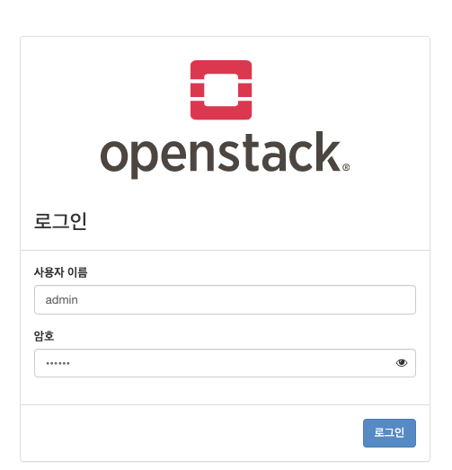

========================================
[학습] devstack 설치하기
========================================

첫번째 모임에서 실습한 devstack설치 방법을 정리해보고자 문서화하였습니다.

준비물: ubuntu 18.04 LTS, 램 8기가 이상의 서버, 30분이라는 시간, 80 포트가 열려있는 방화벽

1. stack 계정 생성
------------------------------

.. code-block:: shell

    sudo useradd -s /bin/bash -d /opt/stack -m stack

    echo "stack ALL=(ALL) NOPASSWD: ALL" | sudo tee /etc/sudoers.d/stack

    sudo su - stack

2. 코드 다운
------------------------------

.. code-block:: shell

    git clone https://opendev.org/openstack/devstack
    cd devstack

여기에서 tag를 보고 설치하고 싶은 버젼을 고르면 checkout 하면 됩니다.

3. 내부 아이피 확인
----------------------------

.. code-block:: shell

    ifconfig

    ens3: flags=4163<UP,BROADCAST,RUNNING,MULTICAST>  mtu 1450
            inet 192.168.1.8  netmask 255.255.255.0  broadcast 192.168.1.255
            inet6 fe80::f816:3eff:fe99:c461  prefixlen 64  scopeid 0x20<link>
            ether fa:16:3e:99:c4:61  txqueuelen 1000  (Ethernet)
            RX packets 5069  bytes 12678483 (12.6 MB)
            RX errors 0  dropped 0  overruns 0  frame 0
            TX packets 4725  bytes 434212 (434.2 KB)
            TX errors 0  dropped 0 overruns 0  carrier 0  collisions 0

192.168.1.8을 기억해둡니다.

4. local.conf 설정
------------------------------

.. code-block:: shell

    vim local.conf

    [[local|localrc]]
    ADMIN_PASSWORD=secret
    DATABASE_PASSWORD=$ADMIN_PASSWORD
    RABBIT_PASSWORD=$ADMIN_PASSWORD
    SERVICE_PASSWORD=$ADMIN_PASSWORD
    HOST_IP=192.168.1.8
    HOST_IP에 내 내부 아이피를 적어줍니다.

5. 설치
-------------------

.. code-block:: shell

    ./stack.sh

설치 해줍니다.

.. code-block:: shell

    ./unstack.sh
    ./clean.sh

설치 실패 시 설정을 수정한 뒤에 `unstack.sh` 을 실행 후 다시 `stack.sh` 을 실행해줍니다. (서버를 다시 만드는 것도 좋은 방법..)

그래도 안되면  `clean.sh` 으로 다 데이터를 밀어버립시다.

.. code-block:: shell

    ./unstack.sh 시에 적용되는 것

    - Stopping the project services, mysql and rabbitmq
    - Cleaning up iSCSI volumes
    - Clearing temporary LVM mounts

.. code-block:: shell

    ./clean.sh 시에 적용되는 것 (unstack.sh 후에 사용)

    - Removing configuration files for projects from /etc
    - Removing log files
    - Hypervisor clean-up
    - Removal of .pyc files
    - Database clean-up
    - etc.

6. 대시보드(horizon) 접속
--------------------------------

공인 아이피로 접속한 다음 

.. code-block:: shell

    아이디: admin 혹은 demo 

    패스워드: secret 

를 입력해주시면 접속됩니다.

참고 링크:

- openstack.dooray.com/share/posts/h-MfTmzOS9S-BaOvYMKjgQ

- docs.openstack.org/devstack/latest/

- docs.openstack.org/contributors/code-and-documentation/devstack.html
