======================================================
[분석] server list 명령어 알아보기
======================================================

1. 시작하기 전에...
--------------------------------------

이미지

저는 좀 더 손쉽게 로컬 환경에서 분석을 하기 위해 pycham을 사용하여 서버에 있는 `/usr/local/lib/python3.6/dist-packages/openstackclient/` 와 
직접 동기화 한 뒤 진행하였습니다. 
(디버깅 모드를 이용하면 위에 보이는 것처럼 argv의 값을 직접 볼 수 있습니다.)

또한 여기에서 분석한 코드는 https://github.com/openstack/python-openstackclient/tree/5.2.0 입니다.

tag 5.2.0입니다.

2. 우리의 목표
----------------------------

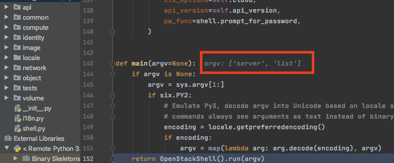

오픈스택을 설치하고, openstack server list를 치게 되면 위 그림처럼 이쁘게 출력됩니다..

1. 명령어는 어떻게 전달되고, 
2. 어디서 이쁘게 출력되는지 알아보려고 합니다.

3. 코드 분석
-------------------------

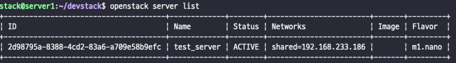

먼저 오픈스택 명령어의 위치를 알아냅니다. 
which를 찍으면 어디서에 실행되었는지 알 수 있습니다. 
해당 파일을 열어보겠습니다.

.. code-block:: python

    stack@server1:~$ cat /usr/local/bin/openstack

    #!/usr/bin/python3.6
    # -*- coding: utf-8 -*-
    import re
    import sys
    from openstackclient.shell import main
    if __name__ == '__main__':
        sys.argv[0] = re.sub(r'(-script\.pyw|\.exe)?$', '', sys.argv[0])
        sys.exit(main())

openstackclient.shell의 main을 import 하고 있는 것을 볼 수 있습니다. 그리곤 단순히 main()만을 실행합니다. 

main()으로 직접 가보겠습니다.

.. code-block:: python

    stack@server1:~$ python3

    Python 3.6.9 (default, Jul 17 2020, 12:50:27)
    [GCC 8.4.0] on linux
    Type "help", "copyright", "credits" or "license" for more information.
    >>> import openstackclient
    >>> openstackclient
    <module 'openstackclient' from '/usr/local/lib/python3.6/dist-packages/openstackclient/__init__.py'>

openstackclient 모듈의 위치는 /usr/local/lib/python3.6/dist-packages/openstackclient/ 에 위치해 있네요.

openstackclient의 shell.py를 열어 main()을 찾아보겠습니다.

.. code-block:: python

    # /usr/local/lib/python3.6/dist-packages/openstackclient/shell.py

    from osc_lib import shell
    """생략 """

    class OpenStackShell(shell.OpenStackShell):

        def __init__(self):
            super(OpenStackShell, self).__init__(
                description=__doc__.strip(),
                version=openstackclient.__version__,
                command_manager=commandmanager.CommandManager('openstack.cli'),
                deferred_help=True)
        """생략 """
                
    def main(argv=None):
        """생략 """
        return OpenStackShell().run(argv) #argv: ['server', 'list']

main 함수의 마지막 부분을 보면 OpenStackShell클래스의 run()을 실행하는 것을 볼 수 있습니다.

OpenStackShell은 shell.OpenStackShell을 상속받고 있으며, 자체적으로 run()을 가지고 있지는 않네요. 아마 부모 클래스의 run()을 사용하는 것 같습니다. 

osc_lib.OpenStackShell.run()이 어디에 있는지 찾아보겠습니다. 

.. code-block:: python

    stack@server1:/usr/local/lib/python3.6/dist-packages/openstackclient$ python3

    Python 3.6.9 (default, Jul 17 2020, 12:50:27)
    [GCC 8.4.0] on linux
    Type "help", "copyright", "credits" or "license" for more information.
    >>> import osc_lib
    >>> osc_lib
    <module 'osc_lib' from '/usr/local/lib/python3.6/dist-packages/osc_lib/__init__.py'>

또 다른 폴더입니다. 이와 같은 방법으로 선언된 부모 클래스를 찾아갈 수 있습니다. 

ocs_lib의 shell.run() 위치를 찾아보겠습니다.

.. code-block:: python

    # /usr/local/lib/python3.6/dist-packages/osc_lib/shell.py

    class OpenStackShell(app.App):
        def run(self, argv):
            ret_val = 1
            self.command_options = argv
            try:
                ret_val = super(OpenStackShell, self).run(argv) #argv: ['server', 'list']
                return ret_val
            except Exception as e:
                '''생략'''

해당 클래스는 app.py의 App클래스를 상속받아 구현된 것을 볼 수 있습니다.

.. code-block:: python

    ret_val = super(OpenStackShell, self).run(argv) #argv: ['server', 'list']

부모 클래스의 run()을 실행한 것을 볼 수 있습니다. 

app.py의 App클래스의 run()으로 이동해보겠습니다.

.. code-block:: python

    # /usr/local/lib/python3.6/dist-packages/cliff/app.py

    class App(object):
        ''' 생략 '''
        def run(self, argv): #argv: ['server', 'list']
            try:
                self.options, remainder = self.parser.parse_known_args(argv) # remainder['server', 'list']
                self.configure_logging()
                self.interactive_mode = not remainder
                if self.deferred_help and self.options.deferred_help and remainder:
                    remainder.insert(0, "help")
                self.initialize_app(remainder)
                self.print_help_if_requested()
            except Exception as err:
            ''' 생략 '''
            result = 1
            if self.interactive_mode:
                result = self.interact()
            else:
                result = self.run_subcommand(remainder) # remainder['server', 'list']
            return result

rgv에 ['server', 'list'] 값이 들어있고, parser.parse_known_arg에 의해 remainder에 ['server', 'list']가 담기게 됩니다.

.. code-block:: python

        else:
            result = self.run_subcommand(remainder) # remainder['server', 'list']

우리는 인터렉티브 모드로 실행하지 않았기 때문에 else문에 들어가게 되는데, run_subcommand() 함수로 인자 값을 넘겨줍니다.

app.py의 APP.run_subcommand() 따라가 보겠습니다.

.. code-block:: python

    # /usr/local/lib/python3.6/dist-packages/cliff/app.py

    class App(object):
        ''' 생략 '''
        def run_subcommand(self, argv):  #argv: ['server', 'list']
            try:
                subcommand = self.command_manager.find_command(argv)
            
            ''' 생략 '''
        
            return result

run_subcommand() 또한 App클래스 내부에 있는 함수입니다. 우리가 넘겨준 remainder 값들을 여기에서는 argv로 받고 있습니다.

그리곤 command_manage.find_command()에 argv를 인자로 넘겨주고 있는 것을 볼 수 있습니다.

아마 여기에서 커맨드를 찾는 거 같군요. 

app.py의 CommandManager.find_command()로

.. code-block:: python

    # /usr/local/lib/python3.6/dist-packages/cliff/app.py

    class CommandManager(object):
        ''' 생략 '''
        def find_command(self, argv):
            start = self._get_last_possible_command_index(argv)
            for i in range(start, 0, -1):
                name = ' '.join(argv[:i])
                search_args = argv[i:]
                return_name = name
                if name in self._legacy:
                    name = self._legacy[name]

                found = None
                if name in self.commands:
                    found = name
                else:
                    candidates = _get_commands_by_partial_name(
                        argv[:i], self.commands)
                    if len(candidates) == 1:
                        found = candidates[0]
                if found:
                    cmd_ep = self.commands[found]
                    if hasattr(cmd_ep, 'resolve'):
                        cmd_factory = cmd_ep.resolve()
                    else:
                        # NOTE(dhellmann): Some fake classes don't take
                        # require as an argument. Yay?
                        arg_spec = utils.getargspec(cmd_ep.load)
                        if 'require' in arg_spec[0]:
                            cmd_factory = cmd_ep.load(require=False)
                        else:
                            cmd_factory = cmd_ep.load()
                    return (cmd_factory, return_name, search_args)

CommandManager라고 하니, 커맨드를 찾는 관리하는 친구인 거 같습니다, 
그리고 최종적으로 cmd_factory, return_name, search_args를 반환합니다.

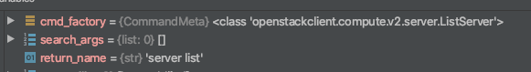

각각 값들을 보면 다음과 같이 담겨서 반환됩니다.

과연 여기에서 어떻게 우리가 친 'server list'라는 명령어를 이용해 <class 'openstackclient.compute.v2.server.ListServer'>라는
 클래스 객체를 cmd_factory에 담을 수 있던 걸까요?

정답부터 알려드리면,,,  

CommandManger클래스가 초기화될 때, self.commands에 EntryPoint라는 객체들이 저장됩니다.

.. code-block:: python

    # /usr/local/lib/python3.6/dist-packages/python_openstackclient-5.2.0.dist-info/entry_points.txt'

    server_group_show = openstackclient.compute.v2.server_group:ShowServerGroup
    server_image_create = openstackclient.compute.v2.server_image:CreateServerImage
    server_list = openstackclient.compute.v2.server:ListServer
    server_lock = openstackclient.compute.v2.server:LockServer

이 값들은 '/usr/local/lib/python3.6/dist-packages/python_openstackclient-5.2.0.dist-info/entry_points.txt'에 존재하는데 여기에 저장되어 있는 값을 이용하여 '_'를 ' '로 교체한 뒤 self.commands에 저장합니다. (server_list -> server list) 

그리고 불러온 커맨드 목록들 중에 'server list'를 찾아서 cmd_factory에 저장하게 됩니다.

블랙홀에 빠지기 싫으시면 5번으로 패스하시면 됩니다.

4. 'server list'라는 명령어를 이용해 어떻게 Class를 위치를 찾을까? 
-------------------------------------------------------------------------------------

.. code-block:: python

            if found: # found: 'server list'
                cmd_ep = self.commands[found] 

found를 보면 server list라는 값이 담겨 있습니다. self.commands에서
 'server list' 값을 찾은 결과 cmd_ep에 값이 담기는 것을 볼 수 있습니다. 

그리고 계속 디버깅하다 보면 dist에 python-openstackclient 5.2.0이라는 값이 보이는데, 

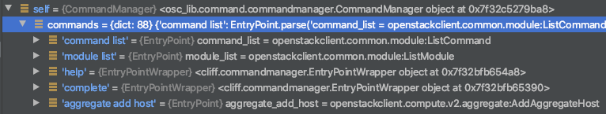

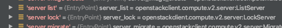

self.commands값을 직접 살펴봤습니다. 'server list'도 있는 것을 볼 수 있습니다. 

그렇다면 self.command에 있는 server list는 어디서 찾은 걸까??

그래서 CommandManager의 클래스 초기화 부분으로 가보았습니다.

.. code-block:: python

    # /usr/local/lib/python3.6/dist-packages/cliff/app.py

    class CommandManager(object):
    '''생략'''
        def __init__(self, namespace, convert_underscores=True):
            self.commands = {}
            self._legacy = {}
            self.namespace = namespace
            self.convert_underscores = convert_underscores
            self._load_commands()

        def _load_commands(self):
            # NOTE(jamielennox): kept for compatibility.
            if self.namespace:
                self.load_commands(self.namespace)

        def load_commands(self, namespace):
            """Load all the commands from an entrypoint"""
            for ep in pkg_resources.iter_entry_points(namespace):
                LOG.debug('found command %r', ep.name)
                cmd_name = (ep.name.replace('_', ' ')
                            if self.convert_underscores
                            else ep.name)
                self.commands[cmd_name] = ep
            return
    '''생략'''

def load_commands()에서 커맨드를 찾고 값들을 replace 하는 것을 볼 수 있습니다.

page_resources.iter_entry_points()에서 나온 값을 commands에 저장하는 것을 볼 수 있습니다.

.. code-block:: python

    # /usr/local/lib/python3.6/dist-packages/openstackclient/shell.py

    class OpenStackShell(shell.OpenStackShell):

        def __init__(self):

            super(OpenStackShell, self).__init__(
                description=__doc__.strip(),
                version=openstackclient.__version__,
                command_manager=commandmanager.CommandManager('openstack.cli'),
                deferred_help=True)

namesapce를 인자 값으로 전달을 하는데,  shell.py에서 init 할 때 넘겨준 값인 것을 볼 수 있습니다.

page_resources.iter_entry_points()로 이동해보겠습니다.

.. code-block:: python

        def iter_entry_points(self, group, name=None): #group: openstack.cli
            return (
                entry
                for dist in self
                for entry in dist.get_entry_map(group).values()
                if name is None or name == entry.name
            )

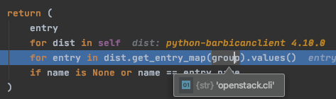

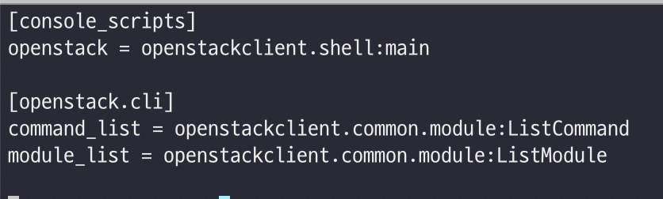

열심히 dist 폴더들을 돌면서 'openstack.cli' 값이 있는지 찾아보고 있는 것으로 보입니다. (추측)

아마 entry_points.txt의 파일 내부에 있는 [openstack.cli]를 찾고 있는 거 같습니다.

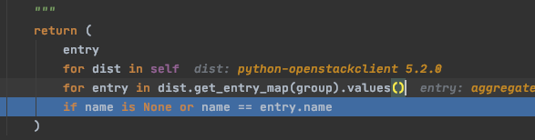

그리고 계속 디버깅하다 보면 dist에 python-openstackclient 5.2.0이라는 값이 보이는데, 

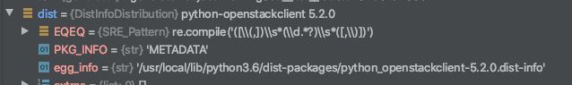

dist객체의 egg_info 정보를 보면 path가 있는 것을 볼 수 있습니다.

.. code-block:: python

    stack@server1:~$ sudo find /usr/local/lib/python3.6/dist-packages/python_openstackclient-5.2.0.dist-info/ -name "*.*" -type f | xargs grep "server_list"

    /usr/local/lib/python3.6/dist-packages/python_openstackclient-5.2.0.dist-info/entry_points.txt:server_list = openstackclient.compute.v2.server:ListServer

그래서 해당 폴더로 가서 검색을 해보았습니다. entry_points.txt에서  server_list가 검색이 된 것을 확인할 수 있었습니다.

entrypoint.txt 에서 데이터를 읽는 것으로 보입니다.

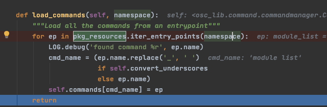

찾고 나면 cmd_name에 moude_list를 변환하여 cmd_name으로 변환한 뒤 하나씩 self.command값들을 추가시키는 것으로 보입니다.

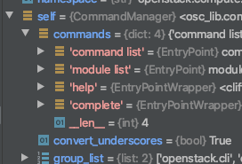

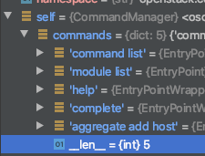

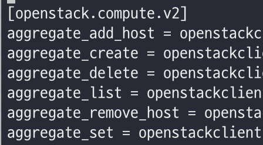

실제 데이터를 확인해보면 한번 for문을 돌 때마다 값이 추가되는 것을 볼 수 있었습니다.

어떻게 도는지 제대로 파악을 못했습니다. 또한 삽질을 하면서 느낌적으로 분석한 거라 잘못된 부분이 충분히 있을 수 있습니다. (있을 겁니다.)

5. 다시 코드 분석
-------------------------------

.. code-block:: python

    # /usr/local/lib/python3.6/dist-packages/cliff/app.py

    class CommandManager(object):
        ''' 생략 '''
        def find_command(self, argv):
                ''' 생략 '''
                if found:
                    cmd_ep = self.commands[found]
                    if hasattr(cmd_ep, 'resolve'):
                        cmd_factory = cmd_ep.resolve()
                        ''' 생략 '''
                    return (cmd_factory, return_name, search_args)

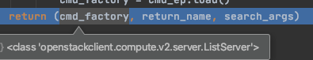

cmd_factory에 ListServer클래스가 반환됩니다.

.. code-block:: python

    # /usr/local/lib/python3.6/dist-packages/cliff/app.py

    class App(object):
        ''' 생략 '''
        def run_subcommand(self, argv):  #argv: ['server', 'list']
            try:
                subcommand = self.command_manager.find_command(argv)
            except ValueError as err:
                ''' 생략 '''
        
            cmd_factory, cmd_name, sub_argv = subcommand
            kwargs = {}
            if 'cmd_name' in utils.getargspec(cmd_factory.__init__).args:
                kwargs['cmd_name'] = cmd_name
            cmd = cmd_factory(self, self.options, **kwargs)
            result = 1

드디어 CommandManager() 클래스를 빠져나올 수 있게 되었습니다. 이곳을 호출한 APP클래스의 run_subcommand로 되돌아왔습니다.

 (cmd_factory, return_name, search_args)를 subcommand로 받은 뒤, (cmd_factory, cmd_name, sub_argv)로 다시 받습니다.

.. code-block:: python

        if 'cmd_name' in utils.getargspec(cmd_factory.__init__).args:
            kwargs['cmd_name'] = cmd_name
        cmd = cmd_factory(self, self.options, **kwargs)

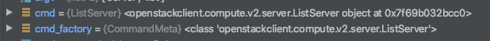

그리고는 cmd_factory를 어떠한 가공(?)을 거쳐 cmd 변수를 새롭게 만드는데, 이 부분은 잘 모르겠습니다.

계속 한 줄씩 실행하겠습니다.

.. code-block:: python

        cmd = cmd_factory(self, self.options, **kwargs)
        result = 1
        try:
            self.prepare_to_run_command(cmd)
            full_name = (cmd_name
                         if self.interactive_mode
                         else ' '.join([self.NAME, cmd_name])
                         )
            cmd_parser = cmd.get_parser(full_name)
            parsed_args = cmd_parser.parse_args(sub_argv)
            result = cmd.run(parsed_args)

prepare_to_run_command(cmd)를 하는데, 저 함수는 비어있고 설명만 적혀 있습니다. 

full name을 받는데, 우리는 interactive_mode가 아니므로 openstack server list가 반환된다. 
만약 인터렉티브 모드로 동작했을 때 차이점이 여기에서 나타나는 듯합니다.

그리고 cmd.get_parser()가 동작을 하는데, 이는 아까 만들었던 cmd 객체라고 볼 수 있다.
즉, 여기에서 ListServer.get_parser()로 들어간다는 것을 볼 수 있습니다.

.. code-block:: python

    # /usr/local/lib/python3.6/dist-packages/openstackclient/compute/v2/server.py

    class ListServer(command.Lister):
        _description = _("List servers")

        def get_parser(self, prog_name):
            parser = super(ListServer, self).get_parser(prog_name)
            parser.add_argument(
                '--reservation-id',
                metavar='<reservation-id>',
                help=_('Only return instances that match the reservation'),
            )
            parser.add_argument(
                '--ip',
                metavar='<ip-address-regex>',
                help=_('Regular expression to match IP addresses'),
            )

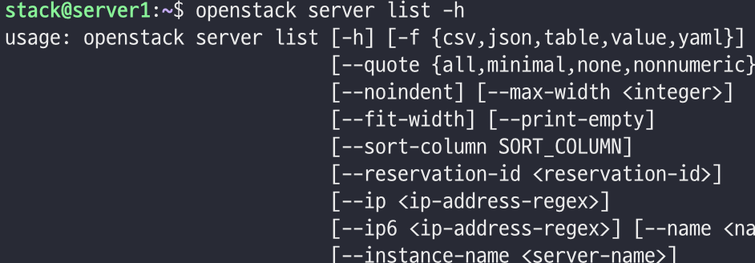

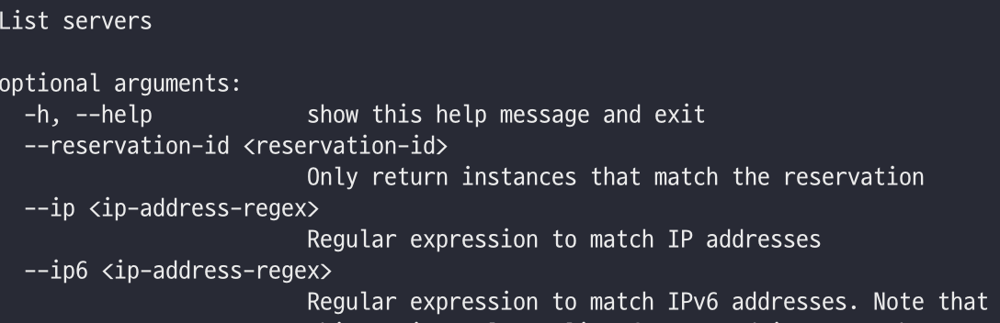

그리고 쭈루루룩 parser들을 추가시킨다. 
여기에서 추가된 값들은 우리가 흔히 보는 커맨드에서 출력하는 의미하는 것 같습니다.

커맨드 라인에 이런 식으로 추가되는 거 같은데, 잘 모르겠습니다. 
추가적인 공부를 해야 할 듯합니다.

.. code-block:: python

            parsed_args = cmd_parser.parse_args(sub_argv)
            result = cmd.run(parsed_args)

cmd.run()이 실행되게 되는데,

이곳에서 실행되면서 커맨드 창에 그림이 그려지고, 서버에 요청을 해서 데이터를 얻어오게 됩니다.

cmd.run을 따라 가보겠습니다.

.. code-block:: python

    @six.add_metaclass(CommandMeta)
    class Command(command.Command):

        def run(self, parsed_args):
            self.log.debug('run(%s)', parsed_args)
            return super(Command, self).run(parsed_args)

Command.run()을 거쳐(잘 몰라서,, 패스)

.. code-block:: python

    # /usr/local/lib/python3.6/dist-packages/cliff/display.py

    @six.add_metaclass(abc.ABCMeta)
    class DisplayCommandBase(command.Command):
        '''생략'''
        def run(self, parsed_args):
            parsed_args = self._run_before_hooks(parsed_args)
            self.formatter = self._formatter_plugins[parsed_args.formatter].obj
            column_names, data = self.take_action(parsed_args)
            column_names, data = self._run_after_hooks(parsed_args,
                                                    (column_names, data))
            self.produce_output(parsed_args, column_names, data)
            return 0

DisyplayCommandBase.run()이 실행됩니다.

.. code-block:: python

    column_names, data = self.take_action(parsed_args)
    self.produce_output(parsed_args, column_names, data)

여기에서 주목해야 할 곳은 take_action()과 produce_output()입니다. 특히 더 주목해야 되는 곳은 take_action()

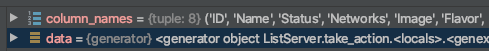

take_action()에서는 서버에 데이터를 요청 및 가공을 하고, 그 결과 값을 column_name, data에 담습니다. 

produce_output()에서는 take_action()에서 column_name, data을 토대로 실제 콘솔에 그림을 그립니다.

take_action
----------------------

take_action()부터 보겠습니다. 

.. code-block:: python

    # /usr/local/lib/python3.6/dist-packages/openstackclient/compute/v2/server.py

    class ListServer(command.Lister):
        _description = _("List servers")
        '''생략'''

        def take_action(self, parsed_args):
            compute_client = self.app.client_manager.compute
            identity_client = self.app.client_manager.identity
            image_client = self.app.client_manager.image
            '''생략'''

            data = compute_client.servers.list(search_opts=search_opts,
                                            marker=marker_id,
                                            limit=parsed_args.limit)
            
        '''생략'''
            table = (column_headers,
                    (utils.get_item_properties(
                        s, columns,
                        mixed_case_fields=mixed_case_fields,
                        formatters={
                            'OS-EXT-STS:power_state':
                                _format_servers_list_power_state,
                            'Networks': _format_servers_list_networks,
                            'Metadata': utils.format_dict,
                        },
                    ) for s in data))
            return table

table이라는 튜플이 리턴되는 것을 볼 수 있습니다. 

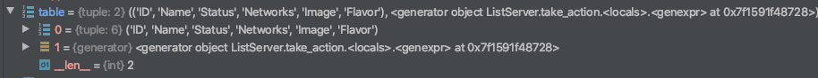

table값을 보면 column_headers와 generator이 서로 쌍으로 들어있는 것을 볼 수 있습니다.

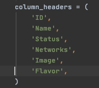

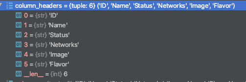

column_headers이 만만해 보이므로 먼저 접근해보았습니다. column_headers는 이게 끝입니다.

.. code-block:: python

        (utils.get_item_properties(
                     s, columns,
                     mixed_case_fields=mixed_case_fields,
                     formatters={
                         'OS-EXT-STS:power_state':
                             _format_servers_list_power_state,
                         'Networks': _format_servers_list_networks,
                         'Metadata': utils.format_dict,
                     },
                 ) for s in data)

이제 column_headers 오른쪽에 있는 복잡한 녀석을 한번 접근해 보겠습니다. 
get_item_properties에 인자 값으로 s, columns, mixed_case_fields, formatters를 전달해줍니다.

def get_item_properties()로 가보겠습니다.

.. code-block:: python

    def get_item_properties(item, fields, mixed_case_fields=None, formatters=None):
        ''' 생략 '''
        row = []

        for field in fields: # field: 'ID'
            if field in mixed_case_fields: 
                field_name = field.replace(' ', '_')
            else:
                field_name = field.lower().replace(' ', '_') # field_name: 'id'
            data = getattr(item, field_name, '')
            if field in formatters:
                formatter = formatters[field]

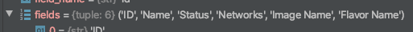

fields에서 하나씩 꺼내온 다음 '_'를 ' '로 변환하고, 대문자를 소문자로 변환하는 과정을 거치는 것을 볼 수 있습니다.

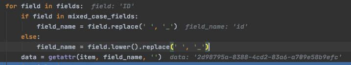

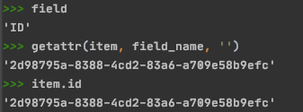

파이참의 디버깅 모드에서는 중간에 디버그 걸린 곳의 변수를 직접 사용할 수 있습니다. 이를 이용해 데이터 값을 조회해 봤습니다.

item에 들어있는 id를 가져와서 data라는 변수에 넣은 것을 확인할 수 있습니다.

.. image:: images/27.png

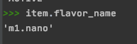

field의 Flavar Name을 뽑아서 추출할 경우도 m1.nano가 data에 담깁니다.

item.flavor_name으로도 데이터를 볼 수 있습니다.

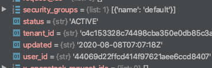

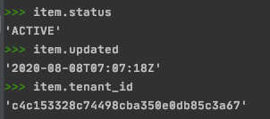

item에 존재하는 다른 값들도 넣어보겠습니다. 잘 출력이 됩니다. item에 존재하는 다른 값들도 꺼내 올 수 있겠네요. 

다시 table을 만드는 튜플로 돌아가 보겠습니다.

.. code-block:: python

        table = (column_headers,
                 (utils.get_item_properties(
                     s, columns,
                     mixed_case_fields=mixed_case_fields,
                     formatters={
                         'OS-EXT-STS:power_state':
                             _format_servers_list_power_state,
                         'Networks': _format_servers_list_networks,
                         'Metadata': utils.format_dict,
                     },
                 ) for s in data))

item은 여기에서 s이고 s는 data에서 뽑아온 값인 것을 확인할 수 있습니다.

여기에서 columns은 fields인 것을 확인할 수 있습니다.

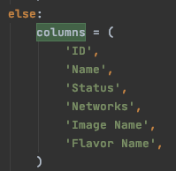

columns는 다음과 같이 정의되어 있는 것을 확인해볼 수 있습니다.

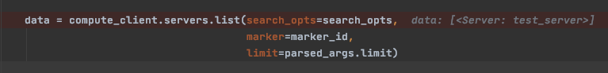

data는 여기에서 새로 받네요.

궁금해서 잠깐 compute_client.servers.list()로 들어가 봤습니다. 
(novaclient로 요청하는 부분은 나중에 분석할 기회가 생기면 자세히 추가시켜 놓겠습니다.)

.. code-block:: python

    # novaclient/client.py

        def request(self, url, method, **kwargs):
            kwargs.setdefault('headers', kwargs.get('headers', {}))
            api_versions.update_headers(kwargs["headers"], self.api_version)

            # NOTE(dbelova): osprofiler_web.get_trace_id_headers does not add any
            # headers in case if osprofiler is not initialized.
            if osprofiler_web:
                kwargs['headers'].update(osprofiler_web.get_trace_id_headers())

            # NOTE(jamielennox): The standard call raises errors from
            # keystoneauth1, where we need to raise the novaclient errors.
            raise_exc = kwargs.pop('raise_exc', True)
            with utils.record_time(self.times, self.timings, method, url):
                resp, body = super(SessionClient, self).request(url,
                                                                method,
                                                                raise_exc=False,
                                                                **kwargs)

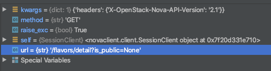

servers.list를 잠깐 들어가 보니까 url로 요청을 보내는 곳이 있는 거 같습니다. Get method도 있네요.

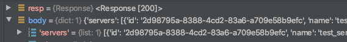

요청해서 받은 응답 헤더와 body를 보니까 200과 서버 데이터들이 들어 있는 것을 볼 수 있습니다. (나중에 살펴봐야겠네요)

.. code-block:: python

        column_names, data = self.take_action(parsed_args)
        column_names, data = self._run_after_hooks(parsed_args,
                                                   (column_names, data))
        self.produce_output(parsed_args, column_names, data)

이렇세 take_action은 끝입니다.

table이 반환이 되지만 튜플 형태로 반환되기 때문에, column_names와 data 각각 나눠서 담기는 것을 확인할 수 있었습니다.

produce_output
-------------------------------

.. code-block:: python

        column_names, data = self._run_after_hooks(parsed_args,
                                                   (column_names, data))
        self.produce_output(parsed_args, column_names, data)

produce_output에서는 그림을 실제로 콘솔 창에 출력을, take_action에서 반환받은 column_names정보와 data정보를 가지고 출력을 합니다.

produce_output의 내부로 진행하다 보면 TableFormatter.emit_list()가 나옵니다.

.. code-block:: python

    # cliff/formatters/Table.py
    class TableFormatter(base.ListFormatter, base.SingleFormatter):
    ''' 생략 '''
        def emit_list(self, column_names, data, stdout, parsed_args):
            x = prettytable.PrettyTable(
                column_names,
                print_empty=parsed_args.print_empty,
            )
            x.padding_width = 1

            # Add rows if data is provided
            if data:
                self.add_rows(x, column_names, data)

            # Choose a reasonable min_width to better handle many columns on a
            # narrow console. The table will overflow the console width in
            # preference to wrapping columns smaller than 8 characters.
            min_width = 8
            self._assign_max_widths(
                stdout, x, int(parsed_args.max_width), min_width,
                parsed_args.fit_width)

            formatted = x.get_string()
            stdout.write(formatted)
            stdout.write('\n')
            return

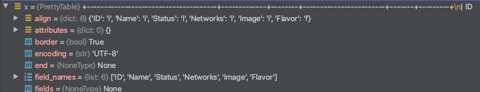

.. code-block:: python

        formatted = x.get_string()
        stdout.write(formatted)
        stdout.write('\n')

x.get_string()로 formatteed 데이터를 넣고, stdout.write로 데이터를 출력하는 것을 볼 수 있습니다.  

여기에서 이쁘게 출력되네요. (2. 어디서 이쁘게 출력되는지 알아보려고 합니다.)

TableFormatter에서 이쁘게 만들기 위해 여러 노력하는 거 같은데 더 깊게는 안 가봤습니다.

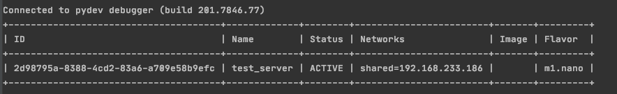

그리고는 터미널에 결과가 출력이 됩니다.

