=================================================
Learn the Gerrit Workflow in the Sandbox
=================================================

이 글은 `샌드박스 튜토리얼 문서 <https://docs.opendev.org/opendev/infra-manual/latest/sandbox.html#sandbox>`_ 
과 2020 컨트리뷰톤 오프라인 모임에서 실습한 것을 토대로 작성되었습니다.

-----------------------------------
1. 오픈스택 WorkFlow 살펴보기
-----------------------------------

오픈스택은 gerrit이라는 코드 협업 도구를 사용합니다. gerrit으로 만들어진 사이트가 바로 `Review opendev <https://review.opendev.org/>`_ 입니다.

openstack만의 workflow를 따르는데, 우리가 알고 있는 깃허브의 PullRequest(PR) 과는 다른 방식으로 운영됩니다.

그림으로 간단하게 살펴보겠습니다.

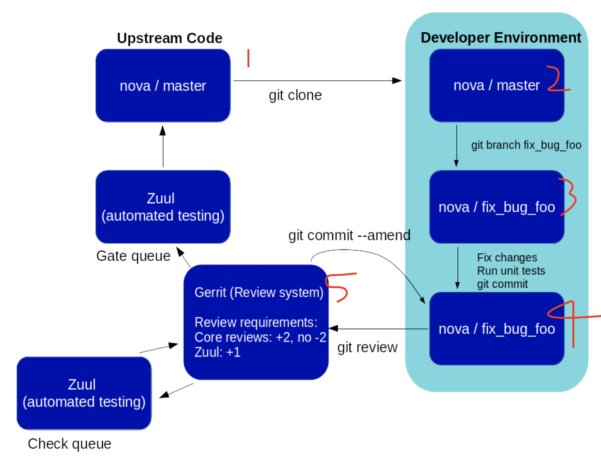

* 사진 출처: https://docs.opendev.g/opendev/infra-manual/latest/gettingstarted.htmlor

1. 사용자가 nova/master를 자신의 개발환경(로컬)에 clone을 합니다.
2. 열심히 브런치를 파고 코드를 수정합니다.
3. 수정을 하고 단위 테스트를 하고 잘되면 커밋을 합니다.
4. git review 명령어를 이용해 `커밋 규칙 <https://docs.opendev.org/opendev/infra-manual/latest/developers.html>`_ 에 잘 맞게 Gerrit 올립니다.
5. 높은 리뷰 점수를 받게 되면 지속적 통합(CI) 도구인 Zuul을 사용해 코드가 병합됩니다.

물론 이건 한번에 성공했을 때 사례고 실제로는 한 번에 성공하기는 쉽지 않을 겁니다. 아마 누군가에게 피드백을 받게 될 것입니다.

그럴 경우 수정해서 올려야 되는데, github에서는 commit을 쌓아서 PR을 보낸다고 했을 때 (물론 git flow 따라 다르겠지만..) 
오픈스택의 WorkFlow는 커밋을 쌓지 않고 하나의 커밋을 수정해서 리뷰사이트에 올립니다.

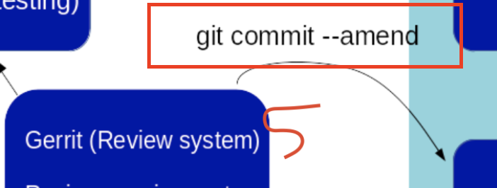

그러기 위해서는 git commit --amend로 수정해서 올려야 합니다. 
이제 본격적으로 샌드박스로 튜토리얼 실습을 진행해 보겠습니다.

------------------------------------------------------------------------
2. 샌드박스로 Gerrit Workflow 흐름 익히기 - 버그 생성
------------------------------------------------------------------------
Gerrit 및 ubuntuOne등 필요한 회원가입 및 로그인이 되어 있다는 것을 전제로 진행하겠습니다.

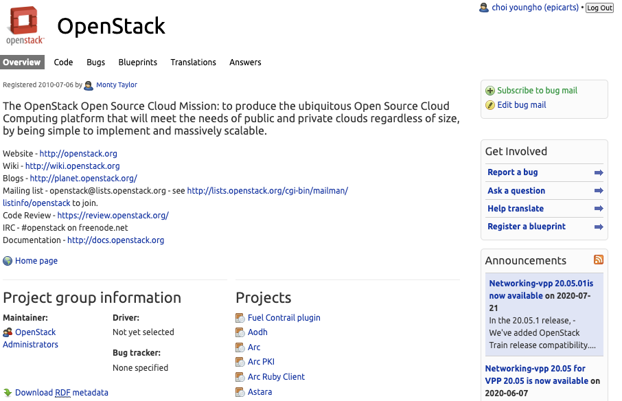

첫 번째로 오픈스택 런치패드에서 버그를 생성해서 올려보겠습니다.

`오픈스택 런치패드 <https://launchpad.net/openstack>`_ 는 버그를 올리고, 
코드를 관리하는 용도로 사용됩니다. 프로젝트마다 차이는 있지만, 
최근에는 `스토리보드 <https://storyboard.openstack.org/>`_ 로 옮겨가는 추세라고 합니다. 

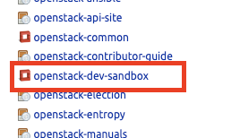

Projetcs 제목 아래로 스크롤을 해보면 여러 프로젝트들을 살펴볼 수 있는데, 
테스트를 할 수 있는 `openstack-dev-sandbox <https://launchpad.net/openstack-dev-sandbox>`_ 로 이동해 보겠습니다.

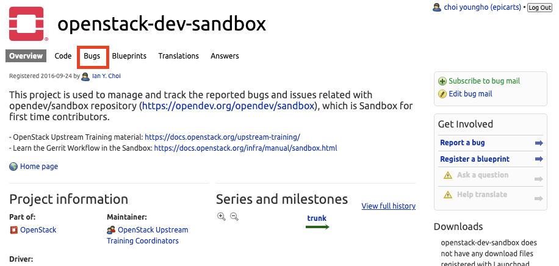

Bug를 누르면 다양한 버그목록들을 볼 수 있습니다.

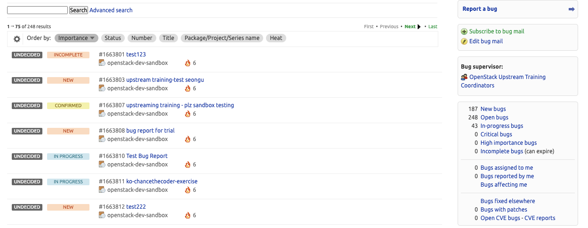

이 버그들은 연습용 버그 목록들입니다. 여기에 버그를 리포팅을 하겠습니다.

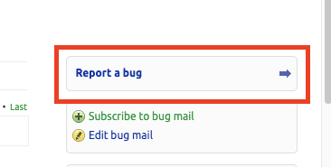

Report a bug 버튼을 눌러줍니다.

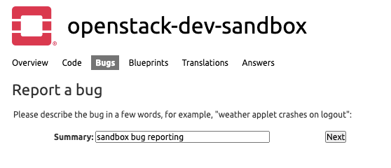

간단하게 버그에 대해 요약을 적어줍니다.

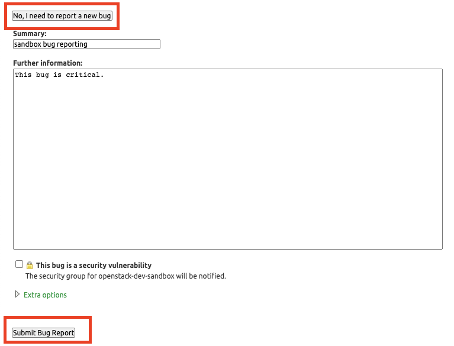

새로운 버그에 대해 정보를 쓴 뒤 등록해줍시다.

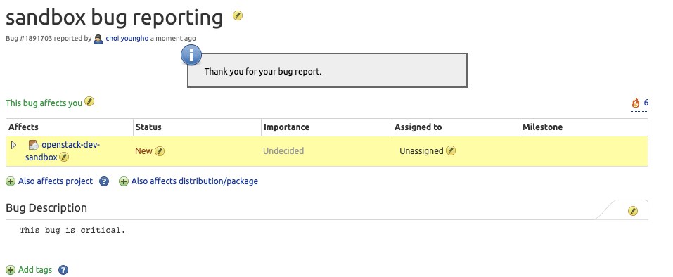

버그가 등록되었습니다.

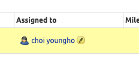

Assinged to로 버그를 할당하여, 다른 사람들에게 알릴 수 있습니다. 스스로에게 이 버그를 할당하였습니다.

----------------------------------------------------------------------
3. 샌드박스로 Gerrit Workflow 흐름 익히기 - Gerrit 회원가입 및 설정
----------------------------------------------------------------------

버그 수정을 하기 위해선 오픈스택에서 사용하는 리뷰 시스템인 `Gerrit <https://review.opendev.org/>`_ 에서 회원 가입 및 일부 설정을 해주어야합니다.

Gerrit에 대한 자세한 설명은 `여기 <https://review.opendev.org/Documentation/index.html>`_ 에서 볼 수 있습니다.

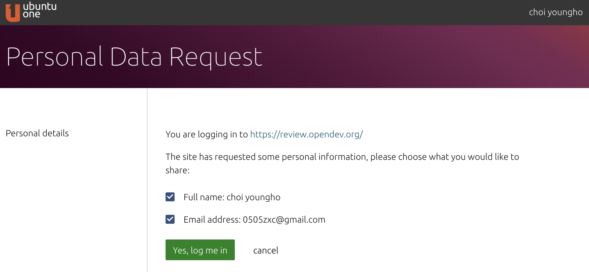

sign in을 눌러 회원가입 및 로그인은 각자 진행해줍니다. ubuntuOne계정이 미리 있어야 합니다.
(추가로 Gerrit의 username은 입력 후 변경할 수 없으며, 깃허브 아이디를 입력할 경우 연동이 된다고 하는데 
아직 제대로 된 활동을 해보지 않아서 확실하지는 않습니다. 추후 수정하겠습니다.)

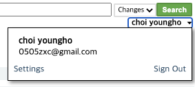

로그인이 되었으면 우측 상단의 계정을 누른 뒤 Settings를 눌러줍니다. 

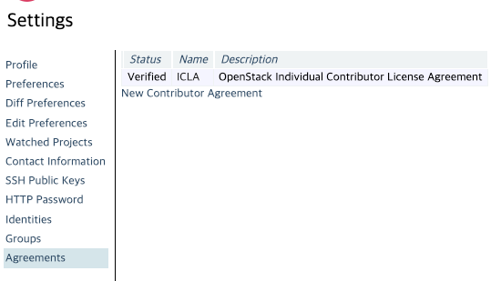

New Contributor Agreement를 눌러 오픈스택 동의서를 제출해야 합니다.
저는 개인이라 ICLA를 선택하여 동의 후 제출을 했습니다.

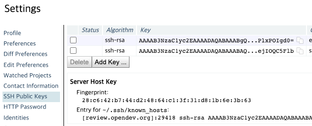

SSH Public Key(공개키)를 등록해 주어야 합니다. 공개키를 등록하기 위해서는 private key(비밀키)를 생성을 해주어야 합니다.

이후 실습 및 키 생성은 ubuntu18.04 LTS 환경에서 진행하겠습니다.

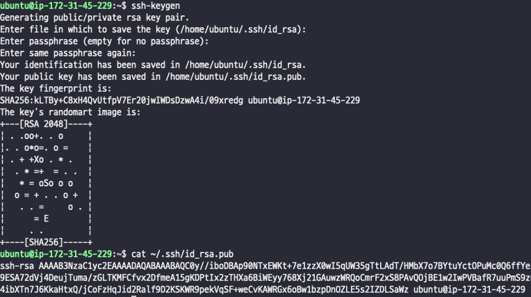

.. code-block:: shell

    ssh-keygen
    cat ~/.ssh/id_rsa.pub

ssh-keygen을 이용하면 공개키(id_rsa.pub)와 비밀키(id_rsa)가 생기는데, 
공개키인 id_rsa.pub가 필요합니다. (절대 비밀키는 노출되면 안 됩니다.)

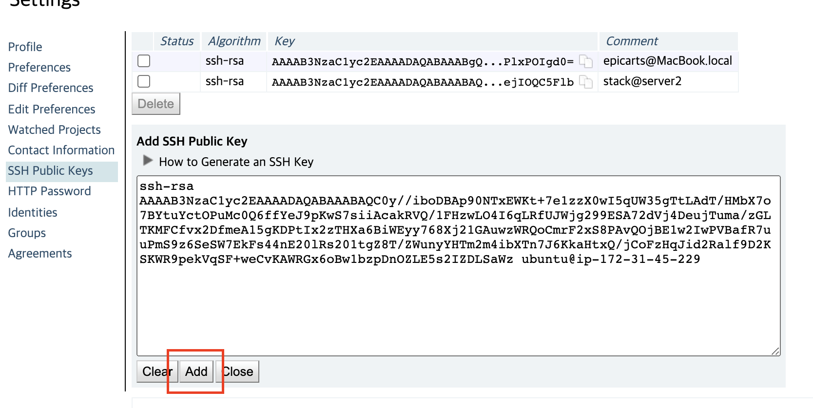

공개키를 복사한 뒤 Add를 눌러 추가시켜주면 끝납니다.

이것으로 gerrit에서의 설정은 끝입니다.

----------------------------------------------------------------
4. 샌드박스로 Gerrit Workflow 흐름 익히기 - git config 설정하기
----------------------------------------------------------------

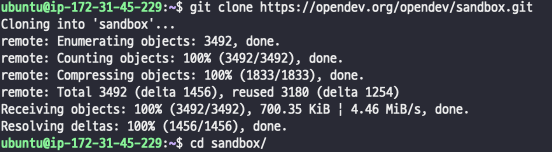

.. code-block:: shell

    git clone https://opendev.org/opendev/sandbox.git
    cd sandbox

먼저 `git 저장소 <https://opendev.org/opendev/sandbox.git>`_ 에서 다운을 받아 줍시다.

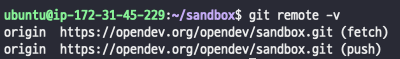

.. code-block:: shell

    git remote -v

현재 origin을 보면 우리가 clone 한 저장소인 것을 알 수 있습니다. 

우리는 gerrit으로 올려야 하므로 git config 설정을 해주어야 합니다.  

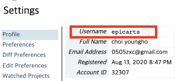

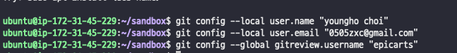

.. code-block:: shell

    git config --local user.name "name"
    git config --local user.email "email@gmail.com"
    git config --global gitreview.username "gerrit username"

공식 문서에서 gitreview.username은 Gerrit에서 설정한 Username을 넣어줘야 합니다.

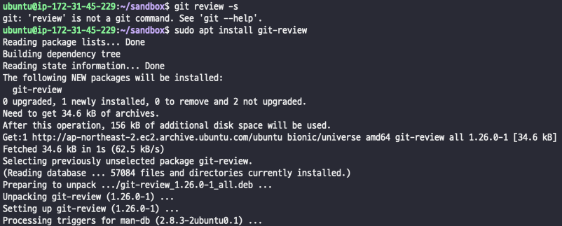

.. code-block:: shell

    sudo apt install git-review

git-review를 설치해줍시다. 
설치방법은 `여기 <https://docs.openstack.org/contributors/common/setup-gerrit.html>`__ 에 
가시면 환경별 설치방법을 보실 수 있습니다

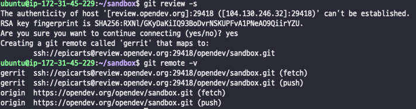

.. code-block:: shell

    git review -s
    git remote -v

git review가 우리가 gerrit에 등록한 RSA 키를 사용해 remote정보를 등록해줍니다.

이제 원격지가 origin뿐만 아니라 gerrit도 추가된 것을 볼 수 있습니다.

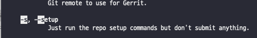

s 옵션은 다음과 같습니다.

------------------------------------------------------------
5. 샌드박스로 Gerrit Workflow 흐름 익히기 - git review 하기
------------------------------------------------------------

위에서 우리가 만든 버그를 해결하겠습니다. 버그 수정을 한다는 가정으로 소스코드를 수정해보겠습니다.

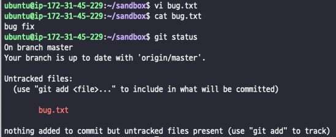

bug.txt라는 파일을 생성한 다음, bug fix라는 내용을 적었습니다.

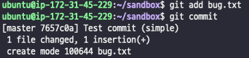

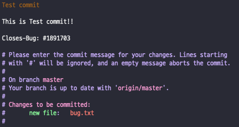

.. code-block:: shell

    git add bug.txt
    git commit

위와 같이 commit 메시지를 작성하였습니다. 제목과 내용, 그리고 Closes-Bug와 #1891703을 작성해주었습니다.

실제 컨트리뷰트를 할 때는 오픈스택 `커밋 규칙 <https://docs.openstack.org/contributors/common/git.html#commit-messages>`__ 이 
있기 때문에 이에 맞게 해 주셔야 합니다.

커밋에 내용에 대한 설명은 아래에 설명해 놓았습니다. 

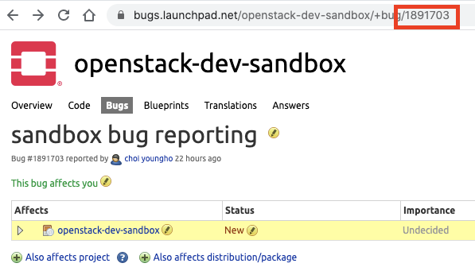

Closes-Bug의 #1891703의 정체는 바로 런치패드에 있는 URL의 맨 뒤에 있는 고유번호입니다.

자신이 만든 버그 리포트 페이지에서 각자 생성된 고유번호를 쓰시면 됩니다.

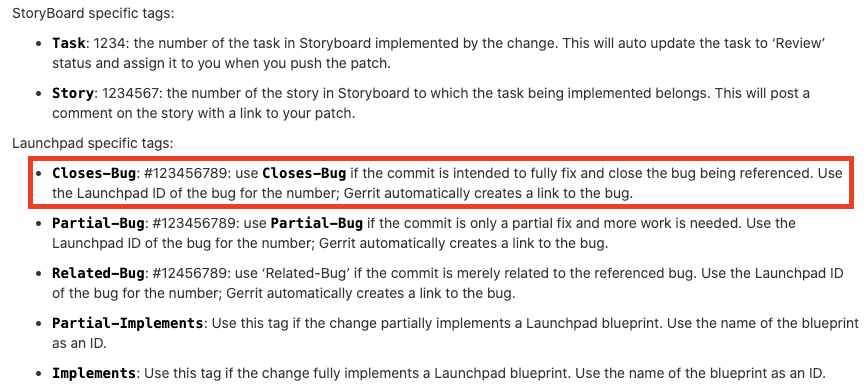

런치패드(Launchpad)에서는 Closes-Bug, Partial-Bug 태그가 있고, 
스토리보드(StoryBoard)는 Task, Story 태그를 사용할 수 있는 것을 볼 수 있습니다.

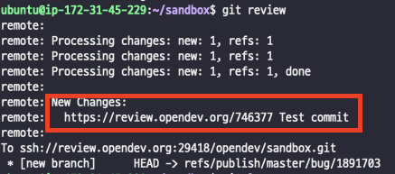

.. code-block:: shell

    git review

이와 비슷하게 뜬다면 정상적으로 Gerrit에 코드가 올라갔다고 볼 수 있습니다. New Changes에 나와 있는 주소로 접속을 해보겠습니다. 

링크: review.opendev.org/746377

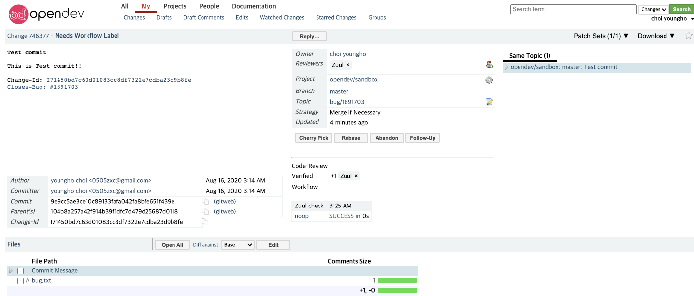

Code 리뷰를 할 수 있는 사이트인 Gerrit에 내가 커밋한 코드가 정상적으로 올라온 것을 확인할 수 있습니다. 

이렇게 올리는 단위를 Patch Set라고 부릅니다. 우리가 코드를 올릴 때마다 Patch Set이 추가됩니다. (1, 2, 3...) 

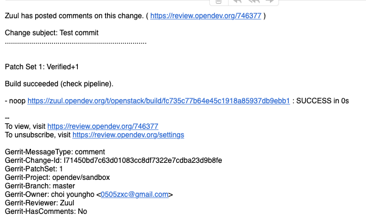

또한 메일도 날아옵니다. 

----------------------------------------------------------
6. 샌드박스로 Gerrit Workflow 흐름 익히기 -  Merge 하기
----------------------------------------------------------
이제 수정한 코드를 저장소로 Merge 해보도록 하겠습니다.

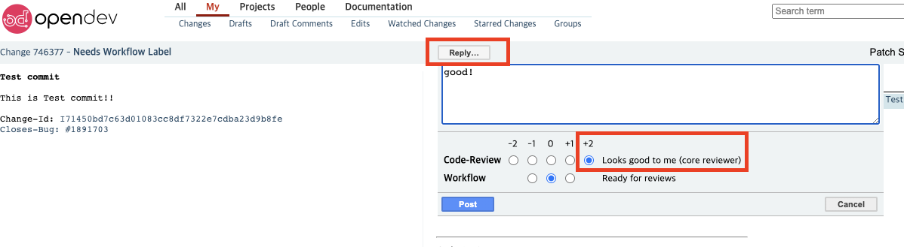

우리가 올린 코드를 maintainer분들께서 리뷰를 해주시고, -2점 ~ 2점 사이의 점수를 줄 수 있습니다.  최소한 2점 1개를 받아야 Merge 할 수 있습니다.

제가 maintainer라고 생각을 하고 2점을 주었습니다. 핳

점수에 대한 자세한 설명은 `여기 <https://docs.openstack.org/contributors/code-and-documentation/using-gerrit.html#reviewing-changes>`__ 에서 볼 수 있습니다.

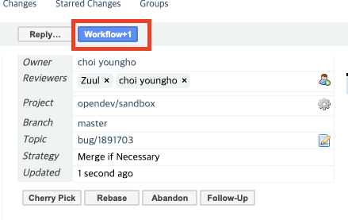

이렇게 2점을 받고 난 뒤 Workflow+1 버튼을 누르게 되면...

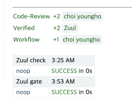

지속적 통합(CI) 도구인 Zuul이 돌게 되면서 체크를 하게 되고,

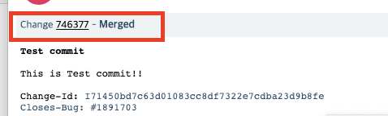

Merged 된 것을 볼 수 있습니다.

---------------------------------------------------------------------------
7. 샌드박스로 Gerrit Workflow 흐름 익히기 -  저장소에서 Merge 확인하기
---------------------------------------------------------------------------

이제 Merge까지 완료가 되었으니, 직접 확인해 봐야겠죠?

먼저 우리가 git clone 받았던 저장소로 가보겠습니다.

링크: https://opendev.org/opendev/sandbox.git

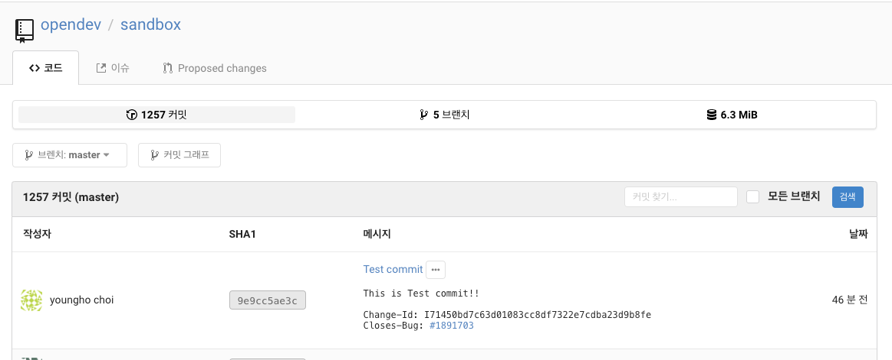

Merge 됐습니다. 

런치패드도 한번 가보겠습니다.

링크: https://bugs.launchpad.net/openstack-dev-sandbox/+bug/1891703

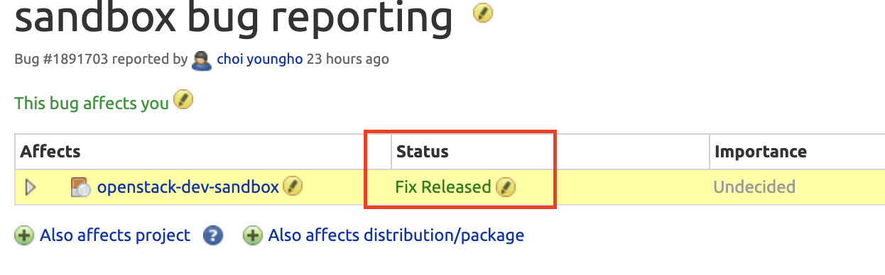

Fix Released 되었습니다.

.. image:: images/sandbox_site_lunchpad_merge_detail.png

친절하게 OpenStack infra가 commit 되었다고 저장소 링크까지 달아주었습니다. 

참고 사이트

* 오픈스택 워크플로우 살펴보기: https://www.youtube.com/watch?v=PEK3FXGPsPI

* https://docs.openstack.org/contributors/common/setup-gerrit.html