=================================================
번역 컨트리뷰트 시작해보기
=================================================

오픈스택의 한국어 팀은 `korea I18Team <https://wiki.openstack.org/wiki/I18nTeam/team/ko_KR>`_ 에서 확인할 수 있습니다.

그리고 번역 가이드 문서는 `I18n 번역 가이드 문서 - 한국어 <https://docs.openstack.org/i18n/latest/ko_KR/>`_ 
에서 확인할 수 있습니다. 
번역 가이드 문서에는 `번역 인프라 <https://docs.openstack.org/i18n/latest/ko_KR/infra.html>`_ , 
`역할 <https://docs.openstack.org/i18n/latest/ko_KR/lang_team.html>`_ , 
`번역 버그 다루기 <https://docs.openstack.org/i18n/latest/ko_KR/handling_bugs.html>`_ 등 다양한 내용들을 담고 있습니다.

----------------------
1. 번역을 위한 준비
----------------------

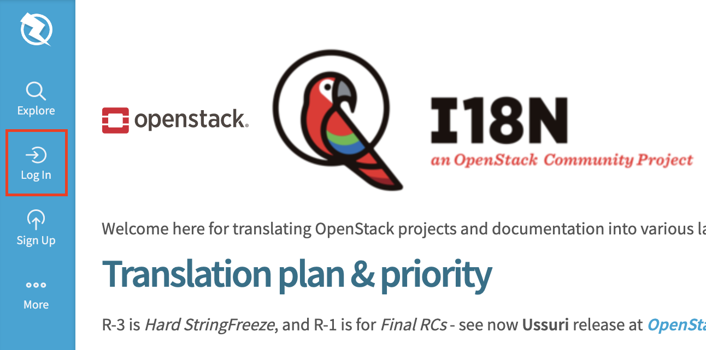

오픈스택에서는 Zanata를 이용해 번역에 손쉽게 기여할 수 있습니다.

먼저 오픈스택 `zanata 대시보드 페이지 <https://translate.openstack.org/>`_ 로 접속을 한 뒤, Log in을 눌러줍니다.

.. image:: images/translate_openstack_login.png

Log in을 누르면 오픈스택ID 페이지로 접속이 되는데, 없다면 회원가입을 한 뒤, 로그인을 해줍시다.

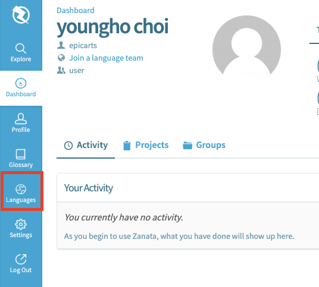

Languages를 눌러 줍니다.

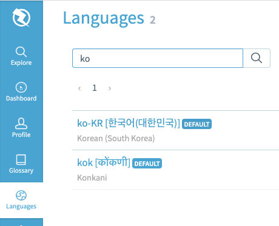

ko를 검색한뒤 ko-KR을 선택해 줍니다.

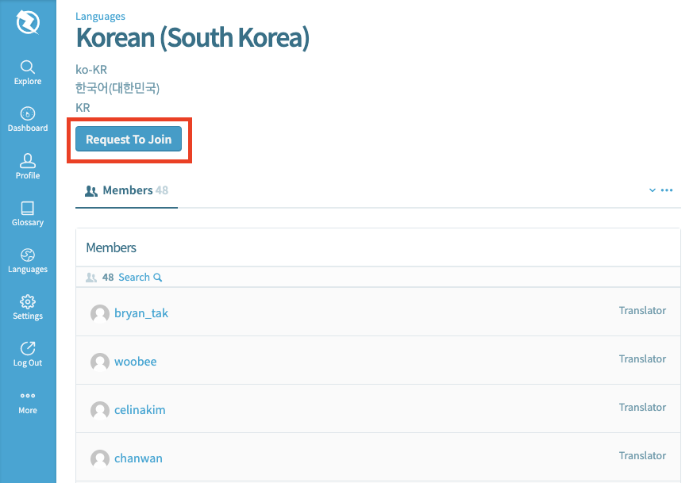

한국어 번역을 하시는 멤버분들을 볼 수 있습니다. 현재 48명이 계시는군요.

Request To Join을 눌러 한국팀에 합류를 해보겠습니다.

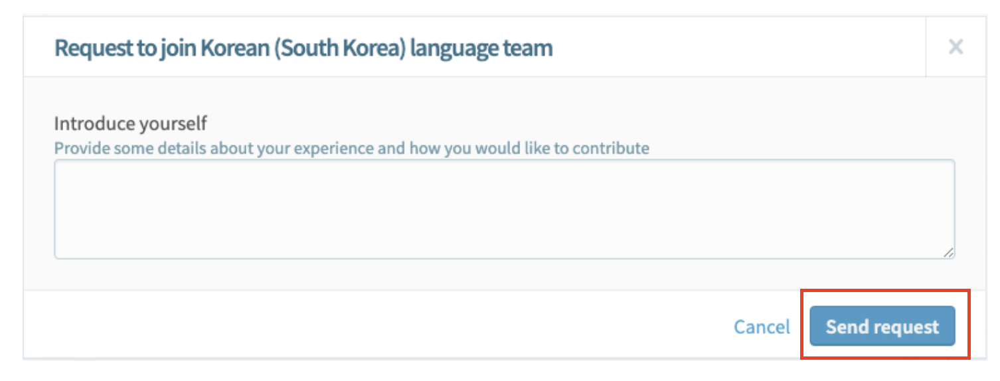

열심히 자기소개서를 작성한 뒤에 요청을 보내줍니다.

만약 요청을 보내고 1주일 정도 지났는데 연락이 없다면,
`한국 IRC 채널 <https://webchat.freenode.net/#openstack,openstack-dev,openstack-ko>`_ 이나, 
`페이스북 <https://www.facebook.com/groups/openstack.kr>`_ 에 도움을 요청해보는 것도 좋은 방법인거 같습니다.
저는 컨트리뷰톤 멘토님께 직접 말씀 드렸더니 승인되었습니다.

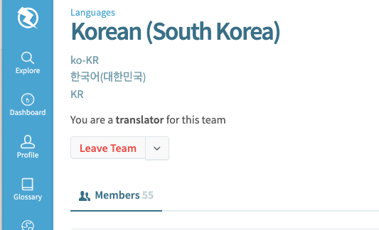

승인이 되었으니 이제 번역을 해보겠습니다.

-------------
2. 번역하기
-------------

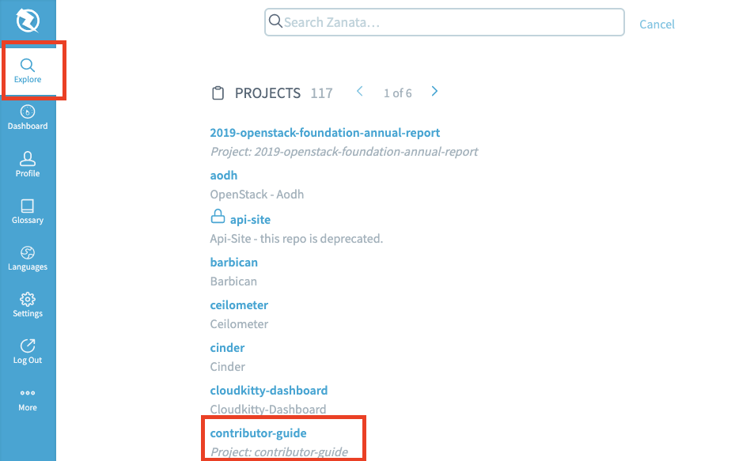

Explore를 누르면 프로젝트들을 볼 수 있습니다.

contributor-guide 프로젝트를 번역해보겠습니다.

링크: translate.openstack.org/project/view/contributor-guide

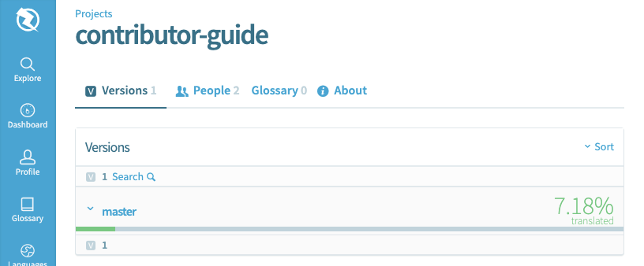

master를 선택해 줍니다.

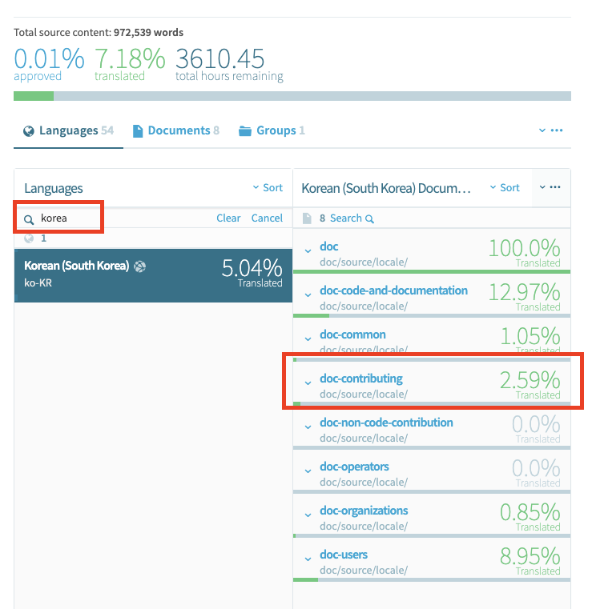

Languages에 korea를 검색하면 번역 상태들을 볼 수 있습니다.

Zanata에는 남은 번역 비율에 비례하여 퍼센티지를 볼 수 있습니다. 현재 2.59%가 번역이 되었네요.

doc-contributing을 번역해보겠습니다.

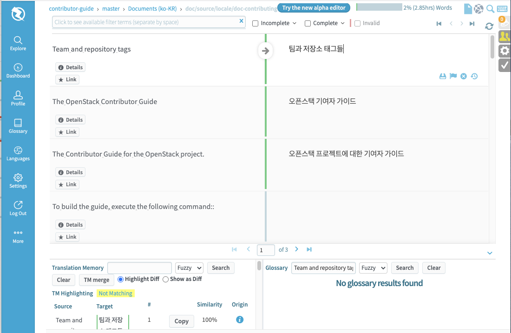

이제 번역하고 싶은 단어를 클릭해서 번역하면 됩니다.

-------------
3. 번역팁
-------------

alpha editor
---------------

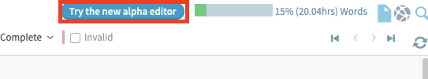

우측 상단에 Try the new alpha editor 이라는 버튼이 있습니다.

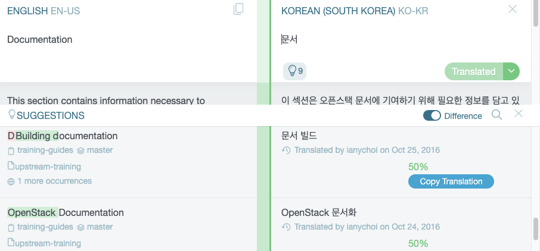

개인적으로 기존 editor보다 좀 더 직관적이고 쉬운 느낌입니다.

단어집
----------

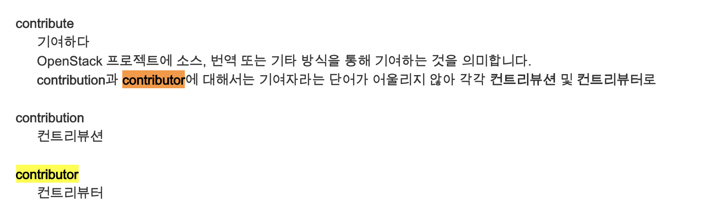

`단어집 <https://wiki.openstack.org/wiki/단어집>`_ 을 펴놓고 하는것도 도움이 됩니다.

예를 들어 contribution, contributor 는 컨트리뷰션과 컨트리뷰터로 번역 되어야합니다.

링크: https://wiki.openstack.org/wiki/단어집

비슷한 단어 검색
------------------

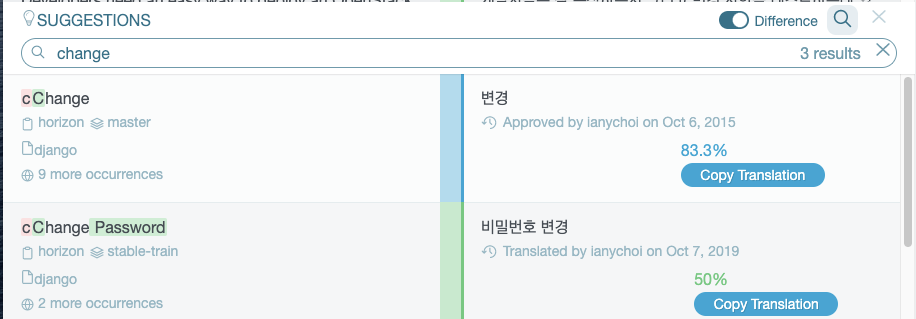

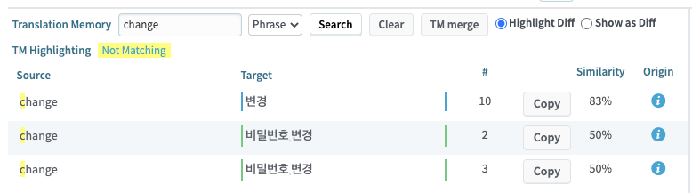

검색 하면 비슷한 단어나, 단어가 들어간 문장을 보여줍니다.

에디터 번역 설정
-------------------

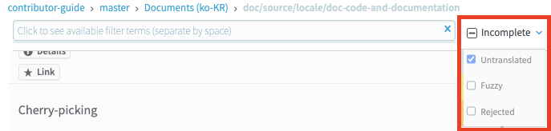

Incomplete는 체크.,  Fuzzy와 Rejected에는 체크를 해제해야 한다고 합니다.

Fuzzy는 자나타에서 자동으로 번역을 넣어주는 역할을 하는데, 번역을 하다 컨트롤 엔터를하면 Fuzzy와 Rejected가 자동으로 저장이 될수 도 있는 상황이 발생한다고 합니다. 

---------------
참고 사이트
---------------

- 유튜브: https://youtu.be/aHOBTGjVkpI

- 한국어 번역팀: https://wiki.openstack.org/wiki/I18nTeam/team/ko_KR

